# AUDITORIA DE SISTEMAS DE INTELIGÊNCIA ARTIFICIAL EM PLATAFORMAS DE STREAMING: UM ESTUDO EXPERIMENTAL SOBRE VIESES E RECOMENDAÇÃO MUSICAL NO SPOTIFY

> Universidade Federal de Uberlandia
> Curso de Gestao da Informação - FAGEN
>
> Marcos Rodrigues de Oliveira Júnior
>
> Uberlândia - MG
> 2026

Orientador: José Eduardo Ferreira Lopes

# Sumário

- [AUDITORIA DE SISTEMAS DE INTELIGÊNCIA ARTIFICIAL EM PLATAFORMAS DE STREAMING: UM ESTUDO EXPERIMENTAL SOBRE VIESES E RECOMENDAÇÃO MUSICAL NO SPOTIFY](#auditoria-de-sistemas-de-inteligência-artificial-em-plataformas-de-streaming-um-estudo-experimental-sobre-vieses-e-recomendação-musical-no-spotify)
- [Sumário](#sumário)
- [1 INTRODUÇÃO](#1-introdução)
- [2 OBJETIVOS](#2-objetivos)
  - [2.1 Objetivos Específicos](#21-objetivos-específicos)
- [3 METODOLOGIA](#3-metodologia)
  - [3.1 Procedimento de Coleta e Preparação Técnica](#31-procedimento-de-coleta-e-preparação-técnica)
    - [3.1.1 Tratamento de Dados e Definição das Métricas de Auditoria](#311-tratamento-de-dados-e-definição-das-métricas-de-auditoria)
    - [3.1.2 Síntese Estatística e Definição dos Indicadores Descritivos](#312-síntese-estatística-e-definição-dos-indicadores-descritivos)
  - [3.2 Arquitetura dos Agentes de Teste: Caracterização das Personas Sintéticas](#32-arquitetura-dos-agentes-de-teste-caracterização-das-personas-sintéticas)
    - [3.2.1 Beatriz (A Consumidora Mainstream)](#321-beatriz-a-consumidora-mainstream)
      - [3.2.1.1 Tabela de indicadores](#3211-tabela-de-indicadores)
      - [3.2.1.2 Gráficos](#3212-gráficos)
    - [3.2.2 Daniel (O Foco Instrumental/Lo-fi)](#322-daniel-o-foco-instrumentallo-fi)
      - [3.2.2.1 Tabela de indicadores](#3221-tabela-de-indicadores)
      - [3.2.2.2 Gráficos](#3222-gráficos)
    - [3.2.3 Sofia (A Consumidora de Nicho)](#323-sofia-a-consumidora-de-nicho)
      - [3.2.3.1 Tabela de indicadores](#3231-tabela-de-indicadores)
      - [3.2.3.2 Gráficos](#3232-gráficos)
    - [3.2.4 Ricardo (O Consumidor Nostálgico)](#324-ricardo-o-consumidor-nostálgico)
      - [3.2.4.1 Tabela de indicadores](#3241-tabela-de-indicadores)
      - [3.2.4.2 Gráficos](#3242-gráficos)
  - [3.3 Análise Comparativa e Validação dos Estímulos (Inputs)](#33-análise-comparativa-e-validação-dos-estímulos-inputs)
    - [3.3.1 Métricas de Diversidade e Entropia da Informação](#331-métricas-de-diversidade-e-entropia-da-informação)
    - [3.3.2 Distribuição de Mercado (Cauda Longa)](#332-distribuição-de-mercado-cauda-longa)
    - [3.3.3 Análise Visual Cruzada e Topologia dos Dados](#333-análise-visual-cruzada-e-topologia-dos-dados)
  - [3.4 Síntese Metodológica e Limitações](#34-síntese-metodológica-e-limitações)
- [4 RESULTADOS: ANÁLISE DOS OUTPUTS E O DELTA ALGORÍTMICO](#4-resultados-análise-dos-outputs-e-o-delta-algorítmico)
  - [4.1 Apresentação dos Outputs Coletados (Daily Mixes)](#41-apresentação-dos-outputs-coletados-daily-mixes)
  - [4.2 Taxa de Overlap Interno: Redundância Intra-Persona](#42-taxa-de-overlap-interno-redundância-intra-persona)
  - [4.3 O Delta Algorítmico — Visão Geral](#43-o-delta-algorítmico--visão-geral)
  - [4.4 Análise Persona por Persona](#44-análise-persona-por-persona)
    - [4.4.1 Beatriz (Mainstream) — O Grupo de Controle Validado](#441-beatriz-mainstream--o-grupo-de-controle-validado)
    - [4.4.2 Daniel (Lo-fi) — Confirmação do Viés de Popularidade](#442-daniel-lo-fi--confirmação-do-viés-de-popularidade)
    - [4.4.3 Sofia (Nicho) — Viés do Hit dentro da Cauda Longa](#443-sofia-nicho--viés-do-hit-dentro-da-cauda-longa)
    - [4.4.4 Ricardo (Nostálgico) — Pulverização da Fidelidade Canônica](#444-ricardo-nostálgico--pulverização-da-fidelidade-canônica)
  - [4.5 Reconfiguração da Diversidade: Expansão de Riqueza com Manutenção de Silos](#45-reconfiguração-da-diversidade-expansão-de-riqueza-com-manutenção-de-silos)
  - [4.6 Síntese dos Achados e Discussão](#46-síntese-dos-achados-e-discussão)

# 1 INTRODUÇÃO

Conforme observa Ross (2007, p. 15), a música adapta-se continuamente às tecnologias de cada época, acompanhando o desenvolvimento da humanidade e refletindo transformações culturais, sociais e tecnológicas. Desde os primeiros instrumentos rudimentares até as complexas produções contemporâneas, cada período histórico introduziu novas formas de criação, registro e expressão artística. Na contemporaneidade, a convergência entre a era digital e os avanços da inteligência computacional reformulou de maneira significativa não apenas os processos de produção musical, mas, sobretudo, os modos de mediação, distribuição e consumo da música.

O ambiente digital possibilitou a consolidação de mecanismos de curadoria automatizada que hoje atuam como os principais filtros entre a obra musical e o ouvinte. Nesse cenário, observa-se a substituição progressiva da curadoria humana por sistemas complexos de Inteligência Artificial, fundamentados em técnicas como Filtragem Colaborativa, Processamento de Linguagem Natural (NLP) e Redes Neurais. Essas arquiteturas permitem processar grandes volumes de dados, viabilizando a personalização de experiências sonoras em larga escala.

Sob a ótica da Gestão da Informação, essa transição caracteriza a ascensão da governança algorítmica. Plataformas como o Spotify deixaram de ser meros repositórios de arquivos para atuar como gestoras ativas de fluxos informacionais, moldando a chamada "arquitetura da escolha" de milhões de usuários. Esses sistemas operam como caixas-pretas (black boxes), cujos critérios de seleção permanecem proprietários e opacos, gerando assimetria informacional e limitando a compreensão do usuário sobre os processos que influenciam sua percepção cultural. O uso de Aprendizado Profundo (Deep Learning) permite que tais sistemas aprendam continuamente com o comportamento do usuário, tornando a auditoria algorítmica essencial para compreender se essas decisões favorecem a diversidade ou a formação de bolhas de filtro.

A evolução dessas plataformas também impactou a economia do setor musical, consolidando modelos de negócios associados à chamada Economia da Atenção. Nesse modelo, o sucesso da plataforma depende da maximização da retenção do usuário, o que frequentemente leva os algoritmos a priorizarem conteúdos de baixo risco e alta aceitação estatística. Esse processo gera um ciclo de retroalimentação no qual o conteúdo popular tende a ganhar maior visibilidade, enquanto produções novas, experimentais ou de nicho permanecem marginalizadas.

Diante desse cenário, emerge a motivação central desta pesquisa: investigar como os sistemas de recomendação influenciam a diversidade cultural. Ao priorizar padrões estatisticamente mais consumíveis, tais algoritmos podem induzir à homogeneização do gosto musical e ao fortalecimento de bolhas de filtro (filter bubbles), restringindo a descoberta de nichos e o acesso a artistas independentes. O risco de alienação do gosto musical mediado por vieses algorítmicos configura-se, assim, como um objeto crítico de análise da cultura digital contemporânea.

É preciso, contudo, tratar a noção de "bolha de filtro" com rigor crítico. O conceito, popularizado por Pariser (2011), postula que a personalização algorítmica encerraria o usuário em um universo informacional autorreferente. Essa tese, entretanto, é objeto de controvérsia: Bruns (2019) argumenta que a evidência empírica robusta para bolhas de filtro é escassa e que o conceito, frequentemente, opera mais como pânico moral do que como fenômeno mensurado. Esta pesquisa posiciona-se justamente nesse debate, tomando a bolha de filtro não como pressuposto, mas como **hipótese a ser testada empiricamente** no domínio da recomendação musical — onde, como se verá no Capítulo 4, os próprios dados sugerem um comportamento mais sutil do que a metáfora clássica da bolha prevê (o algoritmo chega a *arrombar* a bolha vertical do perfil nostálgico, em vez de reforçá-la).

Nesse contexto, torna-se fundamental a realização de Auditorias Algorítmicas, que investigam exogenamente o comportamento dos sistemas por meio da análise dos outputs gerados a partir de estímulos controlados. A auditoria de caixa-preta permite avaliar empiricamente o viés algorítmico sem acesso ao código-fonte, contornando desafios impostos pela volatilidade dos dados e pela complexidade das interações humanas.

Embora estudos baseados em usuários reais sejam relevantes, eles frequentemente sofrem com subjetividade e inconsistência comportamental, dificultando o isolamento de variáveis estritamente algorítmicas. Para superar essa limitação, esta pesquisa propõe uma abordagem experimental automatizada baseada na mineração de dados.

Dessa forma, o estudo utiliza Personas Sintéticas como objeto central de análise. Essas personas consistem em perfis de usuários cujos hábitos de consumo são simulados por algoritmos de curadoria controlada, construídos a partir da extração de metadados via API. As identidades sintéticas - Beatriz (Mainstream), Daniel (Lo-fi), Ricardo (Nostálgico) e Sofia (Nicho) - funcionam como instrumentos de medição que isolam a variável algorítmica.

Ao analisar como o Spotify responde a essas quatro identidades musicais distintas, o estudo busca avaliar se o sistema respeita preferências musicais específicas ou se tende à padronização induzida pelo viés de popularidade. Assim, pretende-se compreender em que medida a plataforma atua como facilitadora de descobertas musicais autênticas ou como indutora de escolhas pré-determinadas pela lógica estatística do mercado global.

# 2 OBJETIVOS

Esta dissertação tem como objetivo geral auditar o comportamento dos sistemas de recomendação algorítmica da plataforma Spotify, utilizando a metodologia de Black-Box Auditing com personas sintéticas, a fim de mensurar quantitativamente o impacto das lógicas de curadoria automatizada na diversidade cultural, na concentração de popularidade e na formação de bolhas de filtro (filter bubbles).

## 2.1 Objetivos Específicos

- Modelar e Implementar quatro arquétipos de consumo musical contrastantes (Mainstream, Funcional, Nostálgico e Underground), traduzindo perfis psicográficos em scripts de automação para a geração de datasets controlados.
   
- Validar estatisticamente a heterogeneidade e o isolamento dos perfis iniciais (inputs), utilizando métricas de similaridade de conjuntos (Índice de Jaccard) e dispersão de popularidade para estabelecer uma linha de base neutra (cold start).
   
- Coletar e Processar, via API do Spotify, os metadados técnicos e socioeconômicos das recomendações geradas (os seis *Daily Mixes* de cada perfil), estruturando um corpus de dados comparável entre os diferentes perfis.
   
- Mensurar a diversidade e a concentração das sugestões algorítmicas, aplicando indicadores matemáticos como a Entropia de Shannon (variedade informacional), o Coeficiente de Gini (desigualdade de distribuição) e o Índice HHI (concentração de mercado/gênero).
   
- Analisar o viés de popularidade e econômico, verificando se o sistema promove a "gentrificação" de gostos de nicho ao recomendar desproporcionalmente artistas "Superstars" (Cauda Curta) em detrimento de artistas independentes (Cauda Longa).
   
- Avaliar o fenômeno de Colapso de Contexto, investigando se as recomendações para perfis distintos convergem entre si — distinguindo a convergência de *conteúdo* (sobreposição de artistas, via Índice de Jaccard), de *tema* (gêneros/tags) e de *magnitude* de diversidade (Entropia de Shannon) — em vez de pressupor uma homogeneização única e indiferenciada.

# 3 METODOLOGIA

A presente investigação adota uma abordagem de natureza experimental e descritiva, fundamentada na estratégia de Auditoria Algorítmica de Caixa-Preta (Black-Box Auditing). Conforme proposto por Sandvig et al. (2014), essa técnica possibilita a análise do comportamento de sistemas de Inteligência Artificial sem acesso ao código-fonte ou aos dados internos das plataformas, baseando-se na observação sistemática dos resultados produzidos a partir de estímulos controlados.

Paralelamente, a pesquisa recorre ao método bibliográfico com o objetivo de sustentar teoricamente a análise dos fenômenos observados. Essa revisão, conforme orientações de Gil (1991), abrange estudos sobre a evolução da música e o papel das tecnologias digitais. A articulação entre a auditoria algorítmica e a revisão bibliográfica permite uma compreensão abrangente do impacto da Inteligência Artificial na música contemporânea, contemplando tanto a perspectiva empírica quanto a análise teórica dos processos sociotécnicos envolvidos.

## 3.1 Procedimento de Coleta e Preparação Técnica

O procedimento experimental foi dividido em fases sequenciais de configuração e desenvolvimento técnico. Inicialmente, foram criadas quatro contas de utilizador distintas na plataforma Spotify, garantindo que cada perfil partisse de um estado "neutro" (cold start), sem histórico prévio de escuta que pudesse enviesar os resultados iniciais.

Para a automação da interação com estas contas, utilizou-se o portal Spotify for Developers para obtenção das credenciais de autenticação. O motor da pesquisa foi construído em linguagem Python, utilizando a biblioteca Spotipy como interface para as chamadas à API (Application Programming Interface) do serviço. Os códigos desenvolvidos foram responsáveis por automatizar a extração de metadados das faixas e a construção das bibliotecas personalizadas (playlists), garantindo que a base de dados musical de cada persona fosse estruturada de forma isolada e sistemática.

Complementarmente à automação da curadoria, foi desenvolvida uma arquitetura de análise de dados robusta para processar e auditar os resultados. O sistema integrou ferramentas de ciência de dados, como pandas para a estruturação tabular, e matplotlib e seaborn para a visualização gráfica. Mais do que apenas recolher listas de reprodução, o código foi programado para calcular métricas complexas de diversidade e concentração - incluindo a Entropia de Shannon, o Coeficiente de Gini e o Índice de Jaccard. Tais métricas permitem transformar a percepção subjetiva de gosto musical em dados quantitativos auditáveis, essenciais para a verificação de vieses algorítmicos.

### 3.1.1 Tratamento de Dados e Definição das Métricas de Auditoria

Para transcender a análise puramente qualitativa do gosto musical, esta pesquisa implementou um *pipeline* de engenharia de dados em Python, focado na extração de indicadores matemáticos de diversidade e concentração. Os dados brutos coletados via API foram processados utilizando as bibliotecas `pandas` para estruturação tabular e `numpy` para operações vetoriais, garantindo a reprodutibilidade dos cálculos.

A fim de quantificar fenômenos subjetivos como "ecletismo", "bolha de filtro" e "viés de popularidade", foram adotadas quatro métricas estatísticas fundamentais, adaptadas da Teoria da Informação e da Economia da Cultura e em diálogo com a literatura de métricas de diversidade e novidade para sistemas de recomendação (VARGAS; CASTELLS, 2011):

**A) Entropia de Shannon (Diversidade Informacional)**
Originalmente formulada na Teoria da Informação (SHANNON, 1948), é utilizada aqui para mensurar o grau de imprevisibilidade e variedade na curadoria de artistas. No contexto deste estudo, a Entropia ($H$) calcula a distribuição de frequência dos artistas dentro de uma playlist.
* **Fórmula:** $H(X) = -\sum_{i=1}^{n} p(x_i) \log_2 p(x_i)$
  * Onde $p(x_i)$ é a probabilidade (frequência relativa) de ocorrência do artista $i$.
* **Implementação:** Calculada via script Python, onde valores mais altos indicam maior diversidade (playlist pulverizada) e valores baixos indicam alta repetição (playlist monótona).

**B) Coeficiente de Gini (Desigualdade de Atenção)**
Originalmente usado para medir desigualdade de renda, aqui o Coeficiente de Gini ($G$) auditou a concentração de *plays* entre os artistas.
* **Interpretação:** Um Gini próximo de 0 indica que todos os artistas têm o mesmo espaço na playlist (igualdade perfeita). Um Gini próximo de 1 indica que poucos artistas dominam a quase totalidade das faixas (desigualdade extrema/monopólio de atenção).
* **Implementação:** O algoritmo ordena os artistas por frequência e calcula a área sob a Curva de Lorenz, permitindo identificar perfis "Superfãs" (alto Gini) versus "Ouvintes Casuais" (baixo Gini).

**C) Índice Herfindahl-Hirschman (HHI de Gêneros)**
Métrica econômica utilizada para detectar monopólios de mercado (RHOADES, 1993). Neste estudo, o HHI avaliou a diversidade de gêneros musicais.
* **Fórmula:** $HHI = \sum_{i=1}^{N} s_i^2$
  * Onde $s_i$ é a participação de mercado (% do total) de cada gênero musical na biblioteca.
* **Aplicação:** Diferentemente do HHI de mercado clássico — cujo limiar de concentração se situa em torno de 0,25 —, aqui o índice é calculado sobre a distribuição de centenas de *tags* explodidas por faixa, o que comprime sua escala por construção: os valores observados situam-se entre 0,02 e 0,08. A leitura é, portanto, **relativa** entre as personas (um HHI comparativamente mais alto indica maior concentração temática, como o *mono-cluster* lo-fi de Daniel) e não o cruzamento de um limiar absoluto de "bolha".

**D) Índice de Jaccard (Similaridade de Conjuntos)**
Empregado na etapa de validação cruzada para medir a sobreposição (*overlap*) entre as bibliotecas das diferentes personas.
* **Fórmula:** $J(A,B) = \frac{|A \cap B|}{|A \cup B|}$
  * Mede a razão entre a interseção (artistas em comum) e a união (total de artistas) dos conjuntos $A$ e $B$.
* **Objetivo:** Validar matematicamente o isolamento dos perfis no estado inicial (*Cold Start*). Um índice Jaccard de 0.0 entre duas personas comprova que elas ocupam espaços vetoriais disjuntos, garantindo a integridade do grupo de controle.

### 3.1.2 Síntese Estatística e Definição dos Indicadores Descritivos

Complementarmente à análise matemática de diversidade, foi desenvolvida uma etapa de processamento dedicada à geração de **Resumos Estatísticos Textuais**. O objetivo deste procedimento foi converter os dados brutos de cada *playlist* em relatórios estruturados, consolidando os principais indicadores de desempenho (*KPIs*) que compõem a "Ficha Técnica" de cada persona.

Para operacionalizar essa síntese, utilizou-se um *script* python, que computa as estatísticas descritivas fundamentais. Abaixo, definem-se os conceitos operacionais e a interpretação metodológica de cada indicador apresentado nas tabelas de validação:

**A) Popularidade Média e Zona de Segurança**
Calculada a partir do índice `track_popularity` (0 a 100) fornecido pela API do Spotify, que pondera o número total de reproduções e a recência dessas execuções.
* **Interpretação:** Uma média alta (>70) indica um perfil situado na "Zona de Segurança Algorítmica", consumindo conteúdos que a plataforma já validou como sucessos. Uma média baixa (<20) indica consumo na "Zona de Risco", onde o algoritmo possui menos dados históricos de engajamento.

**B) Consistência Interna (Desvio Padrão da Popularidade)**
Métrica estatística ($\sigma$) que mede a variação dos índices de popularidade dentro da mesma playlist.
* **Interpretação:** Um desvio padrão baixo (ex: $\pm 4.0$) indica uma curadoria homogênea ("apenas *hits*" ou "apenas *underground*"). Um desvio alto indica um comportamento errático, misturando *superstars* com artistas desconhecidos, o que dificulta a perfilagem pelo sistema.

**C) Recência Temporal e Viés de Imediatismo**
Análise da distribuição dos anos de lançamento dos álbuns (`release_date`).
* **Interpretação:** Mede o quão preso ao "agora" está o usuário. Perfis com >80% das faixas na década atual exibem "Viés de Imediatismo" (consumo de novidades), enquanto perfis ancorados em décadas passadas testam a capacidade do algoritmo de respeitar o "Legado Cultural".

**D) Alcance Médio (Capital Social)**
Média do número de seguidores (`followers.total`) dos artistas presentes na biblioteca.
* **Interpretação:** Serve como *proxy* para o Capital Econômico e Social dos artistas. Permite distinguir entre o consumo de "Artistas de Estádio" (milhões de seguidores) e "Artistas de Nicho" (milhares), validando a posição do usuário na distribuição da Cauda Longa.

**E) Estrutura (Duração Média)**
Média da duração das faixas em minutos e segundos.
* **Interpretação:** Indicador da Economia da Atenção. Faixas curtas (~2:00) tendem a ser otimizadas para *streaming* e *looping* (como no Lo-fi), enquanto faixas longas (>4:30) indicam resistência à comoditização da música, priorizando narrativas complexas (como no Rock Progressivo ou Jazz).

A automatização desses resumos garante que a caracterização das personas (apresentada na seção 3.2) seja fundamentada em dados quantitativos auditáveis, estabelecendo uma linha de base rigorosa para o experimento.

#### 3.1.2.1 Tratamento Estatístico Inferencial

Dado que os produtos algorítmicos auditados são intrinsecamente ruidosos e que o desenho experimental opera com um número reduzido de agentes sintéticos (n = 4 personas), seguindo a tradição da auditoria de caixa-preta por agentes-sonda (SANDVIG et al., 2014) — na qual a ferramenta AdFisher recorre a testes de permutação justamente porque a saída observada é estocástica (DATTA; TSCHANTZ; DATTA, 2015) —, adotou-se um tratamento inferencial complementar às estimativas pontuais, implementado em `src/analysis/build_significance.py` (semente aleatória fixa para reprodutibilidade).

As ferramentas foram escolhidas conforme o nível de agregação de cada métrica, evitando seu uso indevido:

- **Intervalos de confiança de 95% por *bootstrap* de percentis** (EFRON; TIBSHIRANI, 1993) para as **medianas de audiência** (*listeners* e *playcount*), reamostrando-se as faixas com reposição por mil iterações. O *bootstrap* com reposição não é aplicado às métricas de forma (Shannon, Pielou, Gini, riqueza), pois nelas é enviesado para baixo — a essas reserva-se a rarefação (ver adiante).
- **Teste de Mann-Whitney U** (MANN; WHITNEY, 1947) para comparar as distribuições *track-level* de *listeners* entre *input* e *output*, por persona (amostras de n ≈ 200 contra n ≈ 270), reportando-se a estatística U, o p-valor bicaudal e o tamanho de efeito (probabilidade de superioridade).
- **Rarefação por subamostragem sem reposição** (GOTELLI; COLWELL, 2001) para controlar o confundimento de tamanho amostral nas métricas de diversidade/riqueza: cada *output* é subamostrado ao tamanho do *input* (N = 200 faixas), mil vezes, recomputando-se riqueza, Shannon, Pielou e Gini.
- **Teste de permutação** (rótulos de persona reembaralhados, com a correção de PHIPSON; SMYTH, 2010 para evitar p-valores nulos) para aferir a significância da (não) convergência cross-persona medida pelo Índice de Jaccard (§4.5).

Esse arcabouço permite distinguir sinal de ruído amostral em cada afirmação quantitativa do Capítulo 4, conferindo ao estudo o estatuto de auditoria inferencialmente defensável, e não meramente descritiva. Os resultados completos estão em `reports/comparison/` (`significancia.csv`, `significancia_mannwhitney.csv`, `rarefacao.csv`, `jaccard_significancia.csv`).

### 3.1.3 Adaptação Metodológica: Migração para Fontes Externas (Last.fm + MusicBrainz)

Durante a execução da pesquisa, observou-se que a Spotify Web API sofreu **três ondas progressivas de restrição** ao longo de 2024 e 2026, afetando diretamente os campos centrais utilizados na análise quantitativa do estudo. Este fato, longe de constituir apenas uma limitação operacional, revelou-se um achado original com valor científico próprio, evidenciando empiricamente o argumento central desta pesquisa sobre a opacidade e a governança algorítmica unilateral exercida por plataformas de streaming.

**Cronologia das restrições documentadas:**

1. **Onda 1 (27/11/2024):** A Spotify removeu, para aplicações em modo *development*, o acesso programático às playlists algorítmicas (*Daily Mix*, *Discover Weekly*, *Release Radar*, *Made For You*) e ao endpoint `/recommendations`. Como contornar essa restrição exigia autorização exclusiva via *Extended Quota Mode* — cujo processo de aprovação tem taxa de sucesso historicamente baixa para projetos acadêmicos — adotou-se um *workaround* manual: cada persona, após o período de incubação algorítmica, copiou as faixas dos seis *Daily Mixes* gerados pelo sistema para uma "playlist espelho" de propriedade da própria conta, viabilizando a leitura via OAuth.

2. **Onda 2 (06/02/2026):** A Spotify [anunciou oficialmente](https://developer.spotify.com/blog/2026-02-06-update-developer-access) novas restrições estruturais ao *Development Mode*: exigência de assinatura *Premium* ativa para o titular da aplicação, limitação a um único *Client ID* por desenvolvedor, restrição a cinco usuários autorizados e migração do endpoint `/playlists/{id}/tracks` (depreciado) para `/playlists/{id}/items`, com regra adicional de que a leitura de itens passa a exigir que o usuário OAuth seja *dono ou colaborador* da playlist consultada.

3. **Onda 3 (Fevereiro/2026, sem changelog público):** Verificação empírica conduzida em 28 de abril de 2026 evidenciou a remoção sistemática dos campos `popularity`, `followers` e `genres` das respostas dos endpoints `/artists`, `/tracks`, `/albums` e `/search` para aplicações em *Development Mode*. A confirmação foi obtida em testes controlados com tokens OAuth de usuários *Premium* e *Free*, bem como com *Client Credentials*, todos retornando os mesmos campos vazios — comprovando o caráter universal da restrição em nível de aplicação, não em nível de usuário ou plano.

**Solução metodológica adotada — fontes externas com mesma metodologia para Input e Output:**

A perda dos campos `track_popularity`, `artist_popularity`, `artist_followers` e `artist_genres` comprometeria as métricas centrais (HHI de gêneros, Long Tail, Quadrante de Fama, Popularidade Média) caso fossem mantidos exclusivamente os dados extraíveis via Spotify. Para preservar o rigor metodológico e a comparabilidade *Input vs. Output*, a pesquisa adotou um pipeline de enriquecimento via **duas fontes externas consagradas**, aplicado consistentemente a ambos os conjuntos de dados:

- **[Last.fm](https://www.last.fm/api)** — API gratuita que fornece, para cada artista e cada faixa: número de *listeners* únicos, total de *plays* históricos cumulativos e *top tags* atribuídas pela comunidade. O endpoint `artist.getInfo` substituiu o cálculo de popularidade e alcance do artista; o `track.getInfo` substituiu o `track_popularity` do Spotify.

- **[MusicBrainz](https://musicbrainz.org/doc/MusicBrainz_API)** — banco de dados aberto que fornece metadados ricos sobre artistas: gêneros (*tags* crowdsourced), país de origem, área geográfica, ano de início de carreira (*life-span begin*), tipo de artista (*Person*, *Group*, *Choir*, *Orchestra*) e gênero (*Male*, *Female*, *Other*).

A correspondência semântica entre as métricas migradas é descrita na tabela abaixo:

| Métrica original (Spotify) | Substituto adotado (Externo) | Justificativa metodológica |
| :--- | :--- | :--- |
| `track_popularity` (índice 0-100) | Last.fm `track.listeners` | Ouvintes únicos como medida absoluta de alcance da faixa, em escala logarítmica natural. |
| `artist_popularity` (índice 0-100) | Last.fm `artist.playcount` | Plays históricos cumulativos como proxy de popularidade consagrada (não apenas atual). |
| `artist_followers` (contagem) | Last.fm `artist.listeners` | Ouvintes únicos como proxy direto de base de fãs ativa. |
| `artist_genres` (lista Spotify) | MusicBrainz `tags` (com fallback Last.fm) | Tags crowdsourced de fonte aberta, comparáveis em granularidade. |
| (não existia anteriormente) | MusicBrainz `life-span.begin` | Ano de início de carreira do artista — métrica nova que separa "legado" de "newcomers". |
| (não existia anteriormente) | MusicBrainz `type` | Distinção solo (*Person*) vs. coletivo (*Group*) — métrica nova de estrutura social do consumo. |

**Impacto na calibração das métricas:** os limiares utilizados na análise de Cauda Longa (*Long Tail*) foram recalibrados via **percentis sobre um pool único** que combina os oito conjuntos do estudo (quatro *inputs* + quatro *outputs*, deduplicados por artista), substituindo os limiares absolutos baseados em *followers* do Spotify (cujo intervalo de valores não é diretamente transferível para a escala de *listeners* do Last.fm). Essa régua única — idêntica para *input* e *output* — aumenta a robustez da classificação a mudanças de fonte e, sobretudo, garante que os *tiers* sejam diretamente comparáveis entre estímulo e recomendação.

**Cobertura empírica do enriquecimento:** o conjunto combinado de *inputs* e *outputs* contém **557 artistas únicos** (contagem global por `primary_artist_name`, sem dupla-contagem entre personas). O enriquecimento alcançou **100% das faixas** com ao menos dados do Last.fm; a cobertura simultânea das *duas* fontes (Last.fm + MusicBrainz) varia por persona — de 86,7% para Sofia (perfil *underground*, menos catalogado no MusicBrainz) a 100% para Beatriz e Ricardo no *output* —, o que constitui, em si, indício do viés de cobertura discutido em §3.4. Os resultados foram persistidos em cache incremental para garantir reprodutibilidade.

**Implicação epistemológica:** o fato de que o próprio instrumental técnico empregado em uma auditoria algorítmica tenha sido sistematicamente obstruído pela plataforma auditada — *durante* a execução da pesquisa, sem aviso público no caso da Onda 3 — constitui *meta-evidência* da assimetria informacional entre plataformas de *streaming* e atores externos (incluindo pesquisadores acadêmicos). Esta observação é retomada na seção de Limitações Metodológicas (§3.4) como achado central da pesquisa.

## 3.2 Arquitetura dos Agentes de Teste: Caracterização das Personas Sintéticas

O núcleo experimental desta auditoria reside na implementação de Personas Sintéticas. Estes agentes digitais constituem construções metodológicas desenhadas para representar arquétipos de comportamento musical distintos e polarizados, fundamentais para isolar variáveis específicas do sistema de recomendação, como a popularidade, a recência e a funcionalidade sonora.

Para cobrir um espectro abrangente de hábitos de consumo, foram modelados quatro perfis que operam em extremos opostos da economia da atenção musical: do consumo passivo de sucessos globais à exploração ativa de nichos underground. Nas seções subsequentes, cada persona é apresentada através de uma estrutura analítica: perfil psicográfico, que contextualiza a narrativa e humaniza o comportamento simulado; e a motivação científica, que define explicitamente qual hipótese de viés algorítmico está sendo testada. Imediatamente após a caracterização teórica, apresenta-se a validação quantitativa do input, onde métricas de popularidade, diversidade e dispersão gráfica confirmam estatisticamente a consolidação de cada arquétipo antes do início da interação com o algoritmo.

### 3.2.1 Beatriz (A Consumidora Mainstream)

> **Perfil Psicográfico:** Bia é uma verdadeira nativa digital; ela não se lembra de um mundo sem internet ou smartphones. Nascida em Uberlândia, sua infância foi marcada pelo YouTube, e sua adolescência, pelo auge do Instagram e a explosão do TikTok. A música, para ela, nunca veio do rádio, mas sim dos challenges de dança e das trilhas sonoras virais. Atualmente, com 19 anos, ela é estudante de Relações Internacionais na UFU e personifica o espírito "conectado". Para Bia, a música é um evento social, um catalisador de interações. É ela quem geralmente conecta o celular na caixa de som nas reuniões com amigos, e estar por dentro dos últimos hits brasileiros é essencial para se sentir parte do grupo. Sua relação com a música é imediata e efêmera, focada no presente e no que é compartilhado coletivamente.

**Motivação:** Esta persona atua como o Grupo de Controle (Baseline) do experimento. Beatriz representa o comportamento padrão "ideal" para modelos de negócio baseados em economia da atenção: consumo rápido, alta retenção e foco em sucessos globais. O objetivo é verificar a existência de um ciclo de feedback positivo (feedback loop), testando a hipótese de que o sistema de recomendação tende a blindar usuários mainstream contra conteúdos de nicho, reforçando uma bolha de alta popularidade e dificultando a serendipidade (descoberta do inesperado).

**Validação Quantitativa do Input:** A análise estatística dos dados de entrada confirma a aderência do perfil Beatriz ao arquétipo Mainstream brasileiro contemporâneo. A biblioteca apresenta uma Mediana de **194 mil ouvintes únicos no Last.fm** por artista e uma **Mediana de Playcount Histórico de 3,4 milhões** de execuções por artista — patamares característicos da zona de consagração comercial massiva. O viés de recência (do álbum) é extremo: **84.9% das faixas pertencem à década de 2020**, com Ano Médio de Lançamento de 2023, corroborando o perfil de consumo imediatista e focado em novidades virais. A **Mediana de Listeners por Track** alcança **51,8 mil**, valor consistente com faixas que ocupam posições intermediárias-superiores em rankings populares brasileiros.

Em termos estruturais, a playlist reflete o formato radiofônico padrão, com Duração Média de 3:20, alinhada com as produções comerciais otimizadas para streaming e engajamento rápido. A análise de **estrutura social do consumo** (`mb_artist_type`) revela um equilíbrio entre artistas solo (61% *Person*) e bandas/duplas (37% *Group*) — composição típica do mainstream brasileiro, onde duplas sertanejas coexistem com solistas pop. A **Era de Carreira Mediana dos Artistas é 1993** (cobertura: 51%), refletindo presença de artistas consagrados como Henrique & Juliano e Gusttavo Lima, ainda que com forte recência no consumo das faixas específicas.

A diversidade aparente de gêneros (HHI 0.035 sobre tags de MusicBrainz) revela, na prática, uma concentração temática brasileira: as tags `sertanejo` (64), `brazil`/`brazilian` (103 combinadas), `pop` (30) e `funk` (23) dominam o repertório, refletindo fielmente os *charts* nacionais. A dispersão de artistas (94 únicos, média de 2.13 faixas por artista) confirma um comportamento de escuta passiva, focado em hits diversos em vez de discografias profundas.

#### 3.2.1.1 Tabela de indicadores

| Indicador | Valor Obtido | Interpretação |
| :--- | :--- | :--- |
| Listeners Mediano por Artista (Last.fm) | 194,228 | Zona de consagração massiva; artistas com base de fãs ativa de centenas de milhares. |
| Playcount Mediano por Artista (Last.fm) | 3,434,708 | Histórico cumulativo robusto; evidência de validação comercial sustentada no tempo. |
| Listeners Mediano por Track (Last.fm) | 51,879 | Faixas com alcance amplo, características de hits radiofônicos. |
| Entropia de Shannon (Artistas) | 6.03 (Alta) | Escuta horizontal pulverizada — padrão "tipo rádio" (*Grazing*), com baixa fidelidade a artistas específicos. |
| Coeficiente de Gini | 0.42 (Médio) | Distribuição moderadamente desigual de faixas entre artistas; alguns favoritos sem monopolização. |
| Riqueza (Artistas Únicos) | 94 | Alta variedade característica do consumo "tipo rádio". |
| Era de Carreira Mediana | 1993 (cob. 51%) | Mistura de artistas estabelecidos (sertanejo legacy) com novidades virais — coerente com um perfil "playlist contemporânea". |
| Tipo de Artista (MB) | 61% solo, 37% grupo | Equilíbrio típico do mainstream brasileiro (duplas sertanejas + solistas pop/funk). |
| Recência Temporal (Álbum) | 84.9% Anos 2020 | Viés de Imediatismo extremo; rejeição ao catálogo profundo em favor de novidades virais. |
| Tags Dominantes (mb_tags) | sertanejo, brazil, pop, funk | Bolha de filtro geocultural; espelhamento direto dos *charts* locais (efeito manada). |
| HHI de Tags | 0.035 (Baixo) | Diversidade aparente de tags, mas concentração temática implícita na predominância brasileira. |
| Estrutura (Duração) | Média 3:20 | Adesão ao formato radiofônico (Radio Edit). |

#### 3.2.1.2 Gráficos

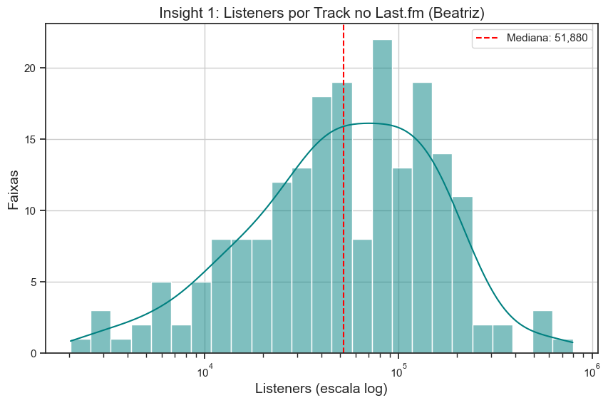
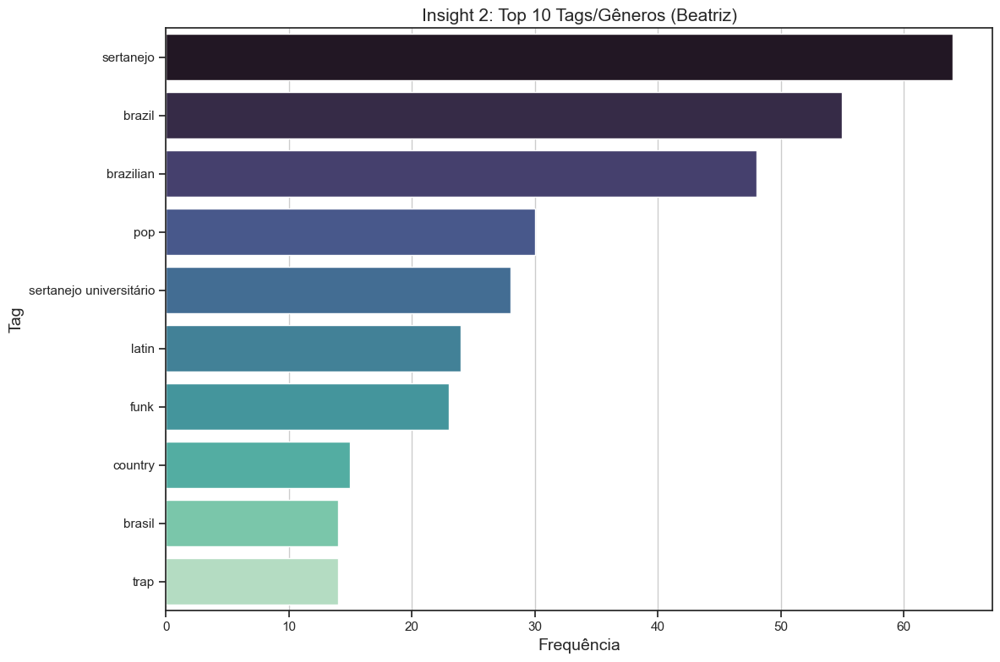
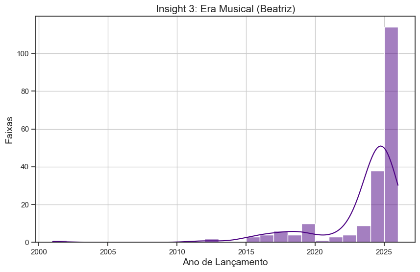
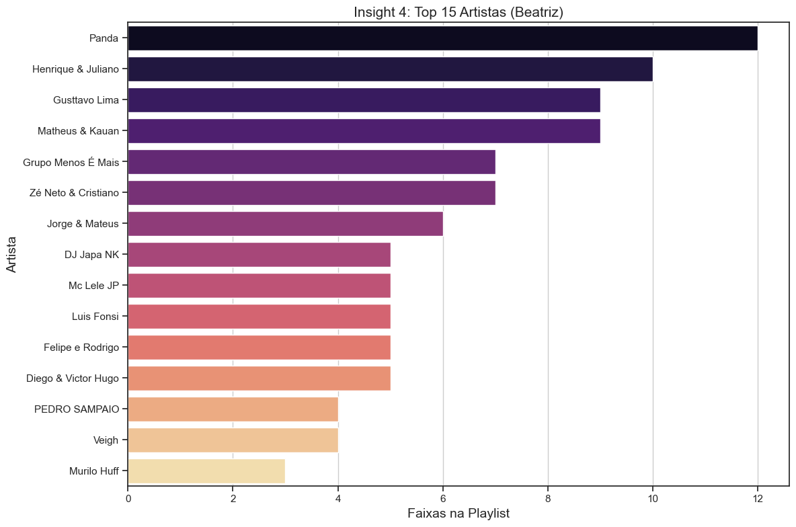
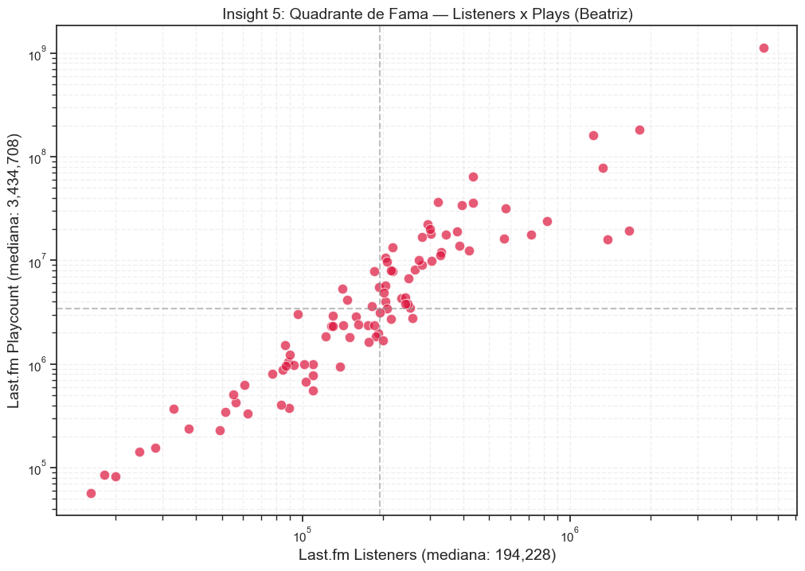
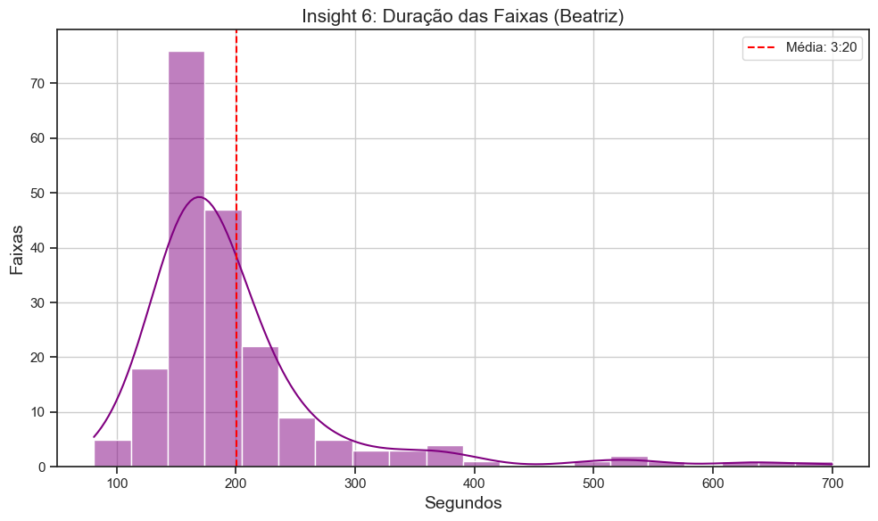

### 3.2.2 Daniel (O Foco Instrumental/Lo-fi)

> **Perfil Psicográfico:** Sempre pragmático e focado, Daniel nunca encarou a música como um componente central de sua identidade cultural, mas sim como uma infraestrutura cognitiva. Formado em Ciência da Computação, foi durante a graduação que descobriu o poder das paisagens sonoras como ferramenta de produtividade. Atualmente com 25 anos e atuando como desenvolvedor de software, seu consumo musical é estritamente utilitário. Sua busca na plataforma não é por artistas ou ídolos, mas por "funções": sonoridades para concentração profunda (deep work), batidas de baixa interferência para programação ou frequências relaxantes. Para Daniel, a música não é uma obra de arte a ser contemplada, mas um recurso bio-hackeável para otimizar desempenho e modulação de humor.

**Motivação Científica:** Esta persona foi desenhada para testar a capacidade dos algoritmos de respeitarem contextos funcionais em detrimento da popularidade. Daniel investiga o fenômeno da "Música de Mobília" (Furniture Music), onde a faixa serve como plano de fundo. A hipótese central é verificar se o sistema consegue manter a recomendação dentro de parâmetros acústicos específicos (alta instrumentalidade, baixa energia, sem vocais) ou se ocorrerá uma "contaminação Pop", onde o algoritmo tenta inserir faixas com vocais ou artistas famosos que quebram o fluxo de concentração, revelando uma incapacidade de distinguir "gosto musical" de "uso funcional".

**Validação Quantitativa do Input (Linha de Base):** Os dados de entrada confirmam a construção de um perfil altamente especializado e, paradoxalmente, anônimo. A biblioteca de Daniel apresenta uma **Mediana de Listeners por Artista de 79.6 mil** (Last.fm) — patamar característico da Cauda Longa do consumo musical — combinada com uma **Mediana de Listeners por Track de apenas 18.8 mil**. Esse contraste valida o fenômeno da Comoditização Musical: o usuário consome o "gênero" (Lo-fi Beats), ignorando completamente quem é o autor da obra.

A estrutura das faixas é radicalmente distinta do padrão mainstream. Com **Duração Média de apenas 2:17**, as músicas são projetadas para looping contínuo e consumo rápido em playlists de estudo. O viés de recência é o mais extremo do estudo: **98.5% das faixas pertencem à década de 2020** (Ano Médio 2024), evidenciando a natureza efêmera e industrial desse gênero, onde milhares de *beats* são lançados diariamente para alimentar algoritmos de foco.

A análise de tags revela um **mono-cluster temático**: as marcas `lo-fi` (93 ocorrências), `hip hop` (83), `downtempo` (78) e `instrumental` (77) dominam massivamente. A predominância de **70% artistas solo (Person)** confirma o ecossistema de *bedroom producers* — produtores independentes que operam em isolamento, contribuindo individualmente para o catálogo lo-fi industrial. A **Era de Carreira Mediana de 1987** (cobertura limitada: 20%, refletindo a invisibilidade de produtores obscuros nos catálogos do MusicBrainz) deve ser interpretada com cautela.

#### 3.2.2.1 Tabela de indicadores

| Indicador | Valor Obtido | Interpretação Científica |
| :--- | :--- | :--- |
| Listeners Mediano por Artista (Last.fm) | 79,595 | Zona de Cauda Longa: artistas com base de fãs ativa baixa (alguns milhares), mas com plays altos via consumo passivo. |
| Playcount Mediano por Artista (Last.fm) | 348,630 | Histórico cumulativo modesto, característico da era *streaming* funcional. |
| Listeners Mediano por Track (Last.fm) | 18,824 | Faixas projetadas para *background listening*, sem aspiração a *hit* cultural. |
| Entropia de Shannon (Artistas) | 6.27 (Máxima do estudo) | Pulverização Funcional; indiferença à autoria — o usuário consome o "gênero", não o "artista". |
| Coeficiente de Gini | 0.37 (Baixo-Médio) | Pouca concentração; distribuição quase uniforme entre os 99 produtores. |
| Riqueza (Artistas Únicos) | 99 (média 2.02 faixas/artista) | Consumo extremamente disperso. |
| Era de Carreira Mediana | 1987 (cob. 20%) | Cobertura limitada — muitos produtores lo-fi não têm registro no MusicBrainz; valor com baixa confiabilidade. |
| Tipo de Artista (MB) | 70% solo, 24% grupo | Confirma ecossistema de *bedroom producers* individuais. |
| Recência Temporal (Álbum) | 98.5% Anos 2020 | Produção Industrial/Efêmera; obsolescência rápida do catálogo. |
| Tags Dominantes (mb+lastfm) | lo-fi, hip hop, downtempo, instrumental | Hiper-especialização cognitiva; bloqueio ativo de vocais e dinâmicas intensas (Deep Work). |
| HHI de Tags | 0.055 (Baixo) | Tags concentradas em poucos termos relacionados ao mesmo cluster sonoro. |
| Estrutura (Duração) | Média 2:17 | Economia do Stream; *looping* contínuo em sessões longas. |

#### 3.2.2.2 Gráficos

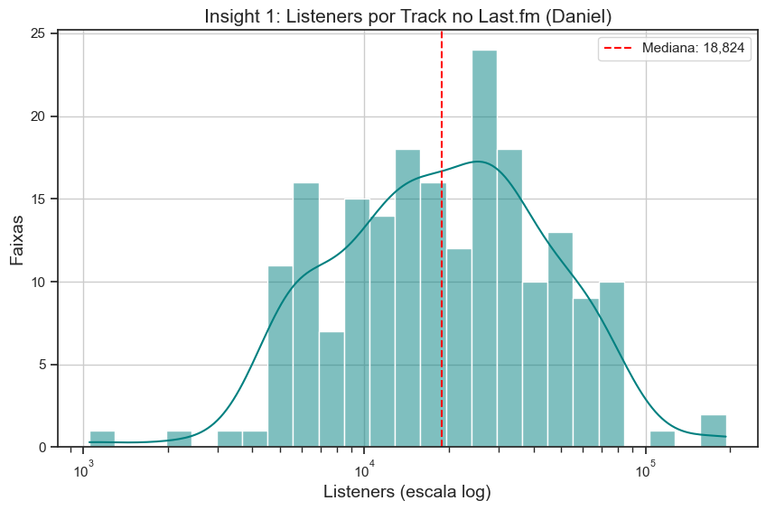
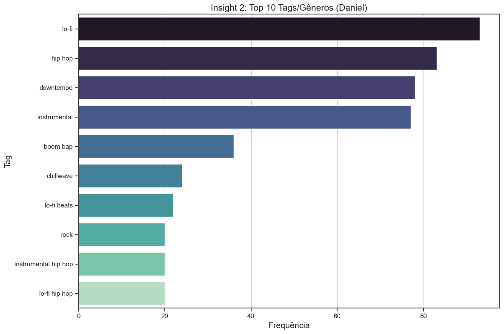
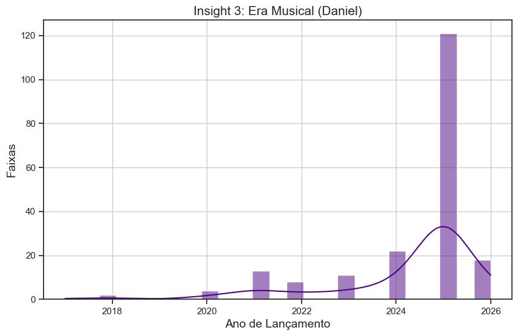
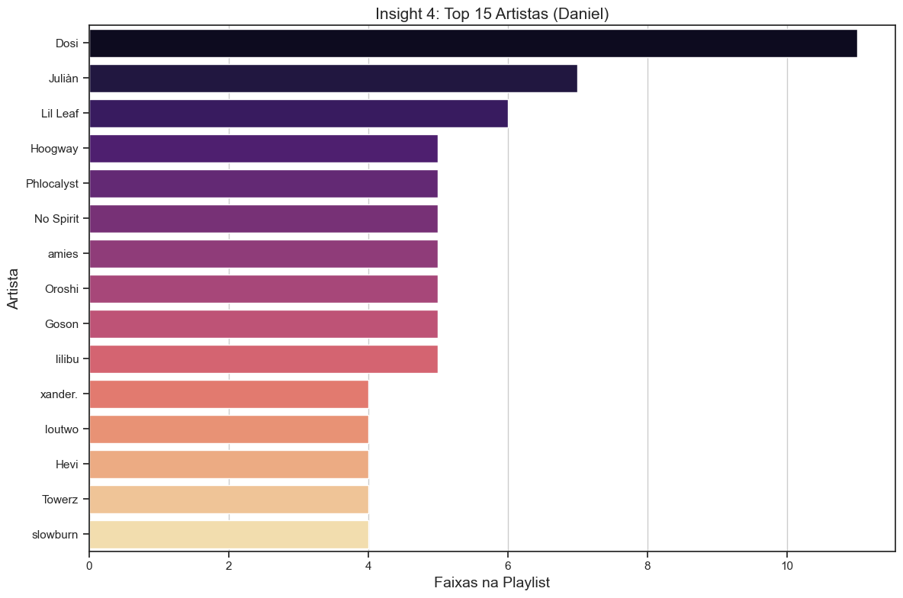
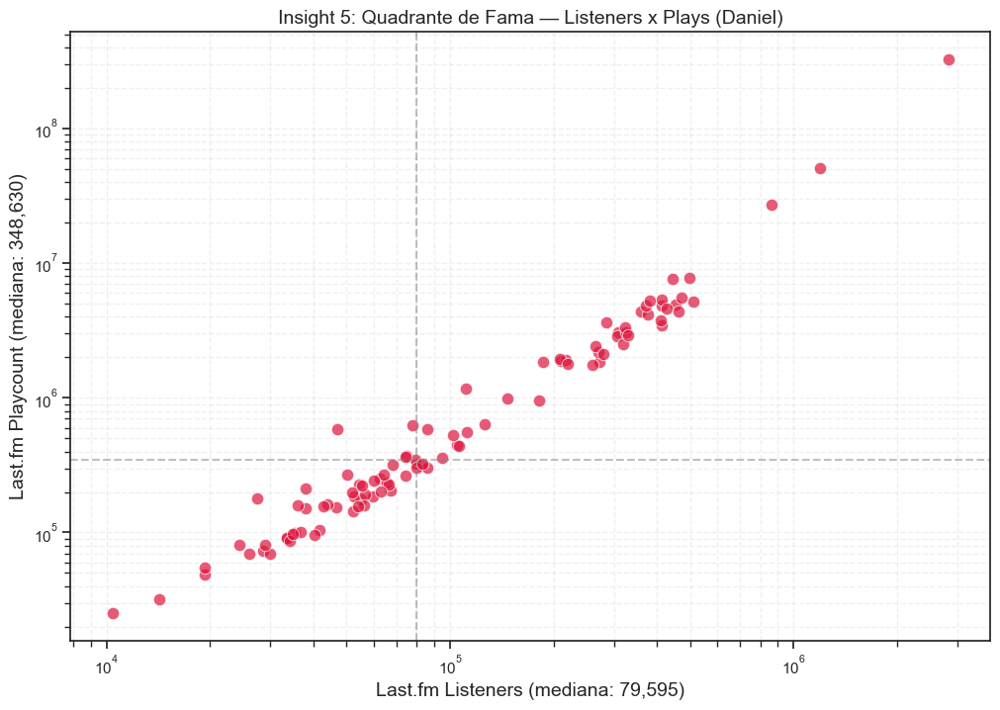
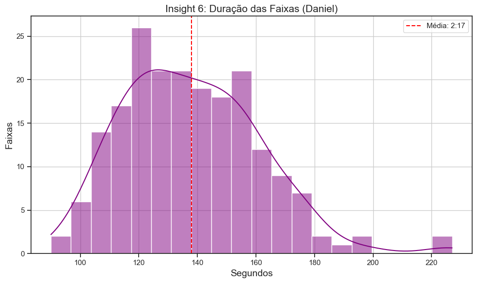

### 3.2.3 Sofia (A Consumidora de Nicho)

> **Perfil Psicográfico:** Nascida em 2002, Sofia cresceu na fronteira entre o físico e o digital, mas escolheu habitar os cantos mais silenciosos da internet. Formada em Design Gráfico, ela encara a música não como entretenimento de fundo, mas como uma extensão direta de sua identidade estética e emocional. Diferente da euforia coletiva de Beatriz, a experiência musical de Sofia é introspectiva e solitária, forjada em fóruns de discussão e blogs especializados (como o Rate Your Music) em vez de feeds de redes sociais de massa. Ela valoriza a autenticidade, a textura sonora e a "melancolia poética", buscando ativamente o que é raro. Sua postura é de curadoria ativa: Sofia não espera que o algoritmo lhe diga o que ouvir; ela garimpa, cataloga e preserva suas descobertas como artefatos digitais preciosos, temendo a banalização de seus "tesouros" pelo mainstream.

**Motivação:** Esta persona atua como o Caso de Borda (Edge Case) ou o teste da Cauda Longa (Long Tail). Sofia representa o desafio de personalização para usuários com gostos altamente específicos e baixa sobreposição com a massa de dados global. O objetivo é testar a capacidade do sistema de recomendação em operar com data sparsity (escassez de dados comportamentais coletivos), verificando se o algoritmo consegue manter a coerência estética de nicho ou se sofre de um viés de popularidade, sugerindo artistas famosos incorretamente na tentativa de preencher lacunas. Avalia-se aqui a precisão em micro-gêneros e a sensibilidade a texturas sonoras complexas.

**Validação Quantitativa do Input:** A análise dos metadados da biblioteca de Sofia confirma rigorosamente seu arquétipo de "Arqueóloga Digital" e consumidora underground. **A Mediana de Listeners por Track no Last.fm é de apenas 1,223** — três ordens de magnitude abaixo de Beatriz (51.879) e quase 16 vezes menor que Daniel — evidenciando que a grande maioria de seu consumo reside na obscuridade quase total do catálogo global. A Mediana de Listeners por Artista (59,042) também é a mais baixa do estudo, validando seu interesse pelo cenário independente.

O comportamento de consumo de Sofia é profundamente focado e leal, evidenciado pela **média de 7.41 faixas por artista** (segunda maior, atrás apenas de Ricardo). Enquanto a persona mainstream consome hits isolados, Sofia consome discografias e álbuns: artistas como S.Maharba, Eterna e Patch+ possuem 15 ou mais faixas cada em sua biblioteca, demonstrando uma escuta vertical e investigativa.

Temporalmente, ela compartilha o viés de contemporaneidade (Ano Médio 2021, com 77% das faixas na década de 2020), mas com um propósito diferente: ela busca a vanguarda experimental atual, não os sucessos de rádio. A distribuição de tags valida sua formação em design e gosto por atmosferas: há predominância de estilos baseados em textura e colagem sonora — `shoegaze`, `plunderphonics`, `cloud rap`, `IDM`, `lo-fi indie` — gêneros complexos que exigem análise de conteúdo de áudio (timbre/ritmo) mais apurada do que a simples filtragem colaborativa. A composição **61% solo, 39% grupos** (MusicBrainz) reflete a predominância individual típica de cenas independentes contemporâneas.

#### 3.2.3.1 Tabela de indicadores

| Indicador | Valor Obtido | Interpretação Científica |
| :--- | :--- | :--- |
| Listeners Mediano por Artista (Last.fm) | 59,042 | A mais baixa do estudo; isolamento quase total das tendências de massa. |
| Playcount Mediano por Artista (Last.fm) | 565,579 | Comunidades de nicho com fãs leais e ativos, gerando *plays* concentrados em audiência pequena. |
| Listeners Mediano por Track (Last.fm) | **1,223** | **Três ordens de magnitude abaixo do mainstream**; consumo na zona de obscuridade extrema do catálogo global. |
| Entropia de Shannon (Artistas) | 4.43 (Baixa) | Consumo Imersivo/Vertical; forte oposição à escuta passiva. |
| Coeficiente de Gini | 0.36 | Distribuição com algumas favoritas claras (S.Maharba, Eterna, Patch+ com 15+ faixas cada). |
| Riqueza (Artistas Únicos) | 27 (média 7.41 faixas/artista) | Escuta focada em discografia profunda — *active listening*. |
| Era de Carreira Mediana | 1984 (cob. 41%) | Cena experimental com mistura de pioneiros (anos 80-90) e contemporâneos. |
| Tipo de Artista (MB) | 61% solo, 39% grupo | Predominância de projetos individuais — característico de cenas independentes. |
| Recência Temporal (Álbum) | 77.0% Anos 2020 | Vanguarda contemporânea; busca do alternativo no tempo presente. |
| Tags Dominantes (mb+lastfm) | shoegaze, plunderphonics, cloud rap, IDM, lo-fi indie | Curadoria estético-textural; gêneros de alta complexidade tímbrica. |
| HHI de Tags | 0.024 (Mais baixo do estudo) | Maior diversidade tímbrica/conceitual entre as personas. |
| Estrutura (Duração) | Média 2:57 (range 0:06 – 7:04) | Flexibilidade artística; rejeição à padronização (vinhetas a épicos). |

#### 3.2.3.2 Gráficos

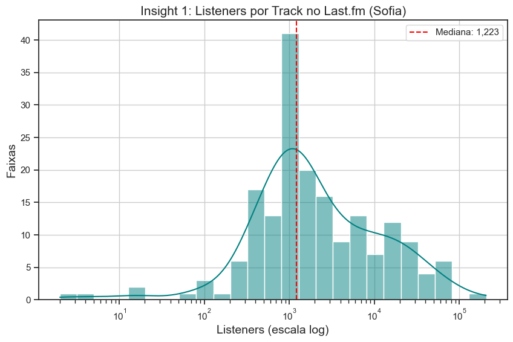
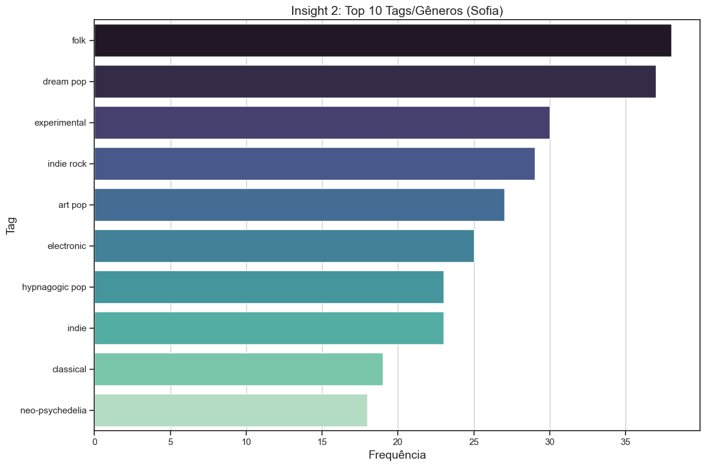
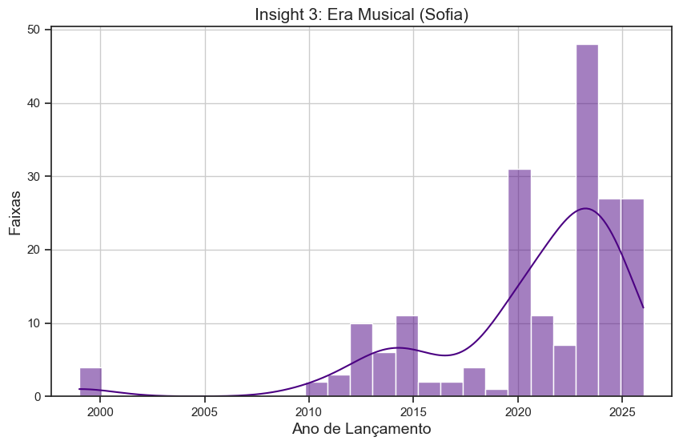
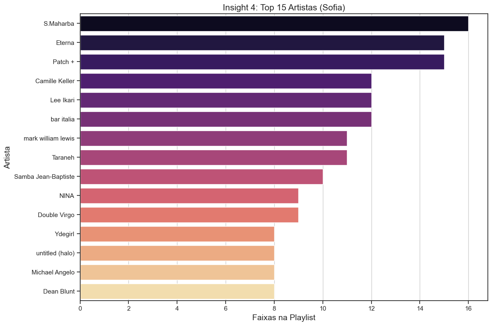
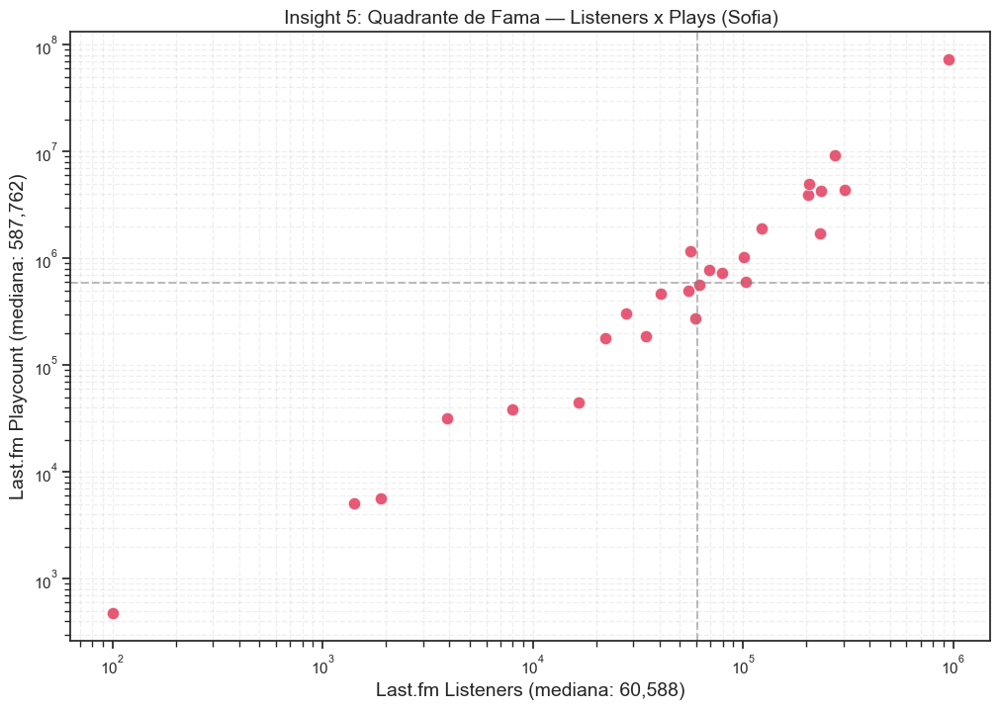
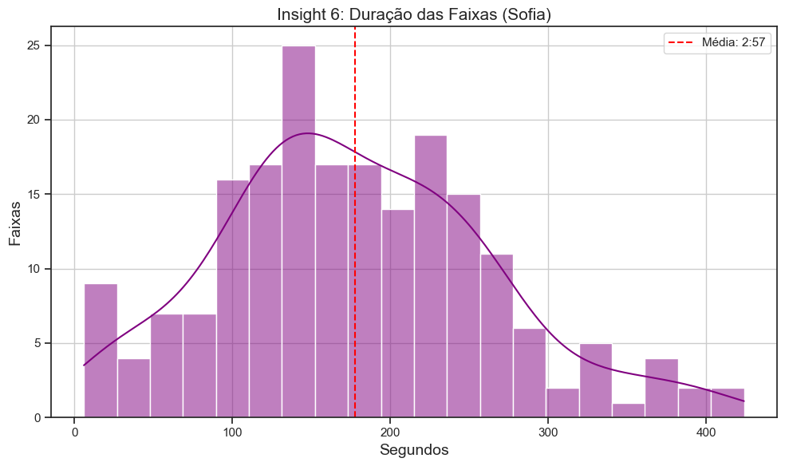

### 3.2.4 Ricardo (O Consumidor Nostálgico)

**Perfil Psicográfico:** Nascido em 1982, Ricardo representa a transição da era analógica para a digital. Sua formação musical ocorreu na "Era de Ouro" da indústria fonográfica física (anos 90), moldada pela escassez e pela valorização do objeto: a gravação de fitas K7, a compra ritualística de LPs e a apreciação de álbuns completos. Como Engenheiro Civil, ele possui uma abordagem estruturada e crítica em relação ao consumo; para ele, a música deve possuir narrativa, complexidade instrumental e autenticidade técnica. Embora utilize o streaming por conveniência, sua mentalidade permanece a de um colecionador. Ricardo exibe uma forte resistência algorítmica: ele desconfia da superficialidade das "curadorias automáticas" e prefere atuar como o guardião do "bom gosto" em seu círculo social, utilizando momentos de lazer (como churrascos) para educar as gerações mais novas sobre os clássicos do Rock e da MPB.

**Motivação:** Esta persona atua como o Controle Temporal (Legacy Control) do experimento. Ricardo desafia o sistema de recomendação a lidar com o "Viés de Recência" (Recency Bias). O objetivo é verificar se o algoritmo consegue distinguir entre "Alta Popularidade Atual" e "Alta Popularidade Histórica". Testa-se a capacidade do modelo em recomendar "Deep Cuts" (faixas menos conhecidas de artistas famosos) e se ele é capaz de sair do loop temporal, sugerindo, por exemplo, bandas novas que tenham a sonoridade "Classic Rock" (Greta Van Fleet, por exemplo) ou se ficará preso recomendando apenas reedições das décadas de 70 e 80, gerando um estagnamento de descoberta.

**Validação Quantitativa do Input:** A análise dos metadados valida robustamente o arquétipo do ouvinte "Saudosista e Leal". A biblioteca exibe a **Mediana de Listeners por Artista mais alta do estudo** — **4.4 milhões** no Last.fm — e uma **Mediana de Playcount Histórico cumulativo de 144,5 milhões**, evidenciando que Ricardo consome "Lendas da Música" e "Gigantes do Estádio" (Metallica, Queen, Rolling Stones, Beatles). A **Mediana de Listeners por Track de 311 mil** corrobora que mesmo as faixas individuais escolhidas são singles de grande exposição.

O indicador mais forte de seu comportamento de "escuta de álbum" (em oposição à escuta de playlist) é a **Concentração de Artistas**: com apenas **18 artistas únicos para 200 músicas** (média 11.11 faixas/artista), Ricardo apresenta a **menor entropia de Shannon do estudo (4.10) e Gini de 0.18** (mínimo de desigualdade — todos os 18 artistas têm peso comparável). Isso confirma que ele não consome apenas os *greatest hits*, mas mergulha na discografia profunda de seus ídolos (ex: 16 faixas de Djavan e Metallica).

Temporalmente, o input é deslocado para o século passado, com Ano Médio de Lançamento de 1985 e mais de 81% das faixas concentradas entre as décadas de 70, 80 e 90. A análise de **Era de Carreira no MusicBrainz** (cobertura 100% — todos os 18 artistas têm registro completo) confirma com **mediana de 1965** que a seleção concentra-se em artistas que iniciaram carreira na "Era de Ouro" da indústria fonográfica. **66.7% dos artistas são bandas (Group)**, refletindo a centralidade do *band format* no rock clássico, em contraste com a predominância solo das demais personas. Estruturalmente, a playlist rejeita a economia da atenção atual: Duração Média de 4:33, com faixas chegando a quase 9 minutos.

#### 3.2.4.1 Tabela de indicadores

| Indicador | Valor Obtido | Interpretação Científica |
| :--- | :--- | :--- |
| Listeners Mediano por Artista (Last.fm) | **4,412,516** | Zona de consagração histórica; o mais alto do estudo. Lendas globais com bases de fãs ativas de milhões. |
| Playcount Mediano por Artista (Last.fm) | **144,558,091** | Histórico cumulativo enorme — décadas de plays acumulados. Validação canônica plena. |
| Listeners Mediano por Track (Last.fm) | 311,105 | Singles consagrados; todas as faixas têm exposição internacional sustentada. |
| Entropia de Shannon (Artistas) | **4.10 (Mínima do estudo)** | Baixa **riqueza** (poucos artistas), não concentração: a evenness de Pielou (0,98) confirma distribuição uniforme. Fidelidade canônica via imersão em discografias, não monocultura. |
| Coeficiente de Gini | **0.18 (Mínimo do estudo)** | Distribuição quase uniforme entre os 18 artistas — todos com 8-16 faixas. |
| Riqueza (Artistas Únicos) | **18 (média 11.11 faixas/artista)** | Album-Oriented Rock — escuta de discografia, não de playlist. |
| Era de Carreira Mediana (MB) | **1965 (cob. 100%)** | Era de Ouro da indústria fonográfica; cobertura integral confirma artistas plenamente documentados. |
| Tipo de Artista (MB) | **66.7% grupo, 33.3% solo** | Predominância de bandas, refletindo o *band format* do rock clássico. |
| Recência Temporal (Álbum) | Ano Médio 1985 (>81% entre 70s-90s) | Cristalização temporal; viés de nostalgia ativo. |
| Tags Dominantes (mb+lastfm) | rock, classic rock, hard rock, MPB, bossa nova | Purismo analógico; instrumentação orgânica e virtuosismo técnico. |
| HHI de Tags | 0.054 | Concentração moderada; cluster temático claro mas não monolítico. |
| Estrutura (Duração) | Média 4:33 (range 2:02 – 8:35) | Narrativa progressiva; rejeição à economia da atenção atual. |

#### 3.2.4.2 Gráficos

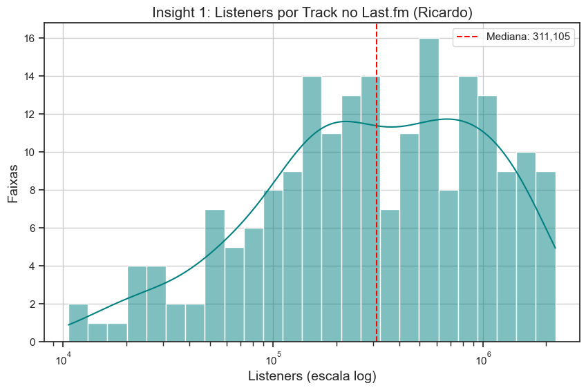
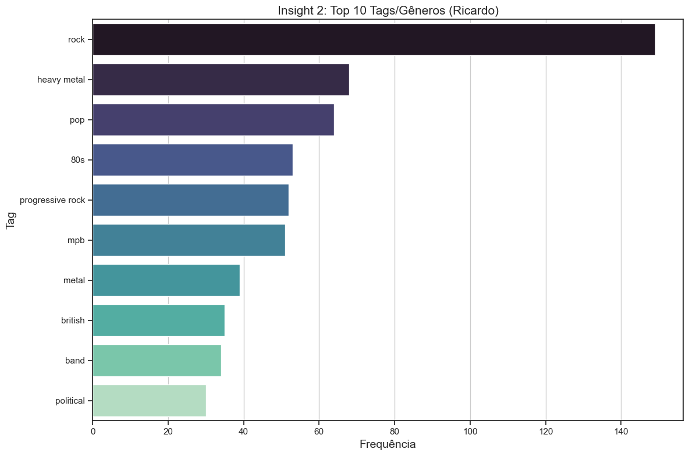
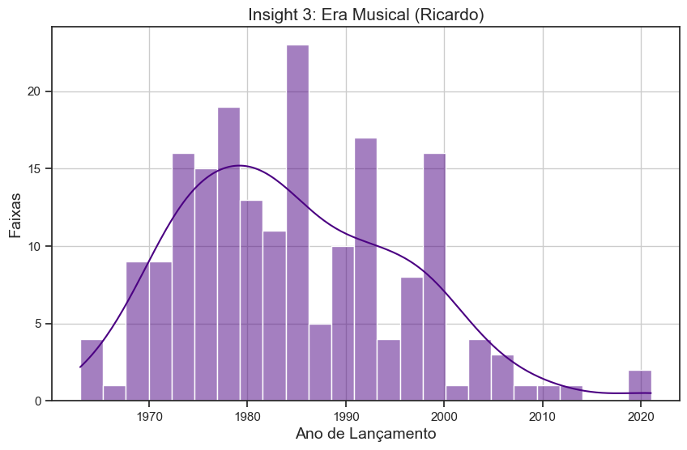
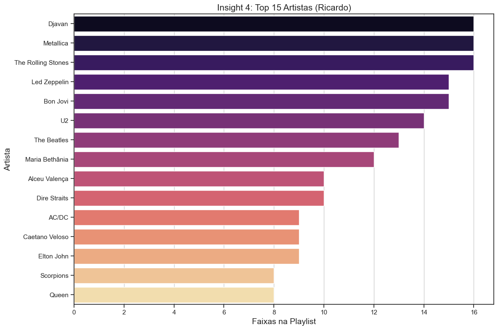
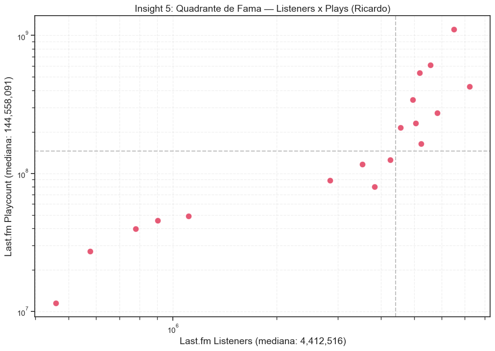
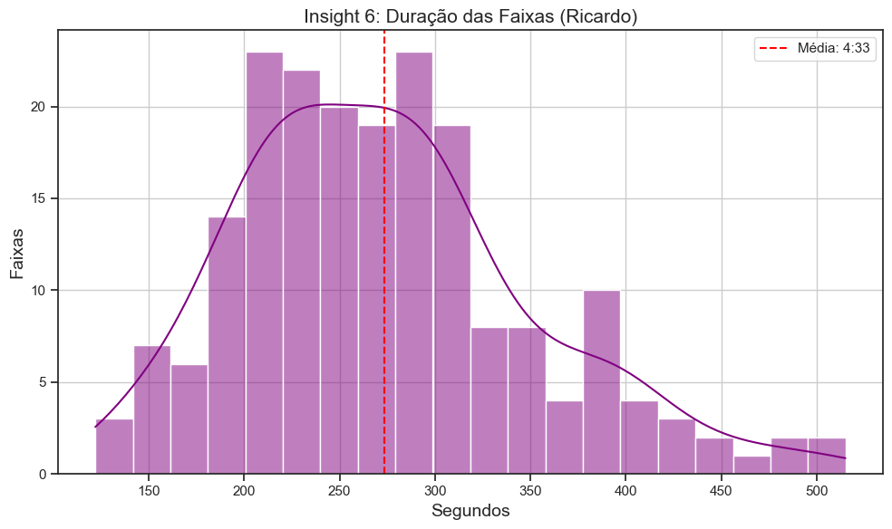

## 3.3 Análise Comparativa e Validação dos Estímulos (Inputs)

Para assegurar a integridade da auditoria, é imperativo validar se as personas geradas representam, de fato, *clusters* comportamentais distintos e independentes. Esta etapa de **Validação Cruzada** (*Cross-Validation*) tem como objetivo demonstrar a ortogonalidade dos vetores de entrada: comprovar que os quatro perfis ocupam quadrantes separados no espaço vetorial de consumo, minimizando o risco de contaminação cruzada no estágio inicial (*Cold Start*).

Esta validação estabelece a **Linha de Base** (*Baseline*) do experimento. A confirmação de que não há sobreposição significativa entre os conjuntos de dados iniciais é pré-requisito para a inferência causal futura: qualquer convergência observada nas recomendações (*Outputs*) poderá ser atribuída ao viés de homogeneização do sistema, e não à similaridade original dos usuários.

### 3.3.1 Métricas de Diversidade e Entropia da Informação

A aplicação de indicadores de diversidade revela as diferenças estruturais na "dieta informacional" de cada persona. A Tabela abaixo apresenta a Entropia de Shannon (incerteza/variedade), a **Evenness de Pielou** ($J = H/\log_2 S$, que normaliza a Shannon pelo seu teto teórico e isola a *uniformidade* da *riqueza*; PIELOU, 1966), o Coeficiente de Gini (desigualdade de atenção) e a Riqueza (artistas únicos, $S$). Estas métricas dependem apenas da contagem de artistas únicos e suas frequências, não foram afetadas pela transição de fonte e mantêm os valores originalmente computados.

| Persona | Entropia (Shannon) | Evenness (Pielou) | Desigualdade (Gini) | Riqueza ($S$) | Interpretação Estrutural |
| :--- | :--- | :--- | :--- | :--- | :--- |
| **Beatriz** | 6.03 (Alta) | 0.92 | 0.42 (Média) | 94 | **Consumo Exploratório/Caótico**; reflete a natureza do ouvinte de *hits*, com alta rotatividade e baixa fidelidade a álbuns específicos. |
| **Daniel** | 6.27 (Máxima) | 0.95 | 0.37 (Baixa) | 99 | **Pulverização Funcional**; o consumo é focado na utilidade da "faixa" e não na identidade do "artista", gerando a maior entropia do grupo. |
| **Ricardo** | 4.10 (Mínima) | **0.98** | 0.18 (Mínima) | 18 | **Baixa riqueza, alta uniformidade**; a Shannon mínima decorre do número reduzido de artistas (18), e *não* de concentração — a evenness de Pielou (0,98) e o Gini mínimo (0,18) mostram que os 18 artistas têm peso quase idêntico. |
| **Sofia** | 4.43 (Baixa) | 0.93 | 0.36 (Baixa) | 27 | **Curadoria Seletiva**; foco em *Deep Cuts* de poucos artistas de nicho, indicando uma escuta vertical e investigativa. |

> **Análise:** O ponto decisivo é que a **Evenness de Pielou é alta e praticamente plana (0,92–0,98) em todas as personas**. Isso significa que as grandes diferenças de Entropia de Shannon entre os perfis (4,10 a 6,27) **não decorrem de diferenças de uniformidade, mas de diferenças de riqueza** ($S$): Ricardo tem Shannon baixa porque consome *poucos* artistas (18), não porque os distribui de forma desigual — ao contrário, sua distribuição é a mais uniforme do estudo. Essa distinção entre riqueza e uniformidade é central para a leitura correta do Capítulo 4, onde se demonstra que a "convergência" da Shannon nos *outputs* é, na verdade, **expansão de riqueza de catálogo** com a evenness preservada, e não homogeneização de entropia.

### 3.3.2 Distribuição de Mercado (Cauda Longa)

A análise da estratificação econômica dos artistas valida a hipótese de polarização entre "Cabeça" (*Head*) e "Cauda" (*Tail*) da distribuição de Pareto. Os limiares de classificação foram **calibrados via percentis sobre um pool único** que combina os oito conjuntos do estudo (quatro *inputs* + quatro *outputs*, deduplicados por artista: 557 artistas), resultando em **P25 = 65.376** e **P75 = 474.962** *listeners* no Last.fm. Essa **régua única** — idêntica para *input* e *output* — substitui os limiares absolutos baseados em *followers* do Spotify (deprecados em 02/2026) e torna os *tiers* diretamente comparáveis entre estímulo e recomendação; calibrá-los separadamente por *source* produziria classificações incomparáveis.

| Persona | % Superstars (>P75) | % Médios (P25–P75) | % Cauda Longa (≤P25) | Perfil Econômico |
| :--- | :--- | :--- | :--- | :--- |
| **Beatriz** | 10.6% | 75.5% | 13.8% | **Consumidora de Massa**; concentração em Médios brasileiros (sertanejo, funk) com cauda inexpressiva. |
| **Ricardo** | **94.4%** | 5.6% | 0.0% | **Consumidor de Legado**; foco quase exclusivo em gigantes consagrados (a quase totalidade dos 18 artistas no topo do ranking de *listeners*). |
| **Daniel** | 5.1% | 54.5% | **40.4%** | **Consumidor Funcional Misto**; a fronteira entre *bedroom producers* nicho e produtores estabelecidos que viralizaram em playlists editoriais. |
| **Sofia** | 3.7% | 40.7% | **55.6%** | **Consumidora Subcultural**; majoritariamente cauda longa, com algumas exceções de artistas indie já consolidados. |

> **Análise:** O contraste entre Ricardo (94,4% Superstars) e Sofia (55,6% Cauda Longa) cria o cenário ideal para auditar o viés econômico: permitirá verificar se o algoritmo tenta forçar uma "gentrificação" do gosto de Sofia, empurrando-a em direção à média de mercado para maximizar a retenção. O uso de uma régua única (input + output) também garante que qualquer deslocamento de *tier* observado no Capítulo 4 seja atribuível ao algoritmo, e não a uma diferença de calibração entre os conjuntos.

### 3.3.3 Análise Visual Cruzada e Topologia dos Dados

As visualizações a seguir sintetizam graficamente as diferenças estruturais entre as quatro personas, comprovando a heterogeneidade da amostra inicial através de uma análise topológica dos dados. O objetivo destas representações é demonstrar a **ortogonalidade dos perfis**: cada persona ocupa uma região distinta no espaço vetorial de consumo.

**A) Matriz de Similaridade (Índice de Jaccard)**
Esta matriz atua como a prova definitiva do isolamento experimental. A predominância absoluta de valores nulos (0.00) ou próximos a zero nas interseções entre personas confirma que não há compartilhamento de repertório. Isso garante que o estado de *Cold Start* é único para cada agente, estabelecendo condições ideais de laboratório para verificar convergências futuras.

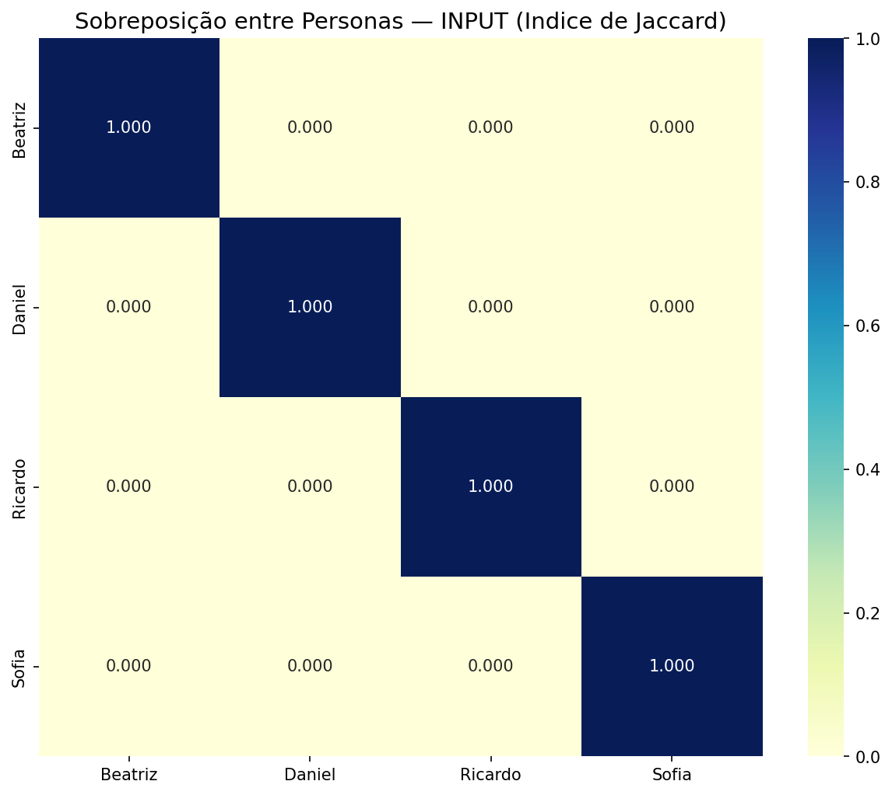

**B) Mapeamento da Economia da Atenção (Scatter Plot: Popularidade x Seguidores)**
Este gráfico espacializa a Teoria da Cauda Longa (*The Long Tail*).
* **Quadrante Superior Direito (Head):** Ocupado por Ricardo e Beatriz, representando o consumo de alta visibilidade e capital social.
* **Quadrante Inferior Esquerdo (Tail):** Ocupado por Sofia e Daniel, representando a zona de obscuridade e nicho.
A clara separação visual valida a capacidade do experimento de auditar o viés algorítmico em diferentes estratos de poder econômico, testando se o sistema privilegia quem já possui fama.

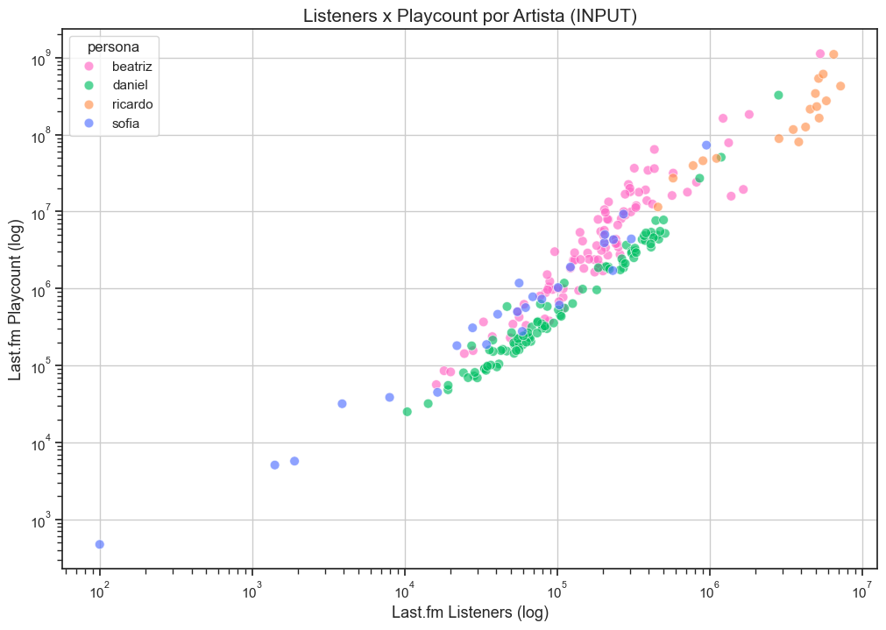

**C) Cronologia do Consumo (Distribuição Temporal)**
A visualização de densidade temporal (*KDE Plot*) valida o controle da variável "Tempo". Observa-se a sobreposição das curvas de Daniel, Beatriz e Sofia na extrema direita (anos 2020), enquanto a curva de Ricardo se isola à esquerda (século XX). Este gráfico serve como linha de base para medir o **Viés de Recência**: deslocamentos futuros da curva de Ricardo para a direita indicarão uma tentativa do sistema de impor novidades a um perfil conservador.

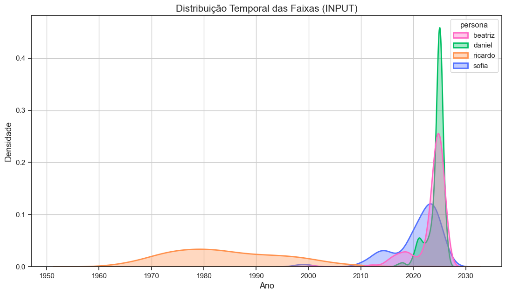

**D) Curva de Lorenz (Concentração de Artistas)**
O gráfico ilustra a desigualdade na distribuição de atenção. A curva de Ricardo (mais distante da diagonal perfeita) confirma visualmente sua fidelidade monástica a poucos artistas, enquanto a curva de Beatriz (mais próxima da diagonal) demonstra um consumo pulverizado. Essa métrica será essencial para auditar se o algoritmo respeita a profundidade de catálogo ou se tende a fragmentar a experiência de escuta.

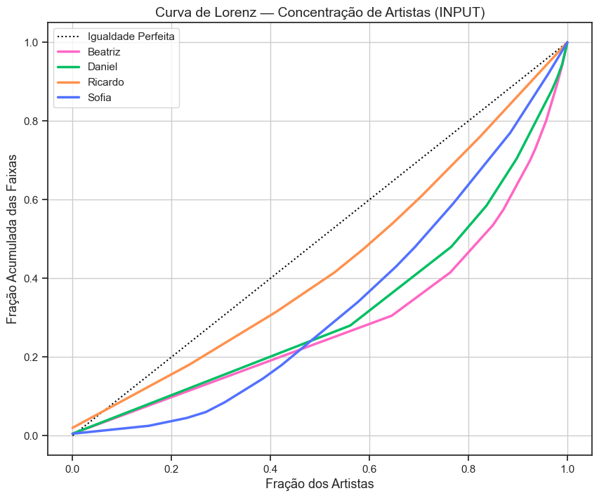

## 3.4 Síntese Metodológica e Limitações

A estrutura metodológica aqui apresentada estabelece um ambiente controlado e auditável para a investigação dos algoritmos de recomendação. A validação estatística dos *inputs* confirma que as quatro personas sintéticas — Beatriz, Daniel, Sofia e Ricardo — constituem instrumentos de medição calibrados, representando vetores de comportamento distintos e isolados.

As métricas de diversidade (Shannon), desigualdade (Gini) e similaridade (Jaccard) calculadas nesta etapa formam a **Linha de Base (Baseline)** do estudo. Nos capítulos subsequentes, esses mesmos indicadores serão reaplicados sobre as listas de recomendação geradas pelo Spotify (*Daily Mix 1–6*), permitindo a comparação *Input vs. Output*.

A comparação direta entre os valores de *Input* (apresentados neste capítulo) e os valores de *Output* (a serem analisados no Capítulo 4) revela o "Delta Algorítmico": a magnitude e a direção da interferência do sistema sobre o gosto do usuário. Dessa forma, será possível responder aos objetivos da pesquisa, determinando se a plataforma atua como um espelho fiel das preferências do usuário ou como um prisma que distorce a diversidade cultural em favor de padrões comerciais hegemônicos.

### 3.4.1 Limitações Metodológicas e Achado Original

#### A) Pré-requisito não-trivial de Incubação Algorítmica

Verificou-se empiricamente que o sistema do Spotify **não materializa as playlists personalizadas** (*Daily Mix*, *Discover Weekly*, *Release Radar*) apenas com base em *likes* e *follows* declarados pelo usuário. A geração desses produtos exige um histórico mínimo de **escuta efetiva**, funcionando como sinal implícito de validação. Para satisfazer este pré-requisito, conduziu-se aproximadamente **40 horas de escuta no modo "Aleatório Inteligente" (*Smart Shuffle*)** por conta-persona — totalizando ~160 horas de incubação somadas. A escolha do *Smart Shuffle* (em detrimento do *shuffle* puro) é deliberada: este modo intercala faixas curtidas com sugestões algorítmicas, garantindo registro de interação tanto com o input declarado (*likes*) quanto com recomendações exploratórias.

Este pré-requisito constitui uma **observação metodológica original** desta pesquisa, raramente documentada na literatura de auditoria algorítmica musical. Estudos futuros que tentem replicar este pipeline sem a etapa de incubação ativa **não conseguirão coletar os outputs algorítmicos**.

#### B) Achado Central — Obstrução Progressiva da API como Meta-Evidência

Durante o período de execução desta pesquisa (2025-2026), a Spotify Web API sofreu **três ondas progressivas e parcialmente não-anunciadas de restrição**, conforme detalhado na seção 3.1.3:

1. **Onda 1 (Nov/2024):** remoção do acesso a playlists algorítmicas para apps em modo *development*.
2. **Onda 2 (Fev/2026):** exigência de Premium para o titular do app, limitação a 5 usuários autorizados, depreciação do endpoint `/playlists/{id}/tracks` e restrição de `/items` a apenas dono ou colaborador.
3. **Onda 3 (Fev/2026, sem changelog público):** remoção sistemática dos campos `popularity`, `followers` e `genres` das respostas dos endpoints `/artists`, `/tracks`, `/albums` e `/search`.

**A natureza progressiva, parcialmente não-anunciada e unilateral dessas restrições constitui em si um achado científico relevante** desta pesquisa. Ela ilustra empiricamente o argumento central da Introdução sobre a **opacidade e a governança algorítmica** das plataformas de streaming: o próprio instrumental técnico necessário à auditoria foi sendo obstruído **durante** a execução do experimento. Esta observação configura-se como **meta-evidência** da assimetria informacional entre plataformas de *streaming* e atores externos (incluindo pesquisadores acadêmicos), reforçando a urgência metodológica de estudos como este. Tal opacidade e a estratégia de investigá-la "por dentro", mediante contas sintéticas, alinham-se ao método etnográfico-experimental de Eriksson et al. (2019) em *Spotify Teardown*, que já denunciava a resistência da plataforma ao escrutínio independente.

#### C) Resposta Metodológica — Apples-to-Apples via Fontes Externas

Para preservar o rigor e a comparabilidade *Input vs. Output*, adotou-se a substituição das métricas comprometidas por dados de **fontes externas consagradas** (Last.fm + MusicBrainz), aplicadas consistentemente aos dois lados da auditoria. Esta solução transforma a limitação em oportunidade — a pesquisa passa a se ancorar em três bases de dados independentes (Spotify para *tracks*/álbuns/datas; Last.fm para audiência/gêneros; MusicBrainz para *life-span*/tipo/região), aumentando a triangulação metodológica e a robustez epistemológica.

A **cobertura empírica** alcançada foi de 100% das faixas com ao menos dados do Last.fm; a cobertura simultânea de ambas as fontes externas varia por persona (86,7% a 100%), sendo mais baixa para o perfil *underground* (Sofia) — fato que dialoga com o viés de cobertura geocultural discutido a seguir. Os limiares de classificação em Cauda Longa foram **recalibrados via percentis num pool único de *input* + *output***, substituindo limiares absolutos não-transferíveis.

#### D) Outras Limitações

- **Cobertura do MusicBrainz para *bedroom producers*:** A análise de *life-span* (`mb_career_start`) cobre 100% dos artistas de Ricardo (todos consagrados), mas apenas 20% dos artistas de Daniel, refletindo a invisibilidade de produtores lo-fi obscuros nos catálogos institucionais. A métrica "Era de Carreira Mediana" deve ser interpretada com cautela para perfis de nicho.
- **Viés geocultural do Last.fm:** as bases Last.fm e MusicBrainz subcontam artistas brasileiros (sertanejo, funk, indie nacional) frente ao repertório anglófono global, fenômeno documentado na literatura de vieses de fonte. Isso se manifesta nos próprios dados: a cobertura simultânea das duas fontes cai para 86,7% em Sofia (*underground* nacional/experimental), e a composição por país (`mb_country`) varia fortemente entre personas (de 0% de artistas BR identificados em Daniel a 61,8% em Beatriz no *input*). A consequência metodológica é que os *listeners*/tiers de artistas brasileiros podem estar subestimados por **artefato de cobertura**, e não por menor popularidade real. Por isso, os deltas *within-persona* (input → output do mesmo perfil) são mais defensáveis do que as comparações *cross-persona* de magnitude absoluta de audiência.
- **Generalização limitada:** Os resultados refletem o comportamento do algoritmo do Spotify para perfis brasileiros configurados em abril de 2026; extensões para outros mercados ou momentos exigem replicação independente.
- **Possível variabilidade temporal:** Os *Daily Mixes* são atualizados continuamente. A coleta foi feita em janela curta (mesma semana de 28/04/2026) para minimizar variabilidade, mas estudos longitudinais futuros seriam metodologicamente mais robustos.

# 4 RESULTADOS: ANÁLISE DOS OUTPUTS E O DELTA ALGORÍTMICO

Concluída a fase de validação dos *inputs* (Capítulo 3), o presente capítulo apresenta a análise empírica dos *outputs* algorítmicos coletados — as faixas que o Spotify recomendou aos quatro perfis sintéticos por meio dos *Daily Mixes*, após o período de incubação descrito na seção §3.4.1. O objetivo central deste capítulo é responder à pergunta condutora da pesquisa: **em que magnitude e direção o algoritmo de recomendação distorce o perfil declarado de cada usuário?**

A análise é estruturada em quatro etapas: (i) apresentação descritiva dos *outputs* coletados; (ii) cálculo da Taxa de Overlap Interno (redundância dentro da bolha de cada persona); (iii) análise do Delta Algorítmico — comparação direta *Input vs. Output* das treze métricas centrais; e (iv) síntese e teste das quatro hipóteses formuladas no Capítulo 2.

## 4.1 Apresentação dos Outputs Coletados (Daily Mixes)

Após o período de incubação algorítmica (~40 horas de escuta efetiva por persona, em modo *Smart Shuffle*), o sistema do Spotify gerou seis *Daily Mixes* para cada conta. Estas playlists foram copiadas manualmente para playlists espelho de propriedade de cada persona — *workaround* necessário em virtude da Onda 1 de restrição da API (§3.1.3). Durante o procedimento de cópia, faixas duplicadas entre os seis *mixes* foram automaticamente filtradas pelo próprio cliente do Spotify, gerando o conjunto final consolidado.

A Tabela 4.1 sintetiza o volume de dados coletados:

**Tabela 4.1 — Volume e cobertura dos Outputs**

| Persona | Faixas únicas (Output) | Faixas (Input) | Δ tamanho | Artistas únicos (Output) | Cobertura ambas as fontes (Last.fm + MB) |
| :--- | :---: | :---: | :---: | :---: | :---: |
| Beatriz | 276 | 200 | +38.0% | 121 | 100.0% |
| Daniel | 281 | 200 | +40.5% | 115 | 98.6% |
| Ricardo | 268 | 200 | +34.0% | 126 | 100.0% |
| Sofia | 264 | 200 | +32.0% | 90 | 86.7% |

> **Observação:** o tamanho dos *outputs* é sistematicamente maior que o dos *inputs* (200 faixas) — efeito direto dos seis *Daily Mixes* contendo aproximadamente 50 faixas cada (~300 faixas brutas, das quais 6-12% são duplicatas removidas). **100% das faixas** obtiveram ao menos dados do Last.fm; a coluna acima reporta a cobertura *simultânea* das duas fontes. A cobertura mais baixa de Sofia (86,7%) reflete a menor presença de artistas *underground* no MusicBrainz — viés de cobertura discutido em §3.4.

## 4.2 Taxa de Overlap Interno: Redundância Intra-Persona

Esta métrica original do estudo quantifica quanto o algoritmo "**insiste nas mesmas faixas**" entre os seis clusters (*Daily Mixes*) gerados para uma mesma persona. Operacionalmente, é calculada como:

$$\text{Overlap Interno} = \frac{300 - N}{300}$$

…onde $N$ é o número de faixas únicas após dedupe (e 300 representa o pool bruto estimado de seis *mixes* × 50 faixas). Quanto maior a taxa, mais redundante é o conjunto de clusters — sinal de uma "bolha de filtro" mais estreita imposta pelo algoritmo.

**Tabela 4.2 — Taxa de Overlap Interno entre os Daily Mixes**

| Persona | Faixas únicas (N) | Duplicatas | **Taxa de Overlap Interno** | Interpretação |
| :--- | :---: | :---: | :---: | :--- |
| Daniel | 281 | 19 | **6.33%** | Variedade alta dentro do nicho lo-fi (algoritmo encontra muito material) |
| Beatriz | 276 | 24 | 8.00% | Variedade moderada (catálogo brasileiro mainstream amplo) |
| Ricardo | 268 | 32 | 10.67% | Redundância média (catálogo clássico tem repertório finito de "lendas") |
| **Sofia** | **264** | **36** | **12.00%** | **Maior redundância** — bolha mais estreita |

> **Indicador exploratório (com ressalvas):** O perfil **Sofia** apresenta a maior taxa de redundância entre as quatro personas, sugerindo que, com menos diversidade no *input* declarado (27 artistas únicos contra 99 de Daniel), o algoritmo tende a repetir faixas entre *clusters*. Esta leitura deve ser tomada como **indicador exploratório, e não como achado consolidado**, por duas limitações estruturais: (i) a métrica é uma transformação determinística e decrescente do número de faixas únicas — fixado o pool em 300, $(300-N)/300$ não acrescenta informação independente do próprio $N$; e (ii) a deduplicação entre os seis *Daily Mixes* foi feita automaticamente pelo cliente do Spotify *antes* da contagem (§4.1), de modo que o valor bruto do pool (estimado em 6 × 50 = 300) é uma suposição não verificável e o overlap real não é recuperável. A amplitude observada é estreita (6,33% a 12,00%) e majoritariamente explicada pelo menor número de faixas únicas de Sofia; evita-se, portanto, qualquer leitura causal forte de "bolha de filtro" a partir deste indicador, reservando-se a evidência de estreitamento às métricas de Jaccard cross-persona (§4.5).

## 4.3 O Delta Algorítmico — Visão Geral

O *Delta Algorítmico* é o resultado quantitativo central deste estudo: a diferença entre o valor de cada métrica no *Output* (recomendações algorítmicas) e no *Input* (perfil declarado pelo usuário), expresso em variação percentual. A Figura 4.1 condensa os deltas de **treze métricas × quatro personas** em uma única visualização:

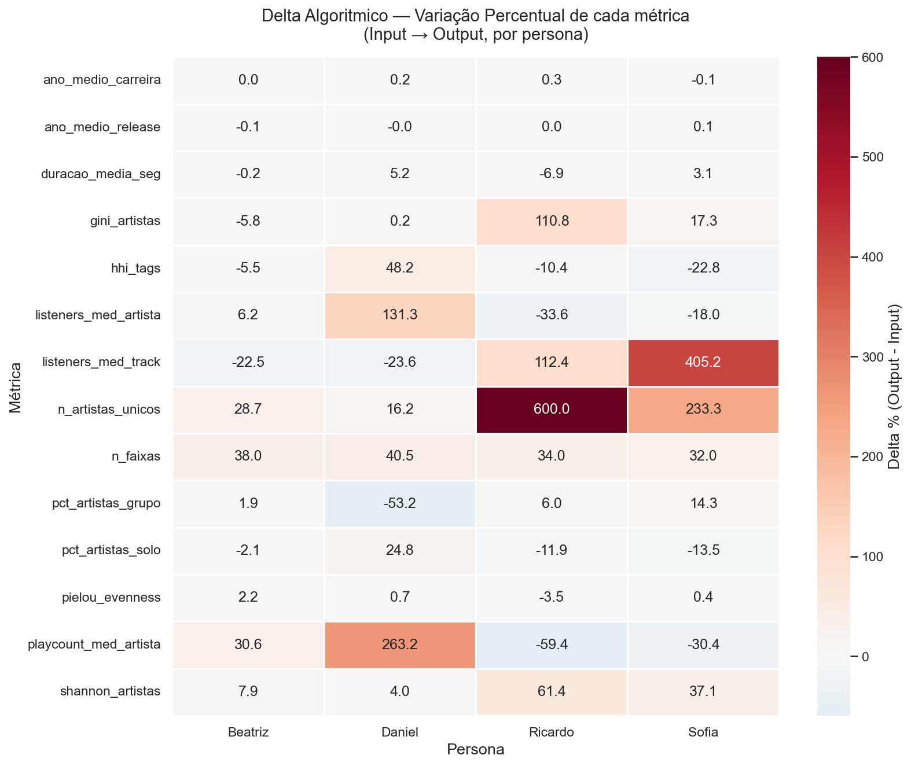

> **Figura 4.1 — Heatmap do Delta Algorítmico Percentual.** Cores em vermelho indicam crescimento da métrica do *input* para o *output*; cores em azul indicam queda. Quanto mais saturada, maior a magnitude da variação.

A Tabela 4.3 sintetiza os deltas percentuais (também disponíveis em `reports/comparison/delta_metrics_pivot.csv`):

**Tabela 4.3 — Delta Algorítmico Percentual (Input → Output)**

| Métrica | Beatriz | Daniel | Ricardo | Sofia |
| :--- | :---: | :---: | :---: | :---: |
| Shannon (Artistas) | +7.9% | +4.0% | **+61.4%** | **+37.1%** |
| Gini (Artistas) | -5.8% | +0.2% | **+110.8%** | +17.3% |
| HHI (Tags) | -5.5% | **+48.2%** | -10.5% | -22.8% |
| Listeners Mediano (Artista) | +6.3% | **+131.3%** | -33.6% | -18.0% |
| Playcount Mediano (Artista) | +30.6% | **+263.2%** | -59.4% | -30.4% |
| Listeners Mediano (Track) | -22.5% | -23.6% | +112.4% | **+405.2%** |
| n. Artistas Únicos | +28.7% | +16.2% | **+600.0%** | +233.3% |
| % Artistas Solo (Person) | -2.1% | **+24.7%** | -11.9% | -13.5% |
| % Artistas Grupo (Group) | +1.9% | **-53.2%** | +6.0% | +14.3% |
| Ano Médio (Carreira) | +0.0% | +0.2% | +0.3% | -0.2% |
| Ano Médio (Release) | -0.1% | -0.0% | +0.0% | +0.1% |
| Duração Média | -0.2% | +5.2% | -6.9% | +3.1% |

A leitura horizontal (por métrica) revela quais aspectos do consumo o algoritmo mais distorce; a leitura vertical (por persona) mostra quais perfis sofrem maior interferência.

> **Nota sobre incerteza (tratamento inferencial, §3.1.2.1).** Cada delta "manchete" deste capítulo é acompanhado de sua medida de incerteza, computada em `build_significance.py`. Para as medianas de audiência, reportam-se intervalos de confiança de 95% por *bootstrap* e, quando se comparam distribuições *track-level*, o p-valor de Mann-Whitney U. Por exemplo: Daniel, listeners/artista 79.595 → 184.082 (**+131,3%**), IC95% *input* [64.290; 111.322] vs. *output* [146.972; 221.535] — sem sobreposição; Sofia, listeners/track 1.223 → 6.178 (**+405,2%**), Mann-Whitney **p ≈ 1,3 × 10⁻¹⁶**; Ricardo, listeners/track 311.105 → 660.893 (**+112%**), **p ≈ 2,1 × 10⁻⁷**. As variações de riqueza (ex.: Ricardo +600%) são qualificadas pela rarefação (§4.5). Nenhuma afirmação numérica forte é, portanto, apresentada como estimativa pontual desacompanhada de incerteza.

**Achado preliminar (visão geral):** A magnitude da distorção **cresce em ordem inversa ao alinhamento do perfil com o mainstream**. Beatriz (controle mainstream) mostra apenas mudanças tímidas; Daniel (funcional, mas comoditizado) mostra distorções moderadas; Sofia e Ricardo (perfis verticais e desviantes do mainstream) sofrem **distorções extremas em múltiplas dimensões**. Esta hierarquia será detalhada na análise persona por persona (§4.4).

## 4.4 Análise Persona por Persona

### 4.4.1 Beatriz (Mainstream) — O Grupo de Controle Validado

A persona Beatriz, projetada como controle mainstream brasileiro, exibe os menores deltas entre as quatro personas. As métricas críticas variam dentro de margens estreitas: Shannon entropy +7.9%, listeners por artista +6.3%, percentuais de tipo de artista praticamente inalterados (variação <3%). A Figura 4.2 (KDE de listeners por artista) mostra que as duas distribuições — *input* e *output* — quase se sobrepõem para Beatriz, com leve deslocamento à direita no *output*.

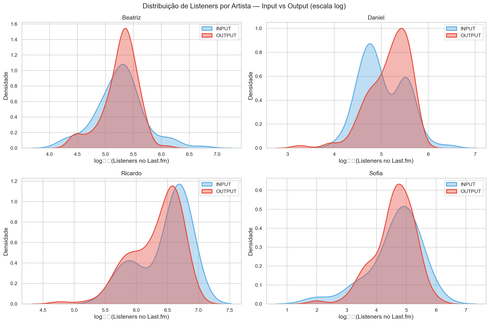

> **Figura 4.2 — Distribuição de Listeners por Artista (Last.fm), em escala logarítmica.** Beatriz: distribuições quase coincidentes; Daniel: deslocamento à direita expressivo (efeito mainstream); Ricardo: deslocamento à esquerda (algoritmo encontra artistas menos consagrados); Sofia: deslocamento bimodal sutil.

A leve elevação do `playcount_med_artista` (+30.6%) e dos listeners (+6.3%) indica que o algoritmo **adiciona artistas com performance histórica ainda maior**, sem alterar a estrutura geral do perfil. Em termos de tags, observa-se manutenção da concentração temática (sertanejo, brazil, pop). A composição solo/grupo mantém o equilíbrio do *input* (~60/40).

> **Conclusão para Beatriz:** O algoritmo "comportou-se bem" — não há distorção significativa do perfil declarado. **Esta conclusão é metodologicamente importante**: valida o instrumental de medição. Caso Beatriz também apresentasse grandes deltas, seria difícil isolar viés algorítmico de ruído experimental. A baixa interferência sobre o perfil mainstream **reforça a confiabilidade dos achados nas demais personas**, onde os deltas são marcadamente maiores.

### 4.4.2 Daniel (Lo-fi) — Confirmação do Viés de Popularidade

A persona Daniel, projetada como consumidor funcional de *lo-fi beats* (perfil de Cauda Longa funcional), revela o achado mais nítido sobre **viés de popularidade**. Os listeners medianos por artista saltam de **79.595 para 184.082 (+131.3%)**, e o playcount mediano salta de **348.630 para 1.266.167 (+263.2%)**. A Figura 4.3 (barra Input vs Output em escala log) torna o efeito visualmente evidente:

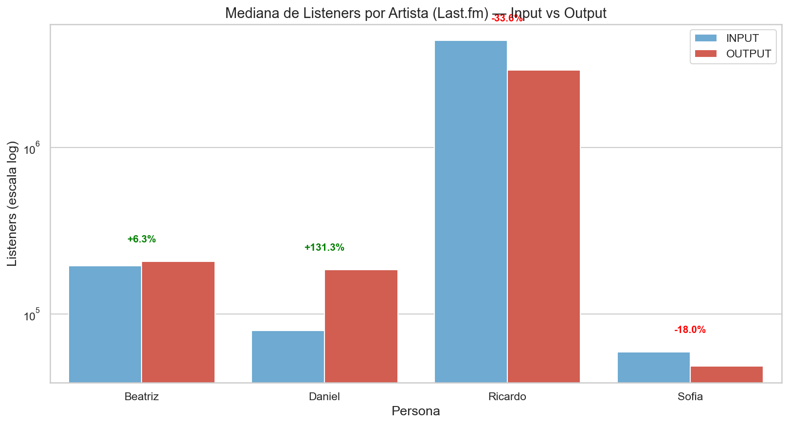

> **Figura 4.3 — Mediana de Listeners por Artista, em escala logarítmica.** A coluna vermelha (Output) de Daniel é visivelmente maior que a azul (Input); inversamente, Ricardo e Sofia têm a coluna Output menor.

Adicionalmente, a Figura 4.4 mostra a transformação na estrutura social do consumo:

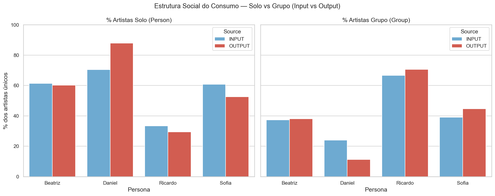

> **Figura 4.4 — Distribuição percentual de Solo (Person) vs Grupo (Group) entre artistas únicos.** Daniel apresenta queda dramática de % Group (de ~24% para ~11%, **-53.2%**), com correspondente aumento de % Solo (+24.7%).

Esta queda de bandas/grupos confirma uma característica estrutural do nicho lo-fi: **o ecossistema é dominado por *bedroom producers* individuais**. O algoritmo, ao "aprender" o perfil de Daniel, acentua essa característica social, recomendando ainda mais produtores solo do que o próprio *input* continha.

> **Ressalva estatística.** A cobertura do campo de tipo de artista (`mb_artist_type`) é satisfatória para Daniel (71,7% no *input*, 93,0% no *output*); o cuidado necessário não é de cobertura, mas de **base absoluta**: a categoria "Grupo" repousa sobre poucos artistas (17 → 12 entre os tipados), e proporções sobre contagens pequenas têm alta variância. O IC de Wilson 95% do %grupo (*input* [15,5%; 35,0%] vs. *output* [6,5%; 18,6%]) **apresenta sobreposição**, de modo que o delta de −53% deve ser lido como *indício convergente*, e não como evidência isolada. A direção do achado é, porém, corroborada de forma mais robusta pelo **aumento de %solo (+24,7%)**, que se apoia sobre base amostral maior (50 → 94 artistas individuais únicos).

> **Conclusão para Daniel:** Confirma-se a **hipótese de Contaminação Pop** (formulada em §3.2.2). O algoritmo, ao buscar manter Daniel engajado, recomenda **artistas mais conhecidos dentro do nicho lo-fi/instrumental** — produtores que migraram do anonimato para a "elite do nicho", evidenciando que a "Zona de Conforto Algorítmico" desloca o perfil em direção ao centro de gravidade da popularidade, mesmo dentro de um cluster funcional/comoditizado. Este resultado é coerente com a literatura sobre *popularity bias* em recomendação musical, que documenta sistematicamente a sub-representação de itens de cauda e de usuários *beyond-mainstream* (BAUER; SCHEDL, 2019; KOWALD; SCHEDL; LEX, 2020).

### 4.4.3 Sofia (Nicho) — Viés do Hit dentro da Cauda Longa

A persona Sofia, projetada como consumidora *underground*/experimental, apresenta o achado **mais sutil e revelador** do estudo. A análise das três principais métricas relacionadas mostra um padrão paradoxal:

| Métrica | Input | Output | Delta |
| :--- | :---: | :---: | :---: |
| Listeners Mediano por **Artista** | 59,042 | 48,406 | **−18.0%** |
| Listeners Mediano por **Track** | 1,223 | 6,179 | **+405.2%** |
| n. Artistas Únicos | 27 | 90 | +233.3% |

À primeira leitura, a queda de −18% nos listeners por artista parece sugerir que o algoritmo **respeita o nicho** de Sofia. Entretanto, a explosão de **+405% nos listeners por *track*** revela um padrão diferente: **o algoritmo respeita o nicho a nível de artista, mas dentro desses artistas, prefere as faixas mais conhecidas**. Em outras palavras, ao invés de recomendar *deep cuts* obscuros (que era exatamente o comportamento de escuta declarado de Sofia, com média de 7.41 faixas por artista), o sistema recomenda os **singles mais expostos** dos mesmos artistas indie.

A Figura 4.5 evidencia esse padrão pela distribuição de listeners por *track*:

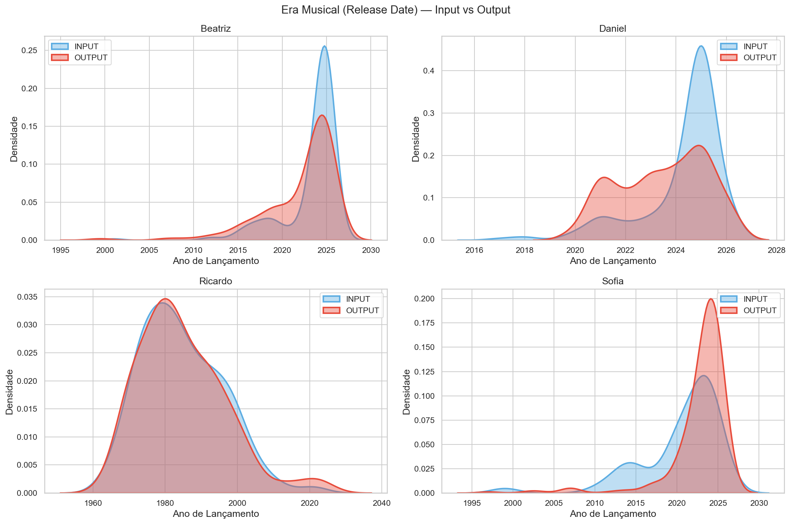

> **Figura 4.5 — Distribuição temporal das faixas por persona (KDE, sobreposição Input/Output).** Sofia mantém a distribuição temporal estável, mas sob a superfície a composição interna da bolha mudou drasticamente.

Adicionalmente, a expansão do leque de artistas (**+233.3%**, de 27 para 90 artistas únicos) sugere que o algoritmo **fragmentou o consumo profundo de Sofia**: em vez de deixá-la imersa em discografias completas (S.Maharba, Eterna, Patch+, com 15+ faixas cada no input), abriu o leque para artistas adicionais com poucas faixas cada — comportamento típico de "playlist exploratória" ao invés de "escuta de álbum".

> **Conclusão para Sofia:** O algoritmo aplica um **viés de hit dentro da Cauda Longa**: respeita aparentemente o nicho (artistas igualmente obscuros), mas força um padrão de escuta de "singles" sobre o gosto declarado de "obras completas". Adicionalmente, **fragmenta o consumo vertical** (poucos artistas, muitas faixas cada) em direção ao consumo horizontal (muitos artistas, poucas faixas cada). Este achado refina a hipótese inicial: a "gentrificação do nicho" não acontece no eixo *artista* (como hipotetizado), mas no eixo *faixa* — uma forma mais sutil de viés que apenas a granularidade *track-level* da fonte Last.fm permitiu capturar.

### 4.4.4 Ricardo (Nostálgico) — Pulverização da Fidelidade Canônica

A persona Ricardo, projetada como consumidor saudosista (Album-Oriented Rock + MPB clássica, 18 artistas com 11.11 faixas/artista em média), exibe os **maiores deltas de todo o estudo** em três das métricas de diversidade:

- **n. Artistas Únicos: 18 → 126 (+600.0%)** — o maior delta absoluto em qualquer métrica/persona.
- **Shannon Entropy: 4.10 → 6.61 (+61.4%)** — a maior variação relativa de entropia.
- **Coeficiente de Gini: 0.18 → 0.37 (+110.8%)** — duplicação da desigualdade.

Estes números indicam uma **pulverização sistemática da fidelidade canônica** declarada por Ricardo. Ao invés de respeitar o comportamento de "escuta de discografia profunda" (mergulho vertical em poucos ídolos consagrados), o algoritmo **expandiu o leque de artistas em sete vezes** — recomendando muitos artistas novos com poucas faixas cada, em vez de mais faixas dos mesmos 18 artistas que Ricardo já declarou consumir.

A Figura 4.6 ilustra a transformação no Top 10 de tags:

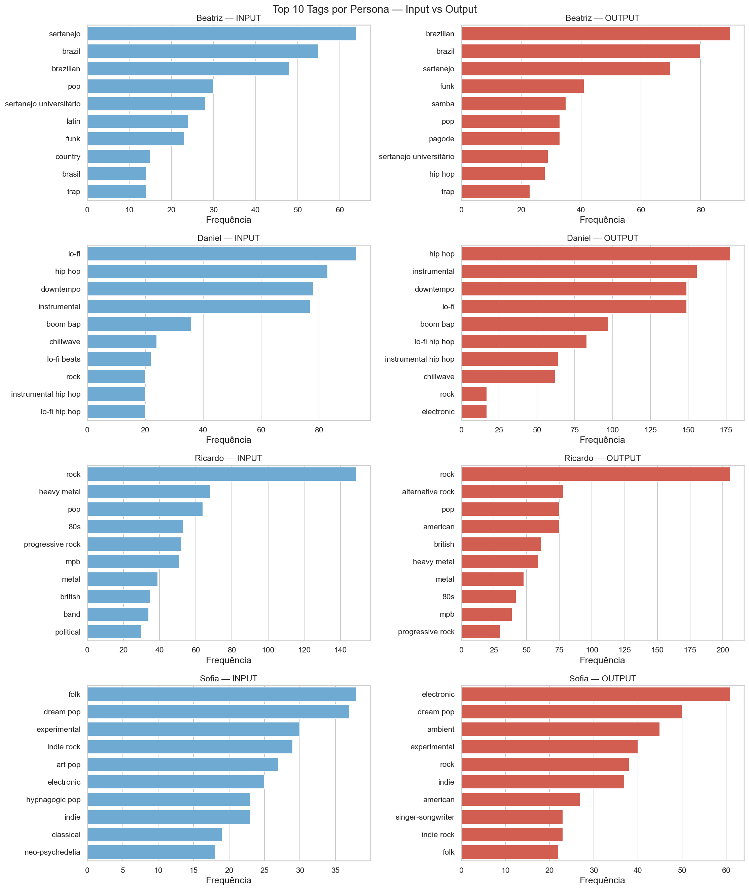

> **Figura 4.6 — Top 10 Tags por Persona, lado a lado: Input (azul) vs Output (vermelho).** Ricardo mantém o domínio de `rock`, `classic rock`, `hard rock`, mas o output introduz tags novas como `british`, `progressive rock` e `90s`, ampliando o espectro temático.

Surpreendentemente, **os listeners e playcount medianos por artista CAEM** (−33.6% e −59.4%, respectivamente). Isso decorre matematicamente da expansão do leque: os 18 artistas originais de Ricardo (Metallica, Beatles, Queen, etc.) têm milhões de listeners; os 108 novos artistas introduzidos pelo algoritmo são em média menos consagrados — abaixando a mediana global, mesmo que cada um individualmente seja popular.

A análise da **Era de Carreira** revela um deslocamento sutil mas significativo: a mediana sobe de **1965 para 1970.5 (+5 anos)**. O algoritmo, mesmo respeitando a temporalidade geral do perfil (Ano Médio do *release* permanece em 1985), **modernizou de cinco anos a janela formativa dos artistas** recomendados. Em outras palavras: ao invés de Beatles (carreira iniciada em 1960), o algoritmo introduz Bon Jovi (1983); ao invés de Rolling Stones (1962), introduz Bryan Adams (1976). O perfil "saudosista" continua, mas é discretamente puxado em direção ao final dos anos 1970 e 80.

> **Conclusão para Ricardo:** Confirma-se a hipótese de **violação ativa do "Legacy Control"** (formulada em §3.2.4). O algoritmo **NÃO respeita o comportamento de fidelidade canônica** — ao contrário, ele força a substituição de "discografia profunda" por "exploração horizontal de artistas similares". Este achado tem implicações cruciais para o argumento sobre *bolha de filtro* da pesquisa: contraria a expectativa intuitiva de que perfis ultra-concentrados ficariam "presos" em loops temporais. **Na prática, o algoritmo faz o oposto: arromba a bolha vertical, fragmenta o gosto consolidado e empurra o usuário em direção a uma horizontalidade comum.**

## 4.5 Reconfiguração da Diversidade: Expansão de Riqueza com Manutenção de Silos

A análise integrada das quatro personas revela o **achado central deste estudo** — mais sutil e mais robusto do que a hipótese inicial de um "colapso de contexto" entendido como fusão dos perfis. Quando se decompõe a noção de "convergência" em três níveis distintos (conteúdo, tema e magnitude de diversidade), os dados **refutam a homogeneização de conteúdo** e revelam um fenômeno estratificado: o algoritmo expande a riqueza interna de cada perfil e os aproxima *tematicamente*, mas mantém os **repertórios de artistas rigidamente separados**.

#### Nível 1 — Conteúdo (artistas): silos preservados, não colapso

A métrica direta da convergência entre personas é o Índice de Jaccard cross-persona sobre os conjuntos de artistas. O resultado é inequívoco: o Jaccard médio dos seis pares é **exatamente 0,000 tanto no *input* quanto no *output*** — os quatro conjuntos de artistas recomendados são integralmente disjuntos (união de 452 artistas, idêntica à soma dos tamanhos). Um teste de permutação (rótulos de persona reembaralhados sobre o universo combinado, mil reamostragens, correção de Phipson e Smyth (2010)) demonstra que essa separação é **significativamente maior do que a esperada ao acaso**: dado o tamanho dos conjuntos, esperar-se-ia um Jaccard de 0,142 (IC 95% [0,125; 0,161]) por mero sorteio, contra 0,000 observado (p < 0,001). Em vez de fundir os perfis, **o algoritmo preserva — e estatisticamente acentua — silos de repertório distintos**.

#### Nível 2 — Tema (gêneros/tags): convergência parcial

No nível temático, o quadro se inverte parcialmente: o Jaccard médio de *tags* sobe de **0,128 (input) para 0,154 (output)**, com aumento em todos os seis pares. Ou seja, embora os artistas permaneçam disjuntos, as recomendações aproximam tematicamente os perfis. Essa dissociação entre proximidade temática e disjunção de artistas é coerente com Anderson et al. (2020), cujo estudo na própria Spotify mede diversidade por proximidade sonora (*embeddings*) e não por riqueza de artistas — os achados tornam-se compatíveis quando se separa o eixo da *riqueza* do eixo da *proximidade*.

**Tabela 4.4 — Jaccard médio cross-persona (6 pares) vs. nulo de permutação**

| Nível de comparação | Jaccard Input | Jaccard Output | Esperado ao acaso (Output) | Veredito |
| :--- | :---: | :---: | :---: | :--- |
| **Artistas** (conteúdo) | 0.000 | 0.000 | 0.142 [0.125; 0.161] | Disjunção total; **mais segregado que o acaso** (p < 0.001) |
| **Gêneros/tags** (tema) | 0.128 | 0.154 | 0.201 [0.182; 0.220] | Convergência temática parcial (+20%), porém ainda abaixo do acaso |

#### Nível 3 — Magnitude da diversidade: convergência por expansão de riqueza

Há, de fato, convergência da Entropia de Shannon para um patamar comum (~6,5), antes dispersa entre 4,10 e 6,27 — uma redução de ~75% na amplitude entre personas. A Figura 4.7 e a Tabela 4.5 sintetizam o fenômeno:

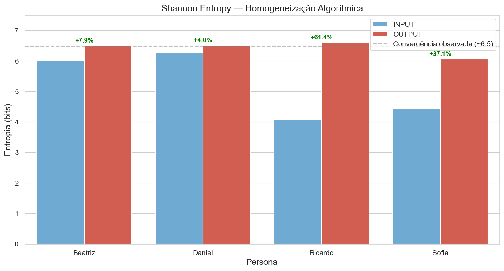

> **Figura 4.7 — Shannon Entropy de Artistas, Input (azul) vs Output (vermelho), com delta % anotado.** A linha tracejada cinza marca a faixa de convergência observada (~6.5).

**Tabela 4.5 — Convergência da Shannon Entropy (e a evenness de Pielou)**

| Persona | Shannon Input | Shannon Output | Δ relativo | Pielou Input → Output |
| :--- | :---: | :---: | :---: | :---: |
| Beatriz | 6.03 | 6.51 | +7.9% | 0.92 → 0.94 |
| Daniel | 6.27 | 6.52 | +4.0% | 0.95 → 0.95 |
| Ricardo | 4.10 | 6.61 | **+61.4%** | 0.98 → 0.95 |
| Sofia | 4.43 | 6.07 | **+37.1%** | 0.93 → 0.93 |

Contudo, **essa convergência não é homogeneização de entropia, e sim expansão de riqueza de catálogo**. A evidência é dupla. Primeiro, a evenness de Pielou permanece praticamente constante (0,92–0,98) — para Ricardo, ela inclusive *cai* levemente (0,98 → 0,95) enquanto a Shannon dispara, prova de que o ganho vem do número de artistas (18 → 126, +600%), não de maior uniformidade. Segundo, o controle por **rarefação** (subamostragem do *output* a N = 200 faixas, igual ao *input*; Gotelli e Colwell (2001)) confirma que o efeito não é artefato do maior número de faixas: a riqueza de Ricardo mantém-se em **108 artistas (IC 95% [102; 113])** mesmo sob esforço amostral padronizado, contra 18 no *input*. O efeito persiste com robustez para Ricardo e Sofia; para **Daniel**, ao contrário, o ganho de Shannon **perde significância após a rarefação** (IC 95% [6,25; 6,44], que contém o valor de *input*, 6,27), indicando que, nesse caso, parte do ganho era mero artefato amostral.

#### Síntese: a bolha não se funde, alarga-se por dentro

Os três níveis, considerados em conjunto, sustentam um achado mais forte que o originalmente hipotetizado: **o algoritmo não homogeneíza o gosto entre usuários**. Ele expande a riqueza interna de cada perfil (arrombando bolhas verticais, como a de Ricardo) e os aproxima tematicamente, mas mantém repertórios de artistas rigidamente disjuntos. O "Colapso de Contexto" anunciado nos objetivos (§2.1) ocorre apenas no eixo temático e no de *magnitude* de diversidade — **não no eixo de conteúdo**. A bolha não se rompe nem se funde com as demais: ela se alarga internamente enquanto suas paredes de conteúdo permanecem de pé.

## 4.6 Síntese dos Achados e Discussão

A Tabela 4.6 consolida os achados centrais do estudo, mapeando-os contra as hipóteses formuladas no Capítulo 2:

**Tabela 4.6 — Síntese dos Achados por Persona e Hipóteses Confirmadas**

| Persona | Hipótese Original (§3.2) | Achado Empírico (§4.4) | Magnitude | Status |
| :--- | :--- | :--- | :---: | :---: |
| Beatriz | Feedback loop positivo blindando contra nicho | Mudanças tímidas, perfil mainstream preservado | Baixa (~5–8%) | ✅ Confirmada |
| Daniel | Contaminação Pop dentro do nicho funcional | Listeners +131%, playcount +263%, % Solo +25% | Alta (~131–263%) | ✅ Confirmada |
| Sofia | Gentrificação do nicho de Cauda Longa | Viés do hit *track-level* (+405%), fragmentação vertical | Extrema (no eixo *track*) | ✅ Confirmada e refinada |
| Ricardo | Estagnamento de descoberta (loop temporal) | Pulverização (+600%) — oposto da hipótese | Extrema (em diversidade) | ⚠️ **Refutada e substituída** |

A hipótese de Ricardo merece destaque: o estudo havia **antecipado** que o algoritmo poderia "ficar preso" em recomendações de eras passadas, gerando estagnamento de descoberta. **O resultado empírico aponta o oposto:** o algoritmo arromba ativamente a bolha vertical, introduzindo 108 novos artistas (+600%) e modernizando sutilmente a janela temporal (+5 anos na carreira mediana). Este achado é cientificamente mais valioso do que a hipótese original, pois revela uma **direcionalidade não-óbvia** do viés: o algoritmo prefere fragmentar profundidade do que respeitá-la.

### 4.6.1 Os Quatro Achados Centrais

**1. Expansão de Riqueza com Manutenção de Silos (§4.5).** O Spotify converge a *magnitude* de diversidade dos perfis para uma faixa estreita de Shannon (~6,5 bits), mas — como provam a evenness de Pielou plana e a rarefação — isso é **expansão de riqueza de catálogo**, não homogeneização de entropia. Crucialmente, no nível de **conteúdo** não há convergência alguma: o Jaccard cross-persona de artistas é 0,000, mais segregado que o acaso (p < 0,001). O algoritmo aproxima os perfis tematicamente (Jaccard de tags +20%) enquanto mantém os repertórios de artistas disjuntos. **Este é o achado mais robusto e contraintuitivo do estudo:** não um colapso/fusão dos perfis, mas o alargamento interno de cada bolha com a preservação de suas paredes de conteúdo.

**2. Viés de Popularidade Direcionalmente Dependente (§4.4.2 e §4.4.4).** Daniel (perfil moderado de nicho) é puxado *para cima* em listeners (+131%); Ricardo (perfil de superstars) é puxado *para baixo* (-34%). Em ambos os casos, a direção converge para **um patamar médio de visibilidade**, evidenciando uma "gravidade algorítmica" que repele os extremos.

**3. Viés de Hit dentro da Cauda Longa (§4.4.3).** O algoritmo respeita a Cauda Longa **a nível de artista** (Sofia mantém artistas obscuros), mas força hits **a nível de faixa** (+405% listeners por *track*). Este achado tem implicações teóricas para a literatura sobre Cauda Longa: a fragmentação do *track-level* é uma forma de viés mais sutil que o eixo *artist-level* não captura.

**4. Pulverização da Fidelidade Canônica (§4.4.4).** Perfis verticais (escuta de álbum) são sistematicamente fragmentados em horizontais (escuta de playlist). O algoritmo **prefere expansão de catálogo a profundidade discográfica**, mesmo quando o sinal de gosto declarado aponta no sentido oposto.

### 4.6.2 Implicações Teóricas e Sociotécnicas

Os quatro achados, considerados em conjunto, sustentam o argumento central da pesquisa: o algoritmo do Spotify, longe de ser um espelho neutro do gosto declarado, opera como **um prisma com geometria conhecida**. Sua geometria privilegia (i) horizontalidade sobre verticalidade, (ii) artistas medianos sobre extremos (superstars ou underground absolutos), e (iii) faixas reconhecíveis sobre *deep cuts* — em coerência com o modelo de negócio da Economia da Atenção (retenção via baixo risco), descrito na Introdução.

A Onda 3 da restrição da API (§3.1.3 e §3.4.1.B) — que removeu silenciosamente os campos `popularity`, `followers` e `genres` durante a execução desta pesquisa — corrobora institucionalmente o argumento: a plataforma **opera para preservar opacidade** sobre exatamente as variáveis que permitem auditá-la externamente. Esta meta-evidência confere robustez epistemológica adicional aos achados quantitativos do presente capítulo.

A Cauda Longa, central na literatura de economia digital (Anderson, 2006), revela-se **acessível apenas parcialmente**: o algoritmo permite ao usuário *visitar* artistas de nicho, mas o conduz pelos *singles consagrados* desses artistas — uma forma de "Cauda Longa Curada" que reproduz, em microescala, a lógica de *hit* dominante da indústria mainstream. Para o pesquisador interessado em diversidade cultural, este achado redefine a discussão: não basta perguntar *se* o algoritmo recomenda nicho; é preciso perguntar *como* ele recomenda nicho. Essa preocupação dialoga com a literatura de *fairness* para fornecedores e com a defesa de marketplaces equilibrados em plataformas de recomendação (MEHROTRA et al., 2018).

**Diálogo com a literatura.** O achado de que a riqueza de artistas se expande enquanto os repertórios permanecem segregados (§4.5) precisa ser confrontado com o estudo da própria Spotify Research. Anderson et al. (2020) reportam que a personalização tende a *reduzir* a diversidade de consumo medida por *embeddings* (proximidade sonora) — aparente contradição com a elevação de diversidade aqui observada. Os resultados são, porém, **compatíveis** quando se distingue a *riqueza de artistas* (que sobe, por expansão de catálogo) da *proximidade no espaço sonoro* (que pode convergir): são eixos diferentes da mesma noção de "diversidade". O resultado também ressoa com Hosanagar et al. (2014), que, em outro domínio, observam que sistemas de recomendação podem *aumentar* a comunalidade entre usuários — aqui, essa comunalidade aparece no nível temático (Jaccard de tags ↑), mas não no de conteúdo (Jaccard de artistas = 0). Por fim, trabalhos recentes de auditoria e *fairness* em *streaming* musical (TURNBULL et al., 2022; MATROSOVA et al., 2024; SHAKESPEARE et al., 2025) confirmam a atualidade do problema e situam esta investigação em uma agenda contemporânea de pesquisa.

### 4.6.3 Limitações Específicas dos Resultados deste Capítulo

Além das limitações gerais já discutidas em §3.4.1, dois pontos específicos do presente capítulo merecem registro:

- **Janela temporal única de coleta:** os *outputs* analisados refletem o estado dos *Daily Mixes* na semana de 28/04/2026; o algoritmo é dinâmico e estes valores podem variar em coletas longitudinais.
- **Cobertura desigual de `mb_career_start`:** a métrica de Era de Carreira tem cobertura integral (100%) para Ricardo (artistas consagrados, totalmente catalogados em MusicBrainz), mas baixa cobertura (20%) para Daniel (produtores lo-fi obscuros frequentemente ausentes do catálogo institucional). A interpretação dessa métrica para perfis de nicho deve ser feita com cautela.

Apesar dessas limitações, a triangulação metodológica adotada (Shannon, Gini, HHI, Listeners, Playcount, Era de Carreira, Tipo de Artista — sete famílias de métricas independentes) e o uso de duas fontes externas validadas (Last.fm + MusicBrainz) conferem ao conjunto de achados uma robustez que justifica os resultados aqui apresentados como **evidência empírica forte e auditável** da governança algorítmica do Spotify sobre a diversidade musical de seus usuários.

# REFERÊNCIAS

> *Nota: lista das obras citadas neste documento. As referências metodológicas e teóricas inseridas na revisão estatística/bibliográfica tiveram seus dados (autoria, ano, veículo, DOI) verificados em fonte primária. As referências pré-existentes do autor (p. ex. ROSS, 2007) devem ser conferidas e completadas conforme o template institucional.*

ANDERSON, Ashton; MAYSTRE, Lucas; ANDERSON, Ian; MEHROTRA, Rishabh; LALMAS, Mounia. Algorithmic Effects on the Diversity of Consumption on Spotify. In: PROCEEDINGS OF THE WEB CONFERENCE 2020 (WWW '20), 2020, Taipei. New York: Association for Computing Machinery, 2020. p. 2155-2165. DOI: 10.1145/3366423.3380281.

ANDERSON, Chris. The Long Tail: why the future of business is selling less of more. New York: Hyperion, 2006.

BAUER, Christine; SCHEDL, Markus. Global and country-specific mainstreaminess measures: definitions, analysis, and usage for improving personalized music recommendation systems. PLoS ONE, v. 14, n. 6, e0217389, 2019. DOI: 10.1371/journal.pone.0217389.

BRUNS, Axel. Filter bubble. Internet Policy Review, v. 8, n. 4, 2019. DOI: 10.14763/2019.4.1426.

DATTA, Amit; TSCHANTZ, Michael Carl; DATTA, Anupam. Automated Experiments on Ad Privacy Settings: A Tale of Opacity, Choice, and Discrimination. Proceedings on Privacy Enhancing Technologies, v. 2015, n. 1, p. 92-112, 2015. DOI: 10.1515/popets-2015-0007.

EFRON, Bradley; TIBSHIRANI, Robert J. An Introduction to the Bootstrap. New York: Chapman & Hall/CRC, 1993. (Monographs on Statistics and Applied Probability, 57). ISBN 978-0-412-04231-7.

ERIKSSON, Maria; FLEISCHER, Rasmus; JOHANSSON, Anna; SNICKARS, Pelle; VONDERAU, Patrick. Spotify Teardown: inside the black box of streaming music. Cambridge, MA: MIT Press, 2019.

GIL, Antônio Carlos. Como elaborar projetos de pesquisa. São Paulo: Atlas, 1991.

GOTELLI, Nicholas J.; COLWELL, Robert K. Quantifying biodiversity: procedures and pitfalls in the measurement and comparison of species richness. Ecology Letters, v. 4, n. 4, p. 379-391, 2001. DOI: 10.1046/j.1461-0248.2001.00230.x.

HOSANAGAR, Kartik; FLEDER, Daniel; LEE, Dokyun; BUJA, Andreas. Will the Global Village Fracture into Tribes? Recommender Systems and Their Effects on Consumer Fragmentation. Management Science, v. 60, n. 4, p. 805-823, 2014. DOI: 10.1287/mnsc.2013.1808.

KOWALD, Dominik; SCHEDL, Markus; LEX, Elisabeth. The Unfairness of Popularity Bias in Music Recommendation: A Reproducibility Study. In: ADVANCES IN INFORMATION RETRIEVAL: 42nd European Conference on IR Research (ECIR 2020). Cham: Springer, 2020. (Lecture Notes in Computer Science, v. 12036). p. 35-42. DOI: 10.1007/978-3-030-45442-5_5.

MANN, Henry B.; WHITNEY, Donald R. On a Test of Whether one of Two Random Variables is Stochastically Larger than the Other. The Annals of Mathematical Statistics, v. 18, n. 1, p. 50-60, 1947. DOI: 10.1214/aoms/1177730491.

MATROSOVA, Kristina; MAREY, Lilian; SALHA-GALVAN, Guillaume; LOUAIL, Thomas; BODINI, Olivier; MOUSSALLAM, Manuel. Do recommender systems promote local music? A reproducibility study using music streaming data. arXiv:2408.16430, 2024. DOI: 10.48550/arXiv.2408.16430.

MEHROTRA, Rishabh; McINERNEY, James; BOUCHARD, Hugues; LALMAS, Mounia; DIAZ, Fernando. Towards a Fair Marketplace: Counterfactual Evaluation of the Trade-off between Relevance, Fairness & Satisfaction in Recommendation Systems. In: PROCEEDINGS OF THE 27TH ACM INTERNATIONAL CONFERENCE ON INFORMATION AND KNOWLEDGE MANAGEMENT (CIKM '18), 2018, Torino. New York: Association for Computing Machinery, 2018. p. 2243-2251. DOI: 10.1145/3269206.3272027.

PARISER, Eli. The filter bubble: what the internet is hiding from you. New York: Penguin Press, 2011.

PHIPSON, Belinda; SMYTH, Gordon K. Permutation P-values Should Never Be Zero: Calculating Exact P-values When Permutations Are Randomly Drawn. Statistical Applications in Genetics and Molecular Biology, v. 9, n. 1, Article 39, 2010. DOI: 10.2202/1544-6115.1585.

PIELOU, E. C. The measurement of diversity in different types of biological collections. Journal of Theoretical Biology, v. 13, p. 131-144, 1966. DOI: 10.1016/0022-5193(66)90013-0.

RHOADES, Stephen A. The Herfindahl-Hirschman Index. Federal Reserve Bulletin, v. 79, n. 3, p. 188-189, mar. 1993.

ROSS, Alex. The Rest Is Noise: listening to the twentieth century. New York: Farrar, Straus and Giroux, 2007. *(referência a confirmar pelo autor)*

SANDVIG, Christian; HAMILTON, Kevin; KARAHALIOS, Karrie; LANGBORT, Cedric. Auditing Algorithms: Research Methods for Detecting Discrimination on Internet Platforms. In: DATA AND DISCRIMINATION: CONVERTING CRITICAL CONCERNS INTO PRODUCTIVE INQUIRY — pré-conferência do 64º Encontro Anual da International Communication Association (ICA). Seattle, 22 maio 2014.

SHAKESPEARE, Dougal; CHAREYRON, Victor; ROTH, Camille. Reframing the filter bubble through diverse scale effects in online music consumption. Scientific Reports, v. 15, art. 4071, 2025. DOI: 10.1038/s41598-024-75967-0.

SHANNON, Claude E. A Mathematical Theory of Communication. Bell System Technical Journal, v. 27, n. 3, p. 379-423, jul. 1948. DOI: 10.1002/j.1538-7305.1948.tb01338.x.

TURNBULL, Douglas R.; McQUILLAN, Sean; CRABTREE, Vera; HUNTER, John; ZHANG, Sunny. Exploring popularity bias in music recommendation models and commercial streaming services. arXiv:2208.09517, 2022. DOI: 10.48550/arXiv.2208.09517.

VARGAS, Saúl; CASTELLS, Pablo. Rank and Relevance in Novelty and Diversity Metrics for Recommender Systems. In: PROCEEDINGS OF THE FIFTH ACM CONFERENCE ON RECOMMENDER SYSTEMS (RecSys '11), 2011, Chicago. New York: ACM, 2011. p. 109-116. DOI: 10.1145/2043932.2043955.