# AUDITORIA DE SISTEMAS DE INTELIGÊNCIA ARTIFICIAL EM PLATAFORMAS DE STREAMING: UM ESTUDO EXPERIMENTAL SOBRE VIESES E RECOMENDAÇÃO MUSICAL NO SPOTIFY

> Universidade Federal de Uberlandia
> Curso de Gestao da Informação - FAGEN
>
> Marcos Rodrigues de Oliveira Júnior
>
> Uberlândia - MG
> 2026

Orientador: José Eduardo Ferreira Lopes

# Sumário

- [AUDITORIA DE SISTEMAS DE INTELIGÊNCIA ARTIFICIAL EM PLATAFORMAS DE STREAMING: UM ESTUDO EXPERIMENTAL SOBRE VIESES E RECOMENDAÇÃO MUSICAL NO SPOTIFY](#auditoria-de-sistemas-de-inteligência-artificial-em-plataformas-de-streaming-um-estudo-experimental-sobre-vieses-e-recomendação-musical-no-spotify)
- [Sumário](#sumário)
- [1 INTRODUÇÃO](#1-introdução)
- [2 OBJETIVOS](#2-objetivos)
  - [2.1 Objetivos Específicos](#21-objetivos-específicos)
- [3 METODOLOGIA](#3-metodologia)
  - [3.1 Procedimento de Coleta e Preparação Técnica](#31-procedimento-de-coleta-e-preparação-técnica)
    - [3.1.1 Tratamento de Dados e Definição das Métricas de Auditoria](#311-tratamento-de-dados-e-definição-das-métricas-de-auditoria)
    - [3.1.2 Síntese Estatística e Definição dos Indicadores Descritivos](#312-síntese-estatística-e-definição-dos-indicadores-descritivos)
  - [3.2 Arquitetura dos Agentes de Teste: Caracterização das Personas Sintéticas](#32-arquitetura-dos-agentes-de-teste-caracterização-das-personas-sintéticas)
    - [3.2.1 Beatriz (A Consumidora Mainstream)](#321-beatriz-a-consumidora-mainstream)
      - [3.2.1.1 Tabela de indicadores](#3211-tabela-de-indicadores)
      - [3.2.1.2 Gráficos](#3212-gráficos)
    - [3.2.2 Daniel (O Foco Instrumental/Lo-fi)](#322-daniel-o-foco-instrumentallo-fi)
      - [3.2.2.1 Tabela de indicadores](#3221-tabela-de-indicadores)
      - [3.2.2.2 Gráficos](#3222-gráficos)
    - [3.2.3 Sofia (A Consumidora de Nicho)](#323-sofia-a-consumidora-de-nicho)
      - [3.2.3.1 Tabela de indicadores](#3231-tabela-de-indicadores)
      - [3.2.3.2 Gráficos](#3232-gráficos)
    - [3.2.4 Ricardo (O Consumidor Nostálgico)](#324-ricardo-o-consumidor-nostálgico)
      - [3.2.4.1 Tabela de indicadores](#3241-tabela-de-indicadores)
      - [3.2.4.2 Gráficos](#3242-gráficos)
  - [3.3 Análise Comparativa e Validação dos Estímulos (Inputs)](#33-análise-comparativa-e-validação-dos-estímulos-inputs)
    - [3.3.1 Métricas de Diversidade e Entropia da Informação](#331-métricas-de-diversidade-e-entropia-da-informação)
    - [3.3.2 Distribuição de Mercado (Cauda Longa)](#332-distribuição-de-mercado-cauda-longa)
    - [3.3.3 Análise Visual Cruzada e Topologia dos Dados](#333-análise-visual-cruzada-e-topologia-dos-dados)
  - [3.4 Síntese Metodológica e Limitações](#34-síntese-metodológica-e-limitações)

# 1 INTRODUÇÃO

Conforme observa Ross (2007, p. 15), a música adapta-se continuamente às tecnologias de cada época, acompanhando o desenvolvimento da humanidade e refletindo transformações culturais, sociais e tecnológicas. Desde os primeiros instrumentos rudimentares até as complexas produções contemporâneas, cada período histórico introduziu novas formas de criação, registro e expressão artística. Na contemporaneidade, a convergência entre a era digital e os avanços da inteligência computacional reformulou de maneira significativa não apenas os processos de produção musical, mas, sobretudo, os modos de mediação, distribuição e consumo da música.

O ambiente digital possibilitou a consolidação de mecanismos de curadoria automatizada que hoje atuam como os principais filtros entre a obra musical e o ouvinte. Nesse cenário, observa-se a substituição progressiva da curadoria humana por sistemas complexos de Inteligência Artificial, fundamentados em técnicas como Filtragem Colaborativa, Processamento de Linguagem Natural (NLP) e Redes Neurais. Essas arquiteturas permitem processar grandes volumes de dados, viabilizando a personalização de experiências sonoras em larga escala.

Sob a ótica da Gestão da Informação, essa transição caracteriza a ascensão da governança algorítmica. Plataformas como o Spotify deixaram de ser meros repositórios de arquivos para atuar como gestoras ativas de fluxos informacionais, moldando a chamada "arquitetura da escolha" de milhões de usuários. Esses sistemas operam como caixas-pretas (black boxes), cujos critérios de seleção permanecem proprietários e opacos, gerando assimetria informacional e limitando a compreensão do usuário sobre os processos que influenciam sua percepção cultural. O uso de Aprendizado Profundo (Deep Learning) permite que tais sistemas aprendam continuamente com o comportamento do usuário, tornando a auditoria algorítmica essencial para compreender se essas decisões favorecem a diversidade ou a formação de bolhas de filtro.

A evolução dessas plataformas também impactou a economia do setor musical, consolidando modelos de negócios associados à chamada Economia da Atenção. Nesse modelo, o sucesso da plataforma depende da maximização da retenção do usuário, o que frequentemente leva os algoritmos a priorizarem conteúdos de baixo risco e alta aceitação estatística. Esse processo gera um ciclo de retroalimentação no qual o conteúdo popular tende a ganhar maior visibilidade, enquanto produções novas, experimentais ou de nicho permanecem marginalizadas.

Diante desse cenário, emerge a motivação central desta pesquisa: investigar como os sistemas de recomendação influenciam a diversidade cultural. Ao priorizar padrões estatisticamente mais consumíveis, tais algoritmos podem induzir à homogeneização do gosto musical e ao fortalecimento de bolhas de filtro (filter bubbles), restringindo a descoberta de nichos e o acesso a artistas independentes. O risco de alienação do gosto musical mediado por vieses algorítmicos configura-se, assim, como um objeto crítico de análise da cultura digital contemporânea.

Nesse contexto, torna-se fundamental a realização de Auditorias Algorítmicas, que investigam exogenamente o comportamento dos sistemas por meio da análise dos outputs gerados a partir de estímulos controlados. A auditoria de caixa-preta permite avaliar empiricamente o viés algorítmico sem acesso ao código-fonte, contornando desafios impostos pela volatilidade dos dados e pela complexidade das interações humanas.

Embora estudos baseados em usuários reais sejam relevantes, eles frequentemente sofrem com subjetividade e inconsistência comportamental, dificultando o isolamento de variáveis estritamente algorítmicas. Para superar essa limitação, esta pesquisa propõe uma abordagem experimental automatizada baseada na mineração de dados.

Dessa forma, o estudo utiliza Personas Sintéticas como objeto central de análise. Essas personas consistem em perfis de usuários cujos hábitos de consumo são simulados por algoritmos de curadoria controlada, construídos a partir da extração de metadados via API. As identidades sintéticas - Beatriz (Mainstream), Daniel (Lo-fi), Ricardo (Nostálgico) e Sofia (Nicho) - funcionam como instrumentos de medição que isolam a variável algorítmica.

Ao analisar como o Spotify responde a essas quatro identidades musicais distintas, o estudo busca avaliar se o sistema respeita preferências musicais específicas ou se tende à padronização induzida pelo viés de popularidade. Assim, pretende-se compreender em que medida a plataforma atua como facilitadora de descobertas musicais autênticas ou como indutora de escolhas pré-determinadas pela lógica estatística do mercado global.

# 2 OBJETIVOS

Esta dissertação tem como objetivo geral auditar o comportamento dos sistemas de recomendação algorítmica da plataforma Spotify, utilizando a metodologia de Black-Box Auditing com personas sintéticas, a fim de mensurar quantitativamente o impacto das lógicas de curadoria automatizada na diversidade cultural, na concentração de popularidade e na formação de bolhas de filtro (filter bubbles).

## 2.1 Objetivos Específicos

- Modelar e Implementar quatro arquétipos de consumo musical contrastantes (Mainstream, Funcional, Nostálgico e Underground), traduzindo perfis psicográficos em scripts de automação para a geração de datasets controlados.
   
- Validar estatisticamente a heterogeneidade e o isolamento dos perfis iniciais (inputs), utilizando métricas de similaridade de conjuntos (Índice de Jaccard) e dispersão de popularidade para estabelecer uma linha de base neutra (cold start).
   
- Coletar e Processar, via API do Spotify, os metadados técnicos e socioeconômicos das recomendações geradas (como "Descobertas da Semana"), estruturando um corpus de dados comparável entre os diferentes perfis.
   
- Mensurar a diversidade e a concentração das sugestões algorítmicas, aplicando indicadores matemáticos como a Entropia de Shannon (variedade informacional), o Coeficiente de Gini (desigualdade de distribuição) e o Índice HHI (concentração de mercado/gênero).
   
- Analisar o viés de popularidade e econômico, verificando se o sistema promove a "gentrificação" de gostos de nicho ao recomendar desproporcionalmente artistas "Superstars" (Cauda Curta) em detrimento de artistas independentes (Cauda Longa).
   
- Avaliar o fenômeno de Colapso de Contexto, observando se, ao longo do tempo, as recomendações para perfis distintos convergem para um padrão homogêneo, reduzindo a distância vetorial entre as personas.

# 3 METODOLOGIA

A presente investigação adota uma abordagem de natureza experimental e descritiva, fundamentada na estratégia de Auditoria Algorítmica de Caixa-Preta (Black-Box Auditing). Conforme proposto por Sandvig et al. (2014), essa técnica possibilita a análise do comportamento de sistemas de Inteligência Artificial sem acesso ao código-fonte ou aos dados internos das plataformas, baseando-se na observação sistemática dos resultados produzidos a partir de estímulos controlados.

Paralelamente, a pesquisa recorre ao método bibliográfico com o objetivo de sustentar teoricamente a análise dos fenômenos observados. Essa revisão, conforme orientações de Gil (1991), abrange estudos sobre a evolução da música e o papel das tecnologias digitais. A articulação entre a auditoria algorítmica e a revisão bibliográfica permite uma compreensão abrangente do impacto da Inteligência Artificial na música contemporânea, contemplando tanto a perspectiva empírica quanto a análise teórica dos processos sociotécnicos envolvidos.

## 3.1 Procedimento de Coleta e Preparação Técnica

O procedimento experimental foi dividido em fases sequenciais de configuração e desenvolvimento técnico. Inicialmente, foram criadas quatro contas de utilizador distintas na plataforma Spotify, garantindo que cada perfil partisse de um estado "neutro" (cold start), sem histórico prévio de escuta que pudesse enviesar os resultados iniciais.

Para a automação da interação com estas contas, utilizou-se o portal Spotify for Developers para obtenção das credenciais de autenticação. O motor da pesquisa foi construído em linguagem Python, utilizando a biblioteca Spotipy como interface para as chamadas à API (Application Programming Interface) do serviço. Os códigos desenvolvidos foram responsáveis por automatizar a extração de metadados das faixas e a construção das bibliotecas personalizadas (playlists), garantindo que a base de dados musical de cada persona fosse estruturada de forma isolada e sistemática.

Complementarmente à automação da curadoria, foi desenvolvida uma arquitetura de análise de dados robusta para processar e auditar os resultados. O sistema integrou ferramentas de ciência de dados, como pandas para a estruturação tabular, e matplotlib e seaborn para a visualização gráfica. Mais do que apenas recolher listas de reprodução, o código foi programado para calcular métricas complexas de diversidade e concentração - incluindo a Entropia de Shannon, o Coeficiente de Gini e o Índice de Jaccard. Tais métricas permitem transformar a percepção subjetiva de gosto musical em dados quantitativos auditáveis, essenciais para a verificação de vieses algorítmicos.

### 3.1.1 Tratamento de Dados e Definição das Métricas de Auditoria

Para transcender a análise puramente qualitativa do gosto musical, esta pesquisa implementou um *pipeline* de engenharia de dados em Python, focado na extração de indicadores matemáticos de diversidade e concentração. Os dados brutos coletados via API foram processados utilizando as bibliotecas `pandas` para estruturação tabular e `numpy` para operações vetoriais, garantindo a reprodutibilidade dos cálculos.

A fim de quantificar fenômenos subjetivos como "ecletismo", "bolha de filtro" e "viés de popularidade", foram adotadas quatro métricas estatísticas fundamentais, adaptadas da Teoria da Informação e da Economia da Cultura:

**A) Entropia de Shannon (Diversidade Informacional)**
Utilizada para mensurar o grau de imprevisibilidade e variedade na curadoria de artistas. No contexto deste estudo, a Entropia ($H$) calcula a distribuição de frequência dos artistas dentro de uma playlist.
* **Fórmula:** $H(X) = -\sum_{i=1}^{n} p(x_i) \log_2 p(x_i)$
  * Onde $p(x_i)$ é a probabilidade (frequência relativa) de ocorrência do artista $i$.
* **Implementação:** Calculada via script Python, onde valores mais altos indicam maior diversidade (playlist pulverizada) e valores baixos indicam alta repetição (playlist monótona).

**B) Coeficiente de Gini (Desigualdade de Atenção)**
Originalmente usado para medir desigualdade de renda, aqui o Coeficiente de Gini ($G$) auditou a concentração de *plays* entre os artistas.
* **Interpretação:** Um Gini próximo de 0 indica que todos os artistas têm o mesmo espaço na playlist (igualdade perfeita). Um Gini próximo de 1 indica que poucos artistas dominam a quase totalidade das faixas (desigualdade extrema/monopólio de atenção).
* **Implementação:** O algoritmo ordena os artistas por frequência e calcula a área sob a Curva de Lorenz, permitindo identificar perfis "Superfãs" (alto Gini) versus "Ouvintes Casuais" (baixo Gini).

**C) Índice Herfindahl-Hirschman (HHI de Gêneros)**
Métrica econômica utilizada para detectar monopólios de mercado. Neste estudo, o HHI avaliou a diversidade de gêneros musicais.
* **Fórmula:** $HHI = \sum_{i=1}^{N} s_i^2$
  * Onde $s_i$ é a participação de mercado (% do total) de cada gênero musical na biblioteca.
* **Aplicação:** Um HHI alto (> 0.25) sinaliza uma "Bolha de Filtro" temática (ex: usuário que só ouve Lo-fi), enquanto um HHI baixo (< 0.15) indica um consumo cosmopolita e variado.

**D) Índice de Jaccard (Similaridade de Conjuntos)**
Empregado na etapa de validação cruzada para medir a sobreposição (*overlap*) entre as bibliotecas das diferentes personas.
* **Fórmula:** $J(A,B) = \frac{|A \cap B|}{|A \cup B|}$
  * Mede a razão entre a interseção (artistas em comum) e a união (total de artistas) dos conjuntos $A$ e $B$.
* **Objetivo:** Validar matematicamente o isolamento dos perfis no estado inicial (*Cold Start*). Um índice Jaccard de 0.0 entre duas personas comprova que elas ocupam espaços vetoriais disjuntos, garantindo a integridade do grupo de controle.

### 3.1.2 Síntese Estatística e Definição dos Indicadores Descritivos

Complementarmente à análise matemática de diversidade, foi desenvolvida uma etapa de processamento dedicada à geração de **Resumos Estatísticos Textuais**. O objetivo deste procedimento foi converter os dados brutos de cada *playlist* em relatórios estruturados, consolidando os principais indicadores de desempenho (*KPIs*) que compõem a "Ficha Técnica" de cada persona.

Para operacionalizar essa síntese, utilizou-se um *script* python, que computa as estatísticas descritivas fundamentais. Abaixo, definem-se os conceitos operacionais e a interpretação metodológica de cada indicador apresentado nas tabelas de validação:

**A) Popularidade Média e Zona de Segurança**
Calculada a partir do índice `track_popularity` (0 a 100) fornecido pela API do Spotify, que pondera o número total de reproduções e a recência dessas execuções.
* **Interpretação:** Uma média alta (>70) indica um perfil situado na "Zona de Segurança Algorítmica", consumindo conteúdos que a plataforma já validou como sucessos. Uma média baixa (<20) indica consumo na "Zona de Risco", onde o algoritmo possui menos dados históricos de engajamento.

**B) Consistência Interna (Desvio Padrão da Popularidade)**
Métrica estatística ($\sigma$) que mede a variação dos índices de popularidade dentro da mesma playlist.
* **Interpretação:** Um desvio padrão baixo (ex: $\pm 4.0$) indica uma curadoria homogênea ("apenas *hits*" ou "apenas *underground*"). Um desvio alto indica um comportamento errático, misturando *superstars* com artistas desconhecidos, o que dificulta a perfilagem pelo sistema.

**C) Recência Temporal e Viés de Imediatismo**
Análise da distribuição dos anos de lançamento dos álbuns (`release_date`).
* **Interpretação:** Mede o quão preso ao "agora" está o usuário. Perfis com >80% das faixas na década atual exibem "Viés de Imediatismo" (consumo de novidades), enquanto perfis ancorados em décadas passadas testam a capacidade do algoritmo de respeitar o "Legado Cultural".

**D) Alcance Médio (Capital Social)**
Média do número de seguidores (`followers.total`) dos artistas presentes na biblioteca.
* **Interpretação:** Serve como *proxy* para o Capital Econômico e Social dos artistas. Permite distinguir entre o consumo de "Artistas de Estádio" (milhões de seguidores) e "Artistas de Nicho" (milhares), validando a posição do usuário na distribuição da Cauda Longa.

**E) Estrutura (Duração Média)**
Média da duração das faixas em minutos e segundos.
* **Interpretação:** Indicador da Economia da Atenção. Faixas curtas (~2:00) tendem a ser otimizadas para *streaming* e *looping* (como no Lo-fi), enquanto faixas longas (>4:30) indicam resistência à comoditização da música, priorizando narrativas complexas (como no Rock Progressivo ou Jazz).

A automatização desses resumos garante que a caracterização das personas (apresentada na seção 3.2) seja fundamentada em dados quantitativos auditáveis, estabelecendo uma linha de base rigorosa para o experimento.
## 3.2 Arquitetura dos Agentes de Teste: Caracterização das Personas Sintéticas

O núcleo experimental desta auditoria reside na implementação de Personas Sintéticas. Estes agentes digitais constituem construções metodológicas desenhadas para representar arquétipos de comportamento musical distintos e polarizados, fundamentais para isolar variáveis específicas do sistema de recomendação, como a popularidade, a recência e a funcionalidade sonora.

Para cobrir um espectro abrangente de hábitos de consumo, foram modelados quatro perfis que operam em extremos opostos da economia da atenção musical: do consumo passivo de sucessos globais à exploração ativa de nichos underground. Nas seções subsequentes, cada persona é apresentada através de uma estrutura analítica: perfil psicográfico, que contextualiza a narrativa e humaniza o comportamento simulado; e a motivação científica, que define explicitamente qual hipótese de viés algorítmico está sendo testada. Imediatamente após a caracterização teórica, apresenta-se a validação quantitativa do input, onde métricas de popularidade, diversidade e dispersão gráfica confirmam estatisticamente a consolidação de cada arquétipo antes do início da interação com o algoritmo.

### 3.2.1 Beatriz (A Consumidora Mainstream)

> **Perfil Psicográfico:** Bia é uma verdadeira nativa digital; ela não se lembra de um mundo sem internet ou smartphones. Nascida em Uberlândia, sua infância foi marcada pelo YouTube, e sua adolescência, pelo auge do Instagram e a explosão do TikTok. A música, para ela, nunca veio do rádio, mas sim dos challenges de dança e das trilhas sonoras virais. Atualmente, com 19 anos, ela é estudante de Relações Internacionais na UFU e personifica o espírito "conectado". Para Bia, a música é um evento social, um catalisador de interações. É ela quem geralmente conecta o celular na caixa de som nas reuniões com amigos, e estar por dentro dos últimos hits brasileiros é essencial para se sentir parte do grupo. Sua relação com a música é imediata e efêmera, focada no presente e no que é compartilhado coletivamente.

**Motivação:** Esta persona atua como o Grupo de Controle (Baseline) do experimento. Beatriz representa o comportamento padrão "ideal" para modelos de negócio baseados em economia da atenção: consumo rápido, alta retenção e foco em sucessos globais. O objetivo é verificar a existência de um ciclo de feedback positivo (feedback loop), testando a hipótese de que o sistema de recomendação tende a blindar usuários mainstream contra conteúdos de nicho, reforçando uma bolha de alta popularidade e dificultando a serendipidade (descoberta do inesperado).

**Validação Quantitativa do Input:** A análise estatística dos dados de entrada confirma a aderência do perfil Beatriz ao arquétipo Mainstream brasileiro contemporâneo. A biblioteca gerada apresenta uma Popularidade Média de Faixas de 75.41 e uma Mediana de 74, com um desvio padrão baixo (+/- 4.42), evidenciando uma consistência rigorosa no consumo de faixas de alta performance comercial. O viés de recência é extremo: 84.9% das faixas pertencem à década de 2020, resultando em um Ano Médio de Lançamento de 2023, o que corrobora o perfil de consumo imediatista e focado em novidades virais.

Em termos estruturais, a playlist reflete o formato radiofônico padrão, com uma Duração Média das Músicas de 3:20, alinhada com as produções comerciais otimizadas para streaming e engajamento rápido. O caráter de "validação social" desta persona é reforçado pelas métricas de alcance econômico: a Média de Seguidores dos artistas selecionados ultrapassa 8 milhões, acumulando um alcance total superior a 1.6 bilhão de seguidores somados.

A diversidade aparente de gêneros (HHI 0.08) revela-se, na prática, uma concentração temática em estilos de apelo massivo no Brasil: o Sertanejo e suas vertentes (Universitário, Agronejo) dominam a lista com mais de 200 ocorrências combinadas, seguidos pelo Funk Brasileiro e suas variações (Trap Funk, Consciente), refletindo fielmente os charts nacionais atuais. A dispersão de artistas (94 únicos, média de 2.13 músicas por artista) confirma um comportamento de escuta passiva, focado em hits diversos em vez de discografias profundas.

#### 3.2.1.1 Tabela de indicadores

| Indicador                   | Valor Obtido      | Interpretação                                                                                                                    |
| :-------------------------- | :---------------- | :------------------------------------------------------------------------------------------------------------------------------- |
| Popularidade Média (Faixas) | 75.41 / 100       | Evidência de Viés de Popularidade positivo; o perfil situa-se na zona de "segurança algorítmica" (baixo risco de rejeição).      |
| Entropia de Artistas        | Alta (94 únicos)  | Padrão de escuta passiva ou "tipo rádio" (Grazing), com baixa fidelidade a artistas específicos e alta rotatividade.             |
| Recência Temporal           | 84.9% (Anos 2020) | Viés de Imediatismo extremo; rejeição ao "catálogo profundo" (back catalogue) em favor de novidades virais.                      |
| Alcance Médio (Seguidores)  | ~8.2 Milhões      | Consumo concentrado na "Cabeça" (Head) da Cauda Longa; validação baseada em prova social massiva.                                |
| Gêneros Dominantes          | Sertanejo / Funk  | Bolha de Filtro Geocultural; espelhamento direto dos charts locais, indicando comportamento de "efeito manada" (herding).        |
| Estrutura (Duração)         | Média 03:20       | Adesão ao Formato Radiofônico (Radio Edit); preferência por estruturas concisas otimizadas para retenção em streaming.           |
| Consistência Interna        |                   | Baixa Entropia de Popularidade; indica uma seleção altamente homogênea, sem outliers ou riscos estatísticos (padrão "Hitmaker"). |

#### 3.2.1.2 Gráficos

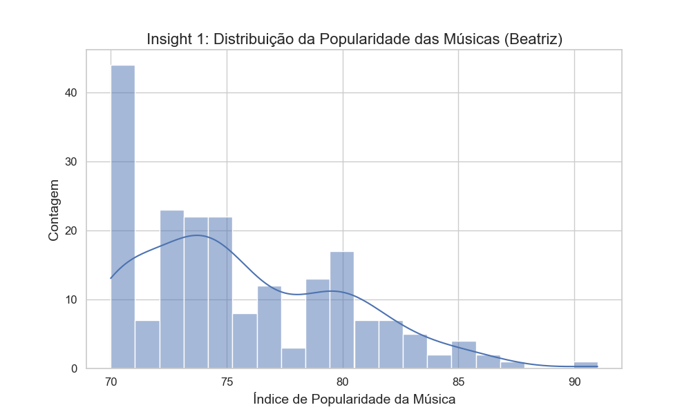
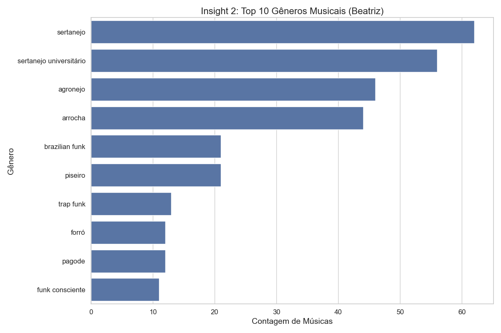
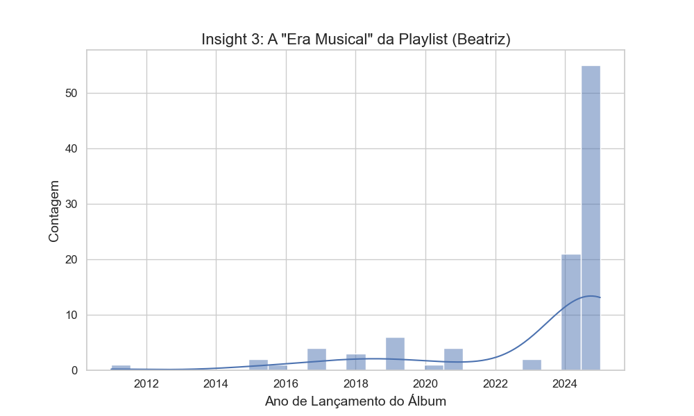
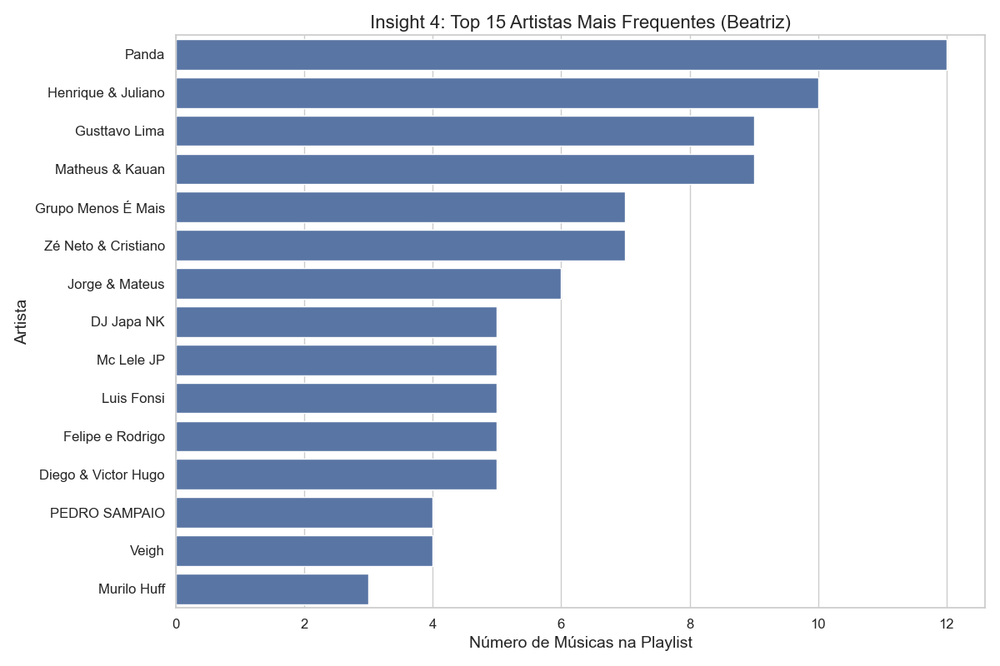
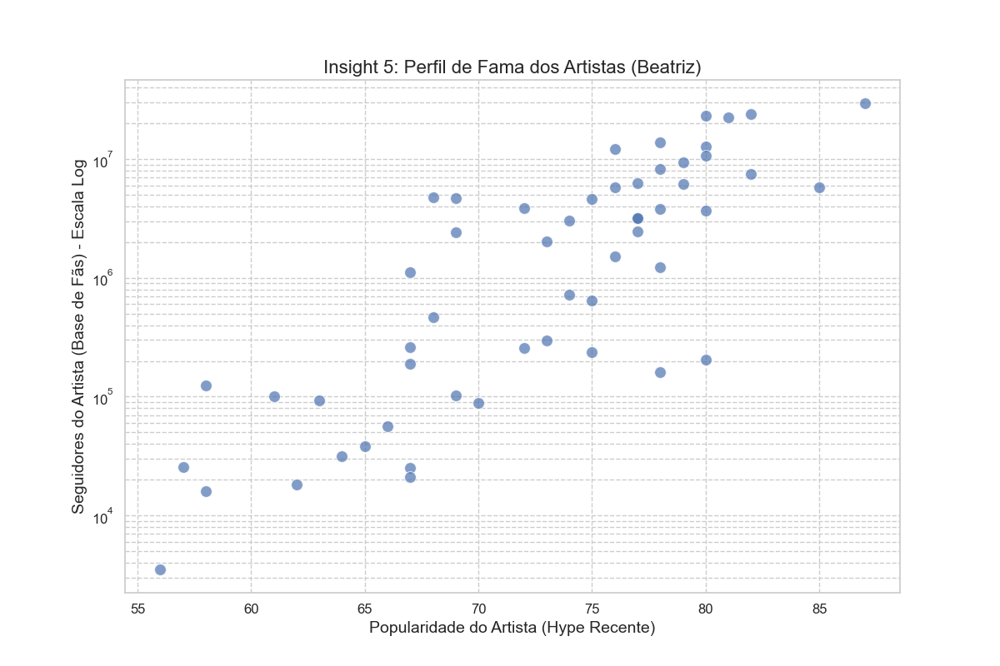
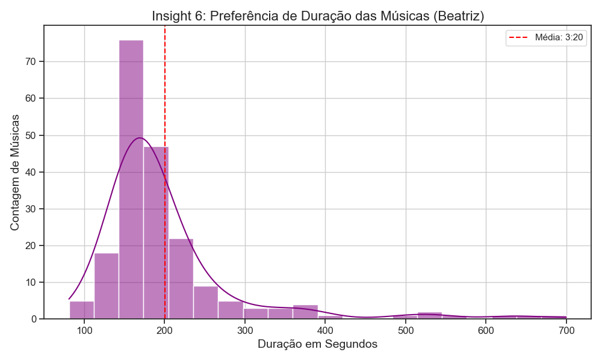

### 3.2.2 Daniel (O Foco Instrumental/Lo-fi)

> **Perfil Psicográfico:** Sempre pragmático e focado, Daniel nunca encarou a música como um componente central de sua identidade cultural, mas sim como uma infraestrutura cognitiva. Formado em Ciência da Computação, foi durante a graduação que descobriu o poder das paisagens sonoras como ferramenta de produtividade. Atualmente com 25 anos e atuando como desenvolvedor de software, seu consumo musical é estritamente utilitário. Sua busca na plataforma não é por artistas ou ídolos, mas por "funções": sonoridades para concentração profunda (deep work), batidas de baixa interferência para programação ou frequências relaxantes. Para Daniel, a música não é uma obra de arte a ser contemplada, mas um recurso bio-hackeável para otimizar desempenho e modulação de humor.

**Motivação Científica:** Esta persona foi desenhada para testar a capacidade dos algoritmos de respeitarem contextos funcionais em detrimento da popularidade. Daniel investiga o fenômeno da "Música de Mobília" (Furniture Music), onde a faixa serve como plano de fundo. A hipótese central é verificar se o sistema consegue manter a recomendação dentro de parâmetros acústicos específicos (alta instrumentalidade, baixa energia, sem vocais) ou se ocorrerá uma "contaminação Pop", onde o algoritmo tenta inserir faixas com vocais ou artistas famosos que quebram o fluxo de concentração, revelando uma incapacidade de distinguir "gosto musical" de "uso funcional".

**Validação Quantitativa do Input (Linha de Base):** Os dados de entrada confirmam a construção de um perfil altamente especializado e, paradoxalmente, anônimo. A biblioteca de Daniel apresenta uma Popularidade Média de Faixas de 54.51 (zona intermediária), contrastando brutalmente com a Média de Seguidores dos Artistas de apenas 43.370. Esse abismo entre a popularidade da música (média) e a fama do artista (baixíssima) valida o fenômeno da Comoditização Musical: o usuário consome o "gênero" (Lo-fi Beats), ignorando completamente quem é o autor da obra.

A estrutura das faixas é radicalmente distinta do padrão mainstream. Com uma Duração Média de apenas 2:17, as músicas são projetadas para looping contínuo e consumo rápido em playlists de estudo. O viés de recência é o mais extremo do estudo: 98.5% das faixas são da década de 2020 (Ano Médio 2024), evidenciando a natureza efêmera e industrial desse gênero, onde milhares de beats são lançados diariamente para alimentar algoritmos de foco.

A análise de gênero mostra um "Mono-Cluster": 186 das 200 faixas são categorizadas explicitamente como "lo-fi", "lo-fi beats" ou "lo-fi hip hop". A consistência interna (Desvio Padrão ± 7.65) é ligeiramente maior que a de Beatriz, refletindo a vasta quantidade de pequenos produtores independentes que alimentam esse ecossistema, mas que sonoramente convergem para o mesmo padrão estético.

#### 3.2.2.1 Tabela de indicadores

| Indicador            | Valor Obtido      | Interpretação Científica                                                                                                                                             |
| :------------------- | :---------------- | :------------------------------------------------------------------------------------------------------------------------------------------------------------------- |
| Popularidade Média   | 54.51 / 100       | Zona Funcional; faixas com alto volume de streaming passivo (playlists editoriais de foco), mas sem status de hit cultural ou reconhecimento de massa.               |
| Consistência Interna | s = ± 7.65        | Padronização Estética; dispersão moderada reflete um cenário fragmentado de produtores independentes que convergem para a mesma sonoridade (Bedroom Producers).      |
| Entropia de Artistas | Alta (99 únicos)  | Consumo Despersonalizado; indiferença à identidade do artista ("Quem está tocando?"), priorizando a utilidade sonora sobre a autoria (Furniture Music).              |
| Recência Temporal    | 98.5% (Anos 2020) | Produção Industrial/Efêmera; o ecossistema Lo-fi opera com alta rotatividade de lançamentos para alimentar algoritmos, gerando uma obsolescência rápida do catálogo. |
| Estrutura (Duração)  | Média 02:17       | Economia do Stream; faixas extremamente curtas projetadas para looping contínuo, maximizando a contagem de reproduções em sessões longas.                            |
| Alcance Médio        | ~43 Mil           | Dissociação Fama-Sucesso; artistas situados no "Corpo" da Cauda Longa, que possuem milhões de plays mas bases de fãs inexpressivas (Fenômeno Mood-based).            |
| Gêneros Dominantes   | Lo-fi / Beats     | Hiper-Especialização Cognitiva; bloqueio ativo de gêneros com vocais ou dinâmicas intensas para manutenção de estados de fluxo mental (Deep Work).                   |

#### 3.2.2.2 Gráficos

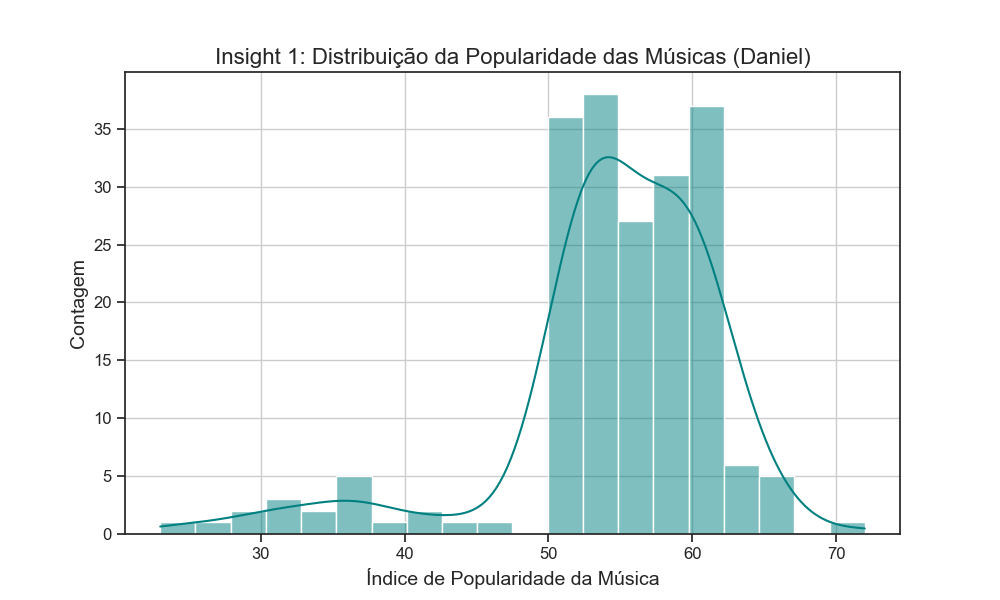
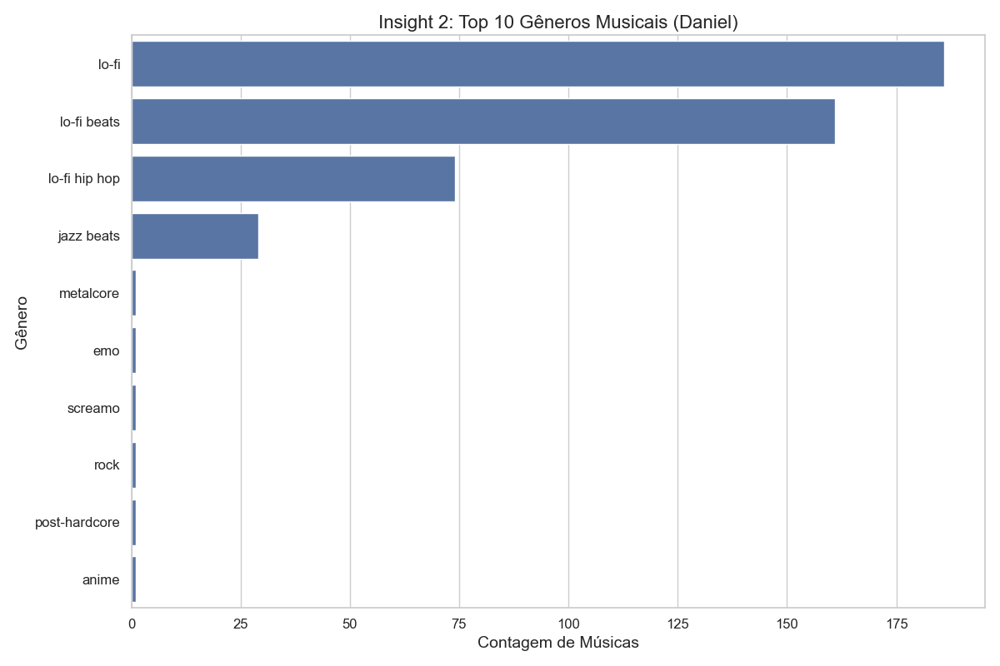
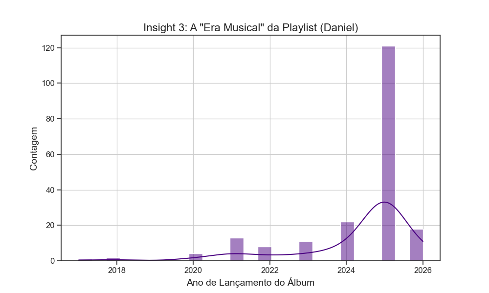
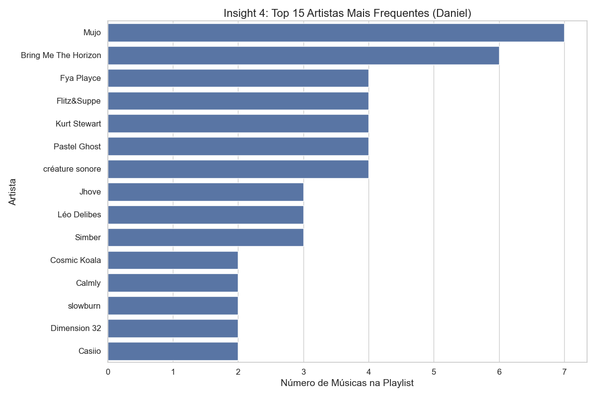
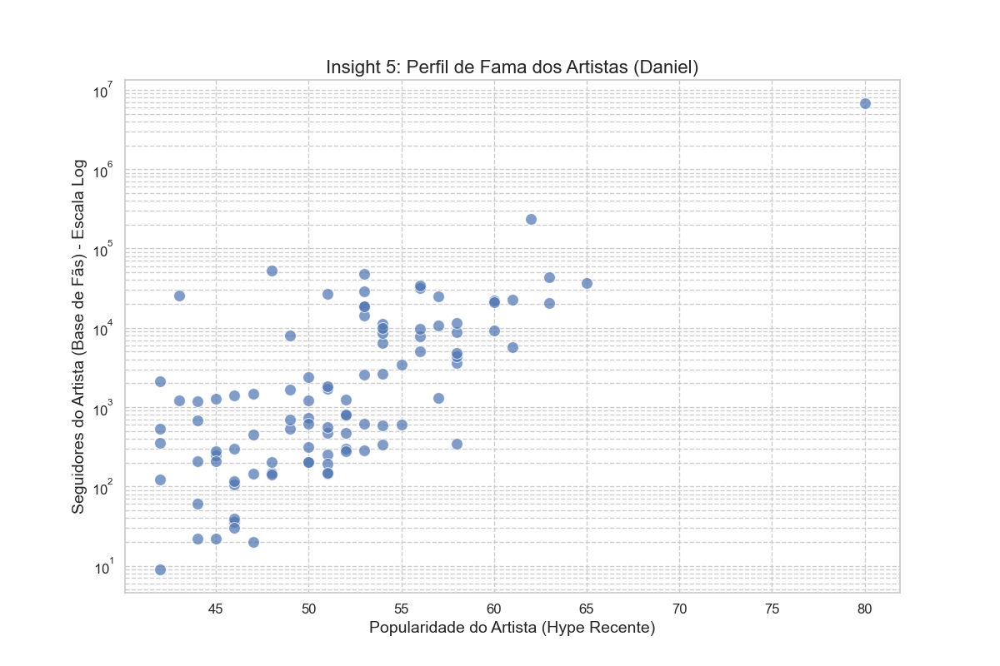
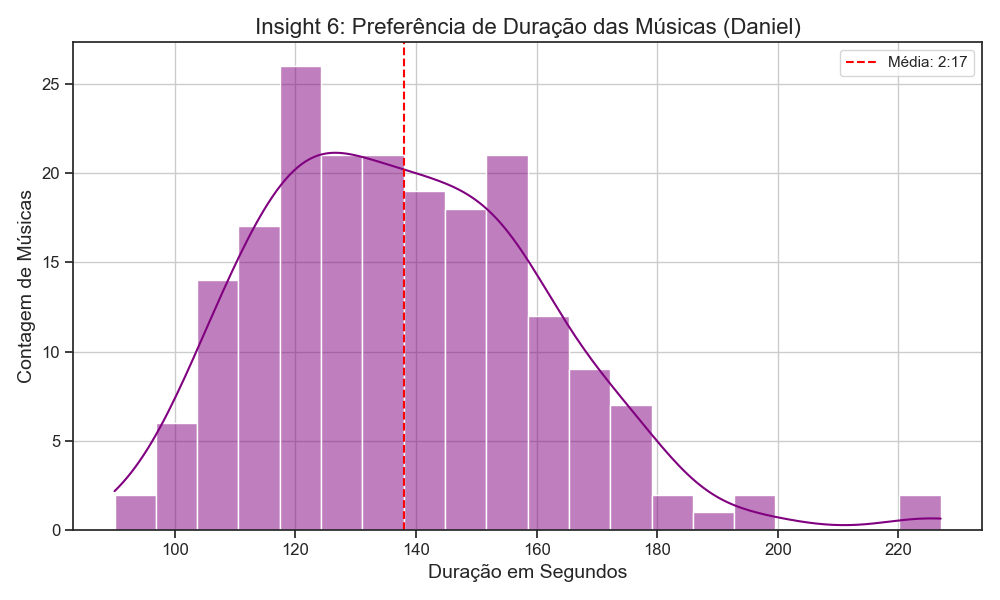

### 3.2.3 Sofia (A Consumidora de Nicho)

> **Perfil Psicográfico:** Nascida em 2002, Sofia cresceu na fronteira entre o físico e o digital, mas escolheu habitar os cantos mais silenciosos da internet. Formada em Design Gráfico, ela encara a música não como entretenimento de fundo, mas como uma extensão direta de sua identidade estética e emocional. Diferente da euforia coletiva de Beatriz, a experiência musical de Sofia é introspectiva e solitária, forjada em fóruns de discussão e blogs especializados (como o Rate Your Music) em vez de feeds de redes sociais de massa. Ela valoriza a autenticidade, a textura sonora e a "melancolia poética", buscando ativamente o que é raro. Sua postura é de curadoria ativa: Sofia não espera que o algoritmo lhe diga o que ouvir; ela garimpa, cataloga e preserva suas descobertas como artefatos digitais preciosos, temendo a banalização de seus "tesouros" pelo mainstream.

**Motivação:** Esta persona atua como o Caso de Borda (Edge Case) ou o teste da Cauda Longa (Long Tail). Sofia representa o desafio de personalização para usuários com gostos altamente específicos e baixa sobreposição com a massa de dados global. O objetivo é testar a capacidade do sistema de recomendação em operar com data sparsity (escassez de dados comportamentais coletivos), verificando se o algoritmo consegue manter a coerência estética de nicho ou se sofre de um viés de popularidade, sugerindo artistas famosos incorretamente na tentativa de preencher lacunas. Avalia-se aqui a precisão em micro-gêneros e a sensibilidade a texturas sonoras complexas.

**Validação Quantitativa do Input:** A análise dos metadados da biblioteca de Sofia confirma rigorosamente seu arquétipo de "Arqueóloga Digital" e consumidora underground. O contraste com a persona anterior é brutal: a Popularidade Média de Faixas é de apenas 10.19, com uma Mediana de 6, indicando que a grande maioria de seu consumo reside na obscuridade quase total do catálogo global. A Média de Seguidores dos Artistas (40.666) é estatisticamente insignificante comparada aos milhões da persona mainstream, validando seu interesse pelo cenário independente e lo-fi.

O comportamento de consumo de Sofia é profundamente focado e leal, evidenciado pela Média de Músicas por Artista de 7.41. Enquanto a persona mainstream consome hits isolados, Sofia consome discografias e álbuns: artistas como S.Maharba, Eterna e Patch+ possuem 15 ou mais faixas cada em sua biblioteca, demonstrando uma escuta vertical e investigativa.

Temporalmente, ela compartilha o viés de contemporaneidade (Ano Médio 2021, com 77% das faixas na década de 2020), mas com um propósito diferente: ela busca a vanguarda experimental atual, não os sucessos de rádio. A distribuição de gêneros valida sua formação em design e gosto por atmosferas: há uma predominância de estilos baseados em textura e colagem sonora, como Shoegaze (18), Plunderphonics (16), Cloud Rap (12) e IDM, gêneros complexos que exigem uma análise de conteúdo de áudio (timbre/ritmo) mais apurada do que a simples filtragem colaborativa.

#### 3.2.3.1 Tabela de indicadores

| Indicador            | Valor Obtido                            | Interpretação Científica                                                                                                                                                                                                                                                 |
| :------------------- | :-------------------------------------- | :----------------------------------------------------------------------------------------------------------------------------------------------------------------------------------------------------------------------------------------------------------------------- |
| Popularidade Média   | 10.19 / 100 (Mediana: 6)                | Zona de Obscuridade Extrema; isolamento quase total das tendências de massa. O consumo atua como gerador de "capital subcultural", onde o valor da obra está intrinsecamente ligado à sua inacessibilidade comercial (Underground).                                      |
| Consistência Interna | s = ± 10.19                             | Coerência de Nicho; a baixa variação absoluta indica uma blindagem voluntária contra o mainstream. Não há "furos" na curadoria com hits acidentais; a biblioteca permanece estritamente na base da Cauda Longa.                                                          |
| Entropia de Artistas | Baixa (27 únicos, Média 7.41/artista)   | Consumo Imersivo/Vertical; forte oposição à escuta passiva. A alta taxa de repetição do mesmo artista (ex: 16 faixas de S.Maharba) evidencia uma escuta focada na autoria, valorizando a jornada do álbum e a identidade do criador (Active Listening).                  |
| Recência Temporal    | 77% (Anos 2020) / Ano Médio: 2021       | Vanguarda Contemporânea; ao contrário do perfil saudosista, a busca pelo alternativo se dá no tempo presente. Há um monitoramento ativo da cena experimental e independente em tempo real, ditando o pulso atual do nicho.                                               |
| Estrutura (Duração)  | Média 02:57 (Range: 0:06 a 7:04)        | Flexibilidade Artística; a variação extrema (de vinhetas abstratas a épicos de 7 minutos) demonstra rejeição à padronização estrutural algorítmica. A métrica de sucesso é a expressão narrativa, não a retenção comercial.                                              |
| Alcance Médio        | ~40.6 Mil                               | Economia de Comunidade; artistas situados na "Cauda Longa Profunda". Embora o alcance global seja minúsculo comparado aos gigantes, essas bases de fãs costumam ter alta densidade de engajamento e lealdade, sustentando micro-cenas independentes.                     |
| Gêneros Dominantes   | Shoegaze / Plunderphonics / Lo-fi Indie | Curadoria Estético-Textural; priorização de gêneros de alta complexidade tímbrica que exigem escuta ativa. A melancolia e a distorção (Shoegaze) ou a colagem sonora (Plunderphonics) refletem uma relação identitária e estética com a música, e não apenas utilitária. |

#### 3.2.3.2 Gráficos

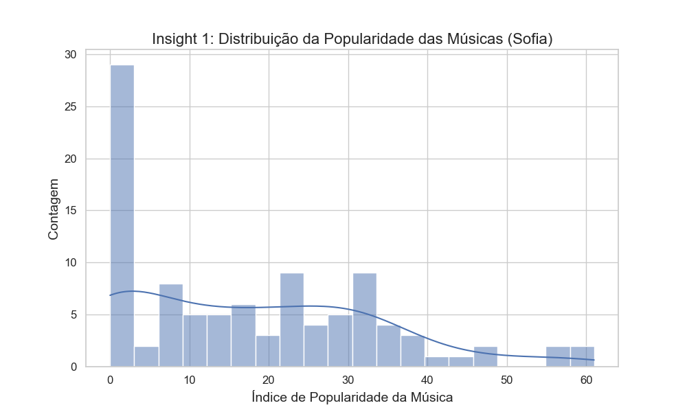
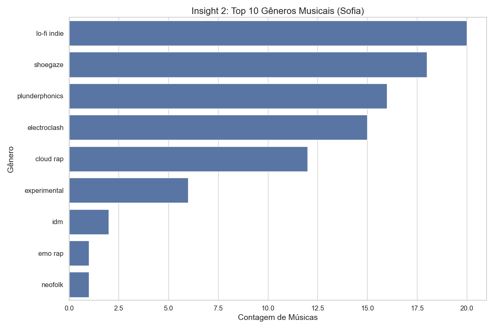
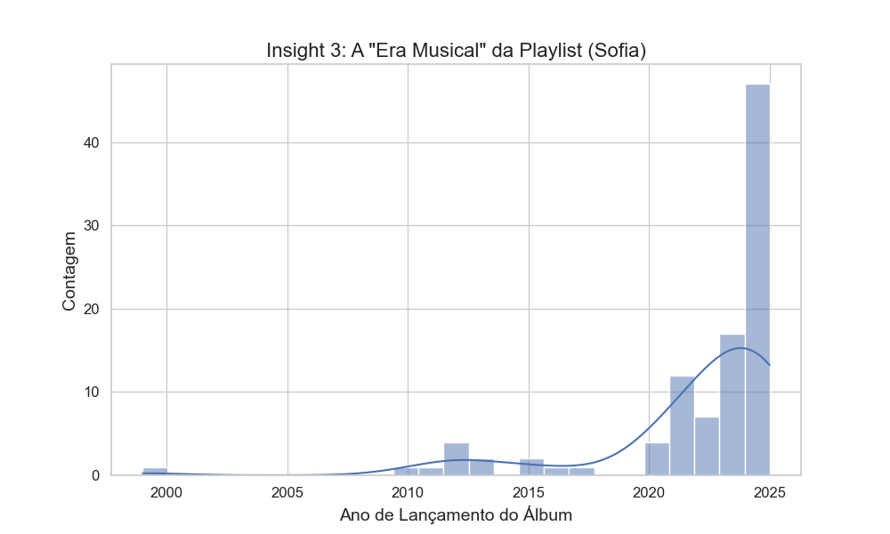
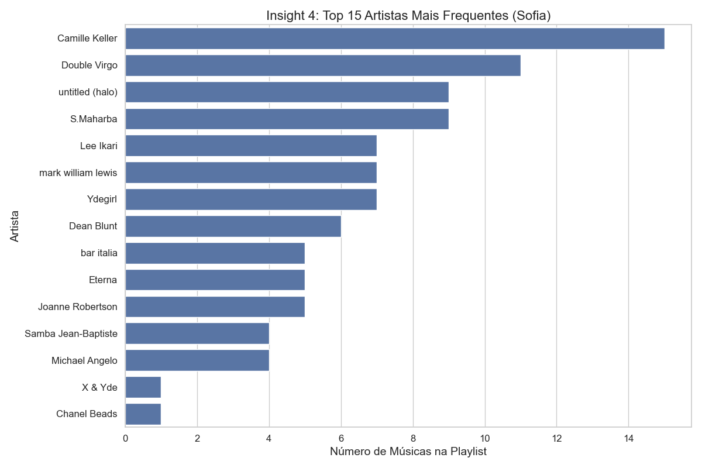
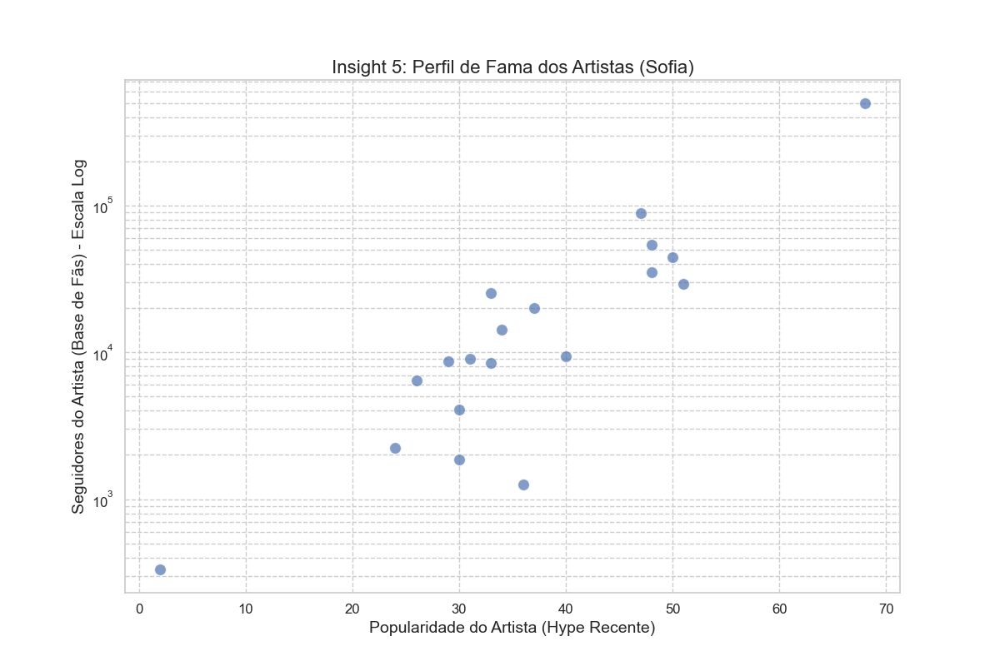
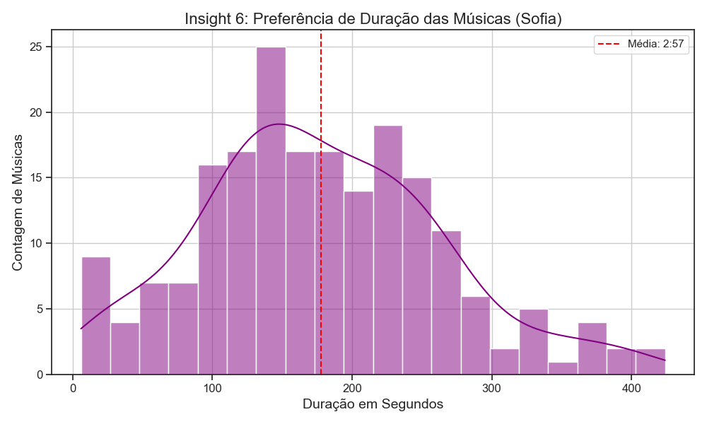

### 3.2.4 Ricardo (O Consumidor Nostálgico)

**Perfil Psicográfico:** Nascido em 1982, Ricardo representa a transição da era analógica para a digital. Sua formação musical ocorreu na "Era de Ouro" da indústria fonográfica física (anos 90), moldada pela escassez e pela valorização do objeto: a gravação de fitas K7, a compra ritualística de LPs e a apreciação de álbuns completos. Como Engenheiro Civil, ele possui uma abordagem estruturada e crítica em relação ao consumo; para ele, a música deve possuir narrativa, complexidade instrumental e autenticidade técnica. Embora utilize o streaming por conveniência, sua mentalidade permanece a de um colecionador. Ricardo exibe uma forte resistência algorítmica: ele desconfia da superficialidade das "curadorias automáticas" e prefere atuar como o guardião do "bom gosto" em seu círculo social, utilizando momentos de lazer (como churrascos) para educar as gerações mais novas sobre os clássicos do Rock e da MPB.

**Motivação:** Esta persona atua como o Controle Temporal (Legacy Control) do experimento. Ricardo desafia o sistema de recomendação a lidar com o "Viés de Recência" (Recency Bias). O objetivo é verificar se o algoritmo consegue distinguir entre "Alta Popularidade Atual" e "Alta Popularidade Histórica". Testa-se a capacidade do modelo em recomendar "Deep Cuts" (faixas menos conhecidas de artistas famosos) e se ele é capaz de sair do loop temporal, sugerindo, por exemplo, bandas novas que tenham a sonoridade "Classic Rock" (Greta Van Fleet, por exemplo) ou se ficará preso recomendando apenas reedições das décadas de 70 e 80, gerando um estagnamento de descoberta.

**Validação Quantitativa do Input:** A análise dos metadados valida robustamente o arquétipo do ouvinte "Saudosista e Leal". A biblioteca apresenta uma dicotomia interessante: uma Popularidade Média de Faixas de 66.42 (alta), mas sustentada por um catálogo antigo. A Popularidade Média dos Artistas (78.28) é superior à da própria persona Mainstream, indicando que Ricardo consome "Lendas da Música" e "Gigantes do Estádio" (Metallica, Queen, Rolling Stones), cujas bases de fãs globais acumulam impressionantes 3.3 bilhões de seguidores somados.

O indicador mais forte de seu comportamento de "escuta de álbum" (em oposição à escuta de playlist) é a Concentração de Artistas: com apenas 18 artistas únicos para 200 músicas, Ricardo apresenta uma Média de Músicas por Artista de 11.11. Isso confirma que ele não consome apenas os greatest hits, mas mergulha na discografia profunda de seus ídolos (ex: 16 faixas de Djavan e Metallica).

Temporalmente, o input é deslocado para o século passado, com um Ano Médio de Lançamento de 1985 e mais de 60% das faixas concentradas entre as décadas de 70 e 80. Estruturalmente, a playlist rejeita a economia da atenção atual: a Duração Média das Músicas é de 4:33, com faixas chegando a quase 9 minutos, refletindo a preferência por solos de guitarra extensos, introduções longas e a complexidade lírica característica do Rock Progressivo e da MPB clássica.

#### 3.2.4.1 Tabela de indicadores

| Indicador            | Valor Obtido                            | Interpretação Científica                                                                                                                                                                                                                                                            |
| :------------------- | :-------------------------------------- | :---------------------------------------------------------------------------------------------------------------------------------------------------------------------------------------------------------------------------------------------------------------------------------- |
| Popularidade Média   | 66.42 / 100 (Mediana: 67)               | Zona de Consagração Histórica; métricas elevadas sustentadas não por viralidade recente, mas pelo acúmulo de prestígio cultural ao longo de décadas (Legacy Acts). O consumo reflete a busca por validação canônica ("Clássicos") em vez de novidade.                               |
| Consistência Interna | s = ± 10.98                             | Estabilidade Canônica; o desvio padrão indica uma curadoria conservadora, que oscila apenas dentro do espectro de artistas já estabelecidos e legitimados pela crítica ou história, evitando tanto o underground obscuro quanto o pop efêmero atual.                                |
| Entropia de Artistas | Mínima (18 únicos, Média 11.11/artista) | Fidelidade Monolítica (AOR); comportamento típico da era do Album-Oriented Rock. A altíssima concentração de faixas por artista demonstra uma rejeição à "cultura do single", priorizando a imersão completa em discografias e obras conceituais.                                   |
| Recência Temporal    | Ano Médio: 1985 (60% entre 70s e 90s)   | Ancoragem Temporal (Cristalização); forte viés de nostalgia, onde o gosto musical "congela" no período formativo do usuário. Há uma resistência ativa à produção contemporânea, associada tecnicamente à preferência por masterizações com maior faixa dinâmica (pré-Loudness War). |
| Estrutura (Duração)  | Média 04:33 (Range: 2:02 a 8:35)        | Narrativa Progressiva; a longa duração média reflete a valorização de complexidade instrumental (solos, introduções lentas) e desenvolvimento lírico, em oposição direta à economia da atenção e formatos curtos otimizados para streaming.                                         |
| Alcance Médio        | ~16.7 Milhões (Soma: ~3.3 Bilhões)      | Legitimidade de Massa (Stadium Status); consumo focado em "Superastros" globais. A validação da qualidade musical para este perfil está correlacionada à longevidade e ao impacto cultural massivo do artista (ex: Queen, Metallica).                                               |
| Gêneros Dominantes   | Classic Rock / MPB / Hard Rock          | Purismo Analógico; preferência estrita por gêneros fundamentados em instrumentação orgânica (guitarra, bateria, voz natural) e virtuosismo técnico. O perfil demonstra ceticismo quanto a gêneros sintéticos ou eletrônicos, buscando "autenticidade" na execução humana.           |

#### 3.2.4.2 Gráficos

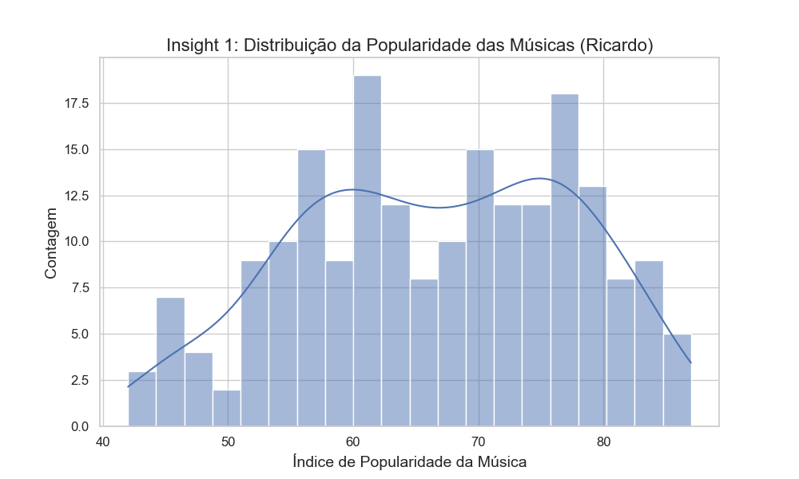
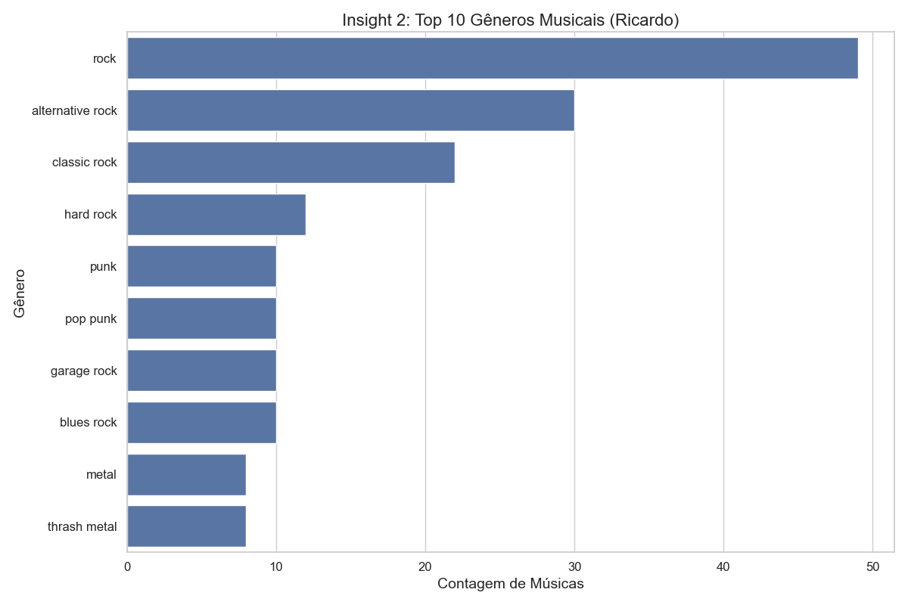
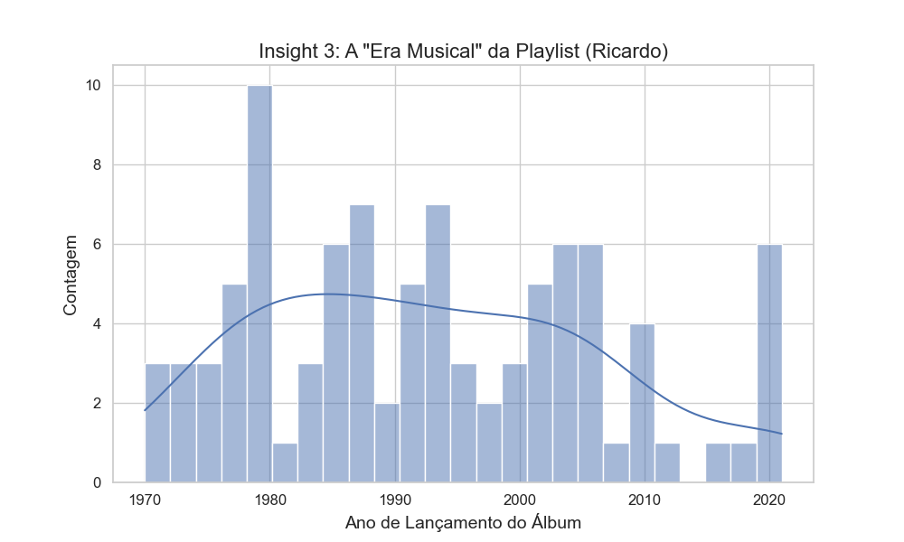
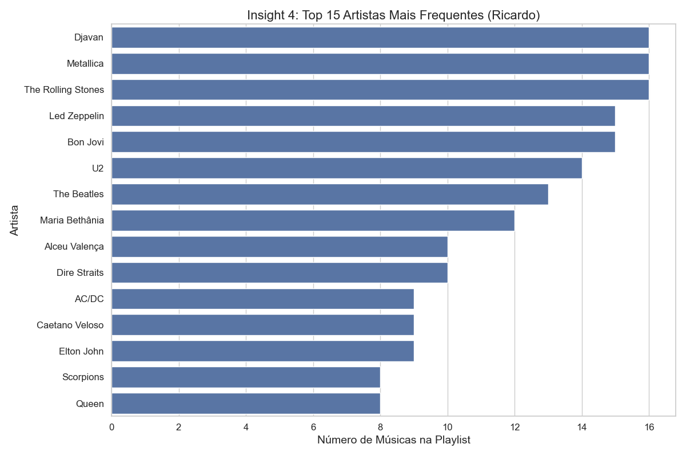
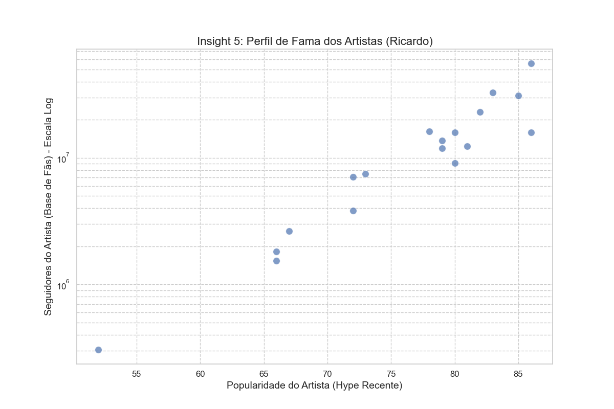
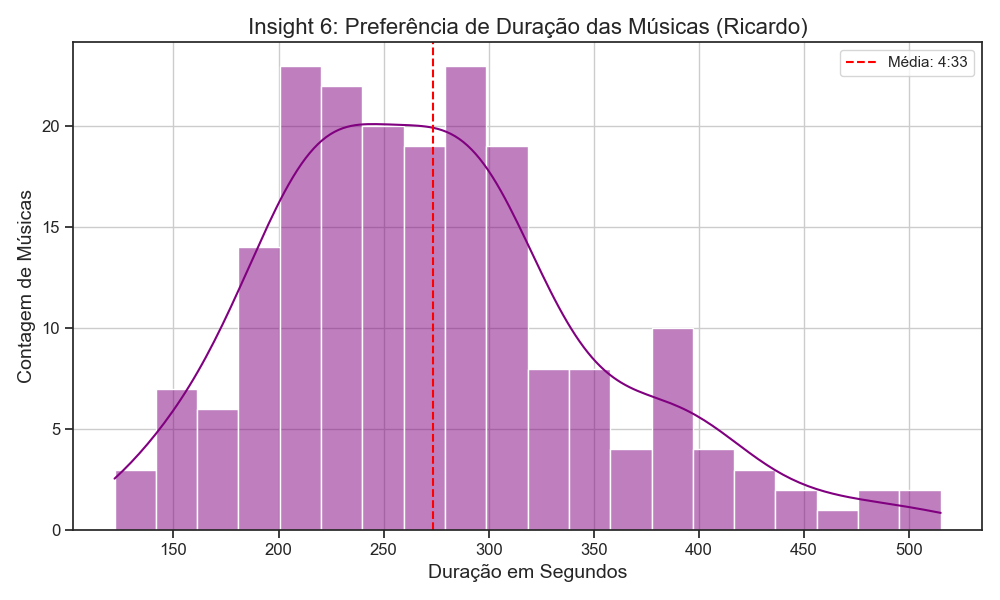

## 3.3 Análise Comparativa e Validação dos Estímulos (Inputs)

Para assegurar a integridade da auditoria, é imperativo validar se as personas geradas representam, de fato, *clusters* comportamentais distintos e independentes. Esta etapa de **Validação Cruzada** (*Cross-Validation*) tem como objetivo demonstrar a ortogonalidade dos vetores de entrada: comprovar que os quatro perfis ocupam quadrantes separados no espaço vetorial de consumo, minimizando o risco de contaminação cruzada no estágio inicial (*Cold Start*).

Esta validação estabelece a **Linha de Base** (*Baseline*) do experimento. A confirmação de que não há sobreposição significativa entre os conjuntos de dados iniciais é pré-requisito para a inferência causal futura: qualquer convergência observada nas recomendações (*Outputs*) poderá ser atribuída ao viés de homogeneização do sistema, e não à similaridade original dos usuários.

### 3.3.1 Métricas de Diversidade e Entropia da Informação

A aplicação de indicadores de diversidade revela as diferenças estruturais na "dieta informacional" de cada persona. A Tabela abaixo apresenta os cálculos de Entropia de Shannon (incerteza/variedade) e Coeficiente de Gini (desigualdade de atenção).

| Persona | Entropia (Shannon) | Desigualdade (Gini) | Riqueza (Artistas Únicos) | Interpretação Estrutural |
| :------ | :----------------- | :------------------ | :------------------------ | :----------------------- |
| **Beatriz** | 6.03 (Alta) | 0.42 (Média) | 94 | **Consumo Exploratório/Caótico**; reflete a natureza do ouvinte de *hits*, com alta rotatividade e baixa fidelidade a álbuns específicos. |
| **Daniel** | 6.27 (Máxima) | 0.37 (Baixa) | 99 | **Pulverização Funcional**; o consumo é focado na utilidade da "faixa" e não na identidade do "artista", gerando a maior entropia do grupo. |
| **Ricardo** | 4.10 (Mínima) | 0.18 (Mínima) | 18 | **Fidelidade Canônica**; a baixa entropia e o Gini mínimo refletem um comportamento de "superfã" concentrado em poucas discografias profundas. |
| **Sofia** | 4.43 (Baixa) | 0.36 (Baixa) | 27 | **Curadoria Seletiva**; foco em *Deep Cuts* de poucos artistas de nicho, indicando uma escuta vertical e investigativa. |

> **Análise:** Observa-se uma clara dicotomia estrutural: enquanto Daniel e Beatriz apresentam alta entropia (consumo horizontal/playlist), Ricardo e Sofia apresentam baixa entropia (consumo vertical/álbum). Essa distinção valida a modelagem de diferentes profundidades de interação, essencial para testar se o algoritmo favorece a superficialidade em detrimento da imersão.

### 3.3.2 Distribuição de Mercado (Cauda Longa)

A análise da estratificação econômica dos artistas selecionados valida a hipótese de polarização entre "Cabeça" (*Head*) e "Cauda" (*Tail*) da distribuição de Pareto. A Tabela a seguir demonstra como cada persona interage com diferentes níveis de capital simbólico e financeiro.

| Persona | % Superstars (>1M seg) | % Médios (50k-1M seg) | % Nicho/Cauda (<50k seg) | Perfil Econômico |
| :------ | :--------------------- | :-------------------- | :----------------------- | :--------------- |
| **Beatriz** | **57.4%** | 31.9% | 10.6% | **Consumidora de Massa**; foco predominante no topo da pirâmide econômica. |
| **Ricardo** | **100.0%** | 0.0% | 0.0% | **Consumidor de Legado**; foco exclusivo em gigantes consagrados e validados historicamente. |
| **Daniel** | 1.0% | 2.0% | **97.0%** | **Consumidor Funcional**; base da pirâmide (comoditização e artistas sem rosto). |
| **Sofia** | 0.0% | 11.1% | **88.9%** | **Consumidora Subcultural**; rejeição total ao *mainstream* e valorização da escassez. |

> **Análise:** Os dados confirmam o isolamento econômico das variáveis. O contraste absoluto entre Ricardo (100% Superstars) e Sofia (89% Cauda Longa) cria o cenário ideal para auditar o viés econômico: permitirá verificar se o algoritmo tenta forçar uma "gentrificação" do gosto de Sofia, empurrando-a em direção à média de mercado para maximizar a retenção.

### 3.3.3 Análise Visual Cruzada e Topologia dos Dados

As visualizações a seguir sintetizam graficamente as diferenças estruturais entre as quatro personas, comprovando a heterogeneidade da amostra inicial através de uma análise topológica dos dados. O objetivo destas representações é demonstrar a **ortogonalidade dos perfis**: cada persona ocupa uma região distinta no espaço vetorial de consumo.

**A) Matriz de Similaridade (Índice de Jaccard)**
Esta matriz atua como a prova definitiva do isolamento experimental. A predominância absoluta de valores nulos (0.00) ou próximos a zero nas interseções entre personas confirma que não há compartilhamento de repertório. Isso garante que o estado de *Cold Start* é único para cada agente, estabelecendo condições ideais de laboratório para verificar convergências futuras.

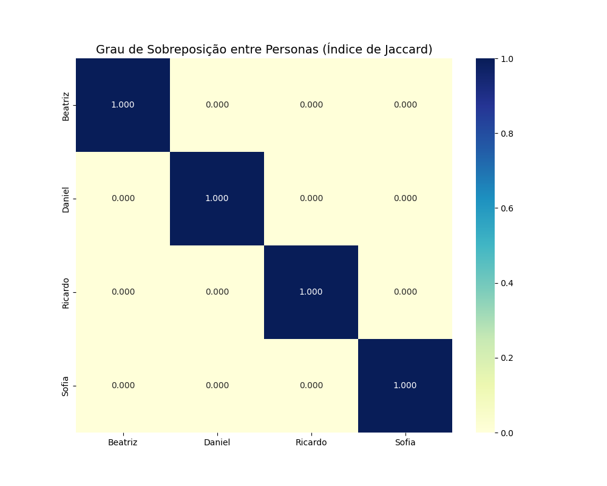

**B) Mapeamento da Economia da Atenção (Scatter Plot: Popularidade x Seguidores)**
Este gráfico espacializa a Teoria da Cauda Longa (*The Long Tail*).
* **Quadrante Superior Direito (Head):** Ocupado por Ricardo e Beatriz, representando o consumo de alta visibilidade e capital social.
* **Quadrante Inferior Esquerdo (Tail):** Ocupado por Sofia e Daniel, representando a zona de obscuridade e nicho.
A clara separação visual valida a capacidade do experimento de auditar o viés algorítmico em diferentes estratos de poder econômico, testando se o sistema privilegia quem já possui fama.

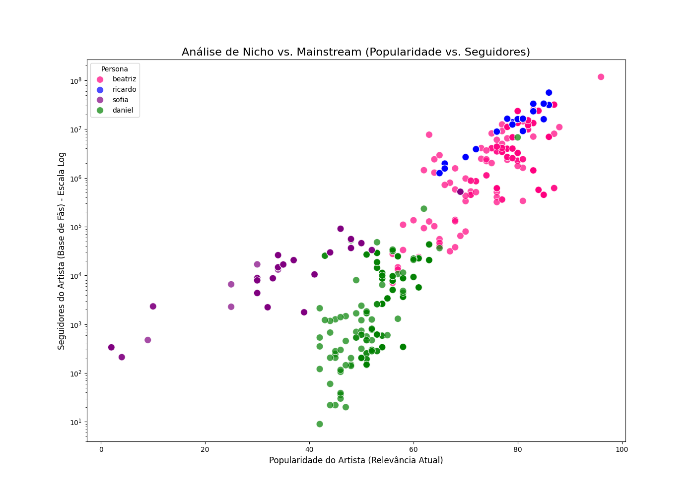

**C) Cronologia do Consumo (Distribuição Temporal)**
A visualização de densidade temporal (*KDE Plot*) valida o controle da variável "Tempo". Observa-se a sobreposição das curvas de Daniel, Beatriz e Sofia na extrema direita (anos 2020), enquanto a curva de Ricardo se isola à esquerda (século XX). Este gráfico serve como linha de base para medir o **Viés de Recência**: deslocamentos futuros da curva de Ricardo para a direita indicarão uma tentativa do sistema de impor novidades a um perfil conservador.

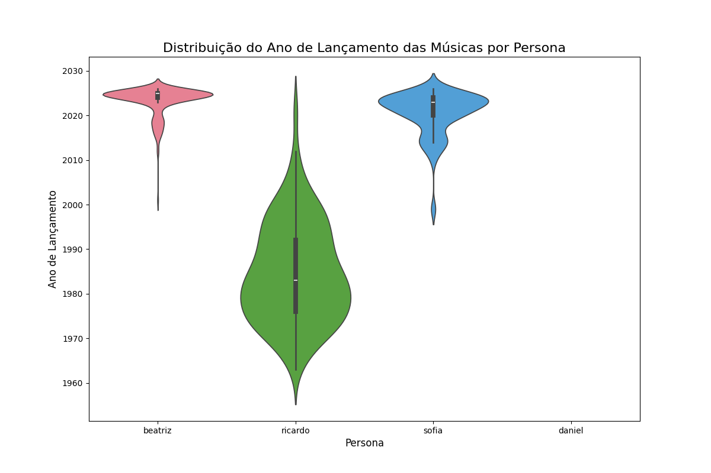

**D) Curva de Lorenz (Concentração de Artistas)**
O gráfico ilustra a desigualdade na distribuição de atenção. A curva de Ricardo (mais distante da diagonal perfeita) confirma visualmente sua fidelidade monástica a poucos artistas, enquanto a curva de Beatriz (mais próxima da diagonal) demonstra um consumo pulverizado. Essa métrica será essencial para auditar se o algoritmo respeita a profundidade de catálogo ou se tende a fragmentar a experiência de escuta.

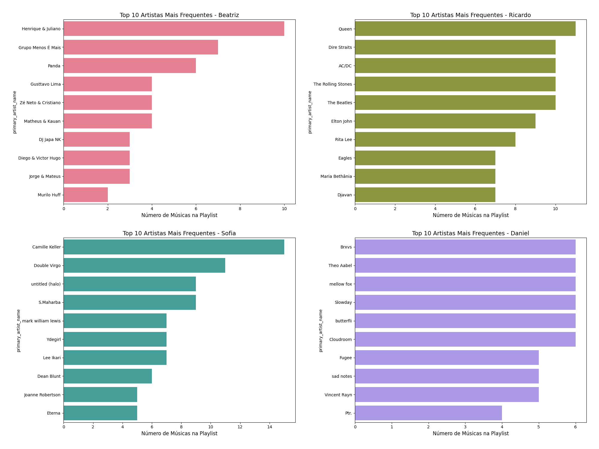

## 3.4 Síntese Metodológica e Limitações

A estrutura metodológica aqui apresentada estabelece um ambiente controlado e auditável para a investigação dos algoritmos de recomendação. A validação estatística dos *inputs* confirma que as quatro personas sintéticas — Beatriz, Daniel, Sofia e Ricardo — constituem instrumentos de medição calibrados, representando vetores de comportamento distintos e isolados.

As métricas de diversidade (Shannon), desigualdade (Gini) e similaridade (Jaccard) calculadas nesta etapa formam a **Linha de Base (Baseline)** do estudo. Nos capítulos subsequentes, esses mesmos indicadores serão reaplicados sobre as listas de recomendação geradas pelo Spotify (como "Descobertas da Semana" e "Rádio da Faixa").

A comparação direta entre os valores de *Input* (apresentados neste capítulo) e os valores de *Output* (a serem coletados) revelará o "Delta Algorítmico": a magnitude e a direção da interferência do sistema sobre o gosto do usuário. Dessa forma, será possível responder aos objetivos da pesquisa, determinando se a plataforma atua como um espelho fiel das preferências do usuário ou como um prisma que distorce a diversidade cultural em favor de padrões comerciais hegemônicos.